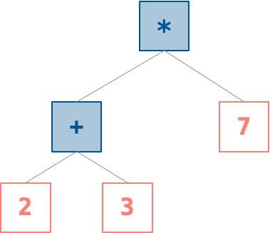
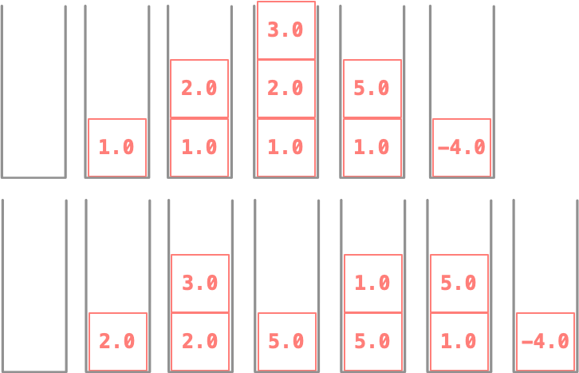

# HW 3: Lists, Datatypes, and a Stack Machine

This assignment has three parts, each building on the last: more practice with lists and higher-order functions, a first datatype of your own, and — the main event — implementing a **stack machine** that evaluates arithmetic expressions. That last part is your first real taste of representing *programs themselves* as data, the idea Module 03.2 was building toward.

!!! note "How you'll get materials and submit this assignment"
    We're still finalizing the workflow for distributing starter code and collecting submissions for this course. Instructions for both will be posted here once they're ready — for now, this page covers what the assignment actually asks of you.

## What You'll Do

- Get more practice writing, running, and debugging Haskell code.
- Deepen your understanding of higher-order functions and currying.
- Apply what you know about lists, tuples, pattern matching, and data types.
- Use all of the above to implement a different model of computation: a stack machine.

## Checklist

- [ ] Get the assignment materials *(details coming soon)*
- [ ] Review good Haskell programming practices
- [ ] Implement list functions `evens`, `odds`, `evenodds`, `riffle`
- [ ] Test your list functions
- [ ] Implement higher-order functions `myCurry`, `myUncurry`
- [ ] Test your higher-order functions
- [ ] Implement the `TreeOfInt` datatype and its `least` function
- [ ] Implement `evalRPN`
- [ ] Implement `toRPN`
- [ ] Implement `toRPNopt`
- [ ] Write `depth3` and `depth4` example expressions
- [ ] Test your stack machine functions
- [ ] Turn in the assignment *(details coming soon)*

## Collaboration

You can work with a partner on this assignment. If you do, follow the pair-programming rules from the [syllabus](../syllabus.md) at all times — even when writing text or math — and make sure both partners contribute to and understand every part of the work you submit together.

---

## Functions on Lists

### `evens` (5 points)

Define:

```haskell
evens :: [a] -> [a]
```

which returns every other element of a list, starting with the first (the zero-th).

!!! example
    ```
    ghci> :l HW3.hs
    *HW3> evens [0,1,2,3,4]
    ```
    Expected output: `[0,2,4]`.

### `odds` (5 points)

Define:

```haskell
odds :: [a] -> [a]
```

which returns every other element starting with the second (the one-th).

!!! example
    ```
    *HW3> odds [0,1,2,3,4]
    ```
    Expected output: `[1,3]`.

### `evenodds` (5 points)

Define:

```haskell
evenodds :: [a] -> ([a],[a])
```

such that `evenodds l` is the same as `(evens l, odds l)`. **Write `evenodds` as its own recursive function**, with no calls to `evens` or `odds` as helpers — you'll want `let` and pattern matching to name the two lists produced by your recursive call.

!!! example
    ```
    *HW3> evenodds [0,1,2,3,4]
    ```
    Expected output: `([0,2,4],[1,3])`.

### `riffle` (5 points)

Define:

```haskell
riffle :: ([a],[a]) -> [a]
```

which undoes `evenodds`, so that for any list `l`, `riffle (evenodds l)` returns `l`. In practice, `riffle` interleaves the elements of the two given lists into one. Document what your function does when the two lists have different lengths.

!!! example
    ```
    *HW3> riffle ([0,2,4],[1,3])
    ```
    Expected output: `[0,1,2,3,4]`.

### Testing Your List Functions

```
ghci test/ListsSpec.hs
```
then, in the REPL, `*ListsSpec> main`, and when you're done, `*ListsSpec> :quit`. As always: passing the provided tests is a good sign, not a guarantee — think up a few of your own too.

---

## Higher-Order Functions: Currying and Uncurrying

Recall that a **higher-order function** takes another function as input, produces one as output, or both. You've also seen that a two-argument function can be written two ways: arguments supplied together as a pair, or supplied one at a time (curried). `riffle` above takes its two lists as a pair:

```haskell
riffle :: ([a], [a]) -> [a]
```

but we could imagine a curried version that takes them one at a time instead:

```haskell
riffle2 :: [a] -> [a] -> [a]
```

Depending on the situation, one interface or the other might be more convenient — and conveniently, we can convert between them automatically.

**Your task:** define

```haskell
myCurry   :: ((a, b) -> c) -> (a -> b -> c)
myUncurry :: (a -> b -> c) -> ((a, b) -> c)
```

### `myCurry` (10 points)

If `g = myCurry f`, then `g x y` and `f (x, y)` should agree for all `x` and `y`. (In particular, `riffle2` is `myCurry riffle`.)

!!! example
    ```
    *HW3> add (a, b) = a + b
    *HW3> g = myCurry add
    *HW3> g 1 2
    ```
    Expected output: `3`.

### `myUncurry` (10 points)

If `h = myUncurry k`, then `h (x, y)` and `k x y` should agree for all `x` and `y`. (In particular, `riffle` is `myUncurry riffle2`.)

!!! example
    ```
    *HW3> add a b = a + b
    *HW3> g = myUncurry add
    *HW3> g (1,2)
    ```
    Expected output: `3`.

Each of these functions can be written in a single short line — in fact, there's really only one piece of code with the right type for each, so if you can read the type signature, you can very likely write the code.

### Testing Your Higher-Order Functions

```
ghci test/HOFSpec.hs
```
then `*HOFSpec> main`, and `*HOFSpec> :quit` when done.

---

## Haskell Datatypes: Warming Up

This part isn't test-graded — it's graded on compiling successfully and completion, just to get you comfortable with datatypes before the main event.

### `TreeOfInt` (15 points)

Define a datatype `TreeOfInt` representing a binary search tree of `Int`s, with two kinds of values: `Empty` (an empty tree), and `Branch`, storing three associated values — an `Int`, a left subtree, and a right subtree, in that order.

### `least` (10 points)

Write a recursive function `least` that returns the minimum element of a `TreeOfInt` (or `undefined` if the tree is empty). You can assume the tree is a valid binary search tree.

**The names and types here matter** — the datatype must be named `TreeOfInt`, with constructors and field types exactly as described, since later grading depends on it.

---

## Evaluating Arithmetic Expressions Using a Stack Machine

### Background: Representation and Evaluation

To reduce an expression like `1+2+3` to a value like `6`, we need two things: a **representation** — a data structure holding the expression — and an **evaluator**, an algorithm that turns that representation into a result. We'll focus on **stack machines**: evaluating an expression using a stack, one instruction at a time.

One way to represent an arithmetic expression is as a tree, with operations at interior nodes and numbers at the leaves:

```haskell
data Expr = Num   Double
          | BinOp Expr Op Expr
  deriving (Show, Eq)

data Op = PlusOp | MinusOp | TimesOp | DivOp
  deriving (Show, Eq)
```

`(2+3)*7` becomes:

```haskell
BinOp (BinOp (Num 2) PlusOp (Num 3)) TimesOp (Num 7)
```

{ width="280" }
<br>*A tree-based encoding of `(2+3)*7`.*

Certain calculators and languages (PostScript and BibTeX among them) instead evaluate expressions using a **stack** — a flat list of instructions to execute in order:

```haskell
data StackInstr = Push Double
                | DoOp Op
                | Swap
  deriving (Show, Eq)
```

{ width="360" }
<br>*A list-based (stack-instruction) encoding of the same expression.*

`Push r` pushes `r` onto the stack. `DoOp PlusOp` replaces the top two numbers with their sum (and similarly for the other operators). `Swap` swaps the top two numbers. In table form, with the top of the stack shown on the left:

| Stack looks like | Operation | Stack afterwards |
|---|---|---|
| `…` | `Push r` | `r …` |
| `a b …` | `DoOp PlusOp` | `(b+a) …` |
| `a b …` | `DoOp MinusOp` | `(b-a) …` |
| `a b …` | `DoOp TimesOp` | `(b*a) …` |
| `a b …` | `DoOp DivOp` | `(b/a) …` |
| `a b …` | `Swap` | `b a …` |

`(2+3)*7` as a stack program:

```haskell
[Push 2, Push 3, DoOp PlusOp, Push 7, DoOp TimesOp]
```

### `evalRPN` (15 points)

We'll represent the stack itself as a list of floating-point numbers, with the head as the top:

```haskell
type StackValue = Double
type Stack = [StackValue]
```

("RPN" stands for **Reverse Polish Notation**, named for Polish logician Jan Łukasiewicz, who invented the notation.)

**Your task:** write a recursive function

```haskell
evalRPN :: [StackInstr] -> Stack -> StackValue
```

that runs a list of stack instructions against a starting stack, in order, and returns the number left at the top.

![Six stack states side by side, showing the stack growing and shrinking as [Push 2, Push 3, DoOp PlusOp, Push 7, DoOp TimesOp] executes, ending at 35.](img/hw03/stack-example.png){ width="600" }
<br>*The stack's progression while evaluating `(2+3)*7`, instruction by instruction.*

Be careful with the order of operands for `MinusOp` and `DivOp` — per the table above, `evalRPN [Push 2.0, Push 1.0, DoOp MinusOp] []` should return `1.0`, not `-1.0`.

!!! example
    ```
    ghci> :l HW3.hs
    *HW3> evalRPN [Push 8.0, Push 2.0, DoOp DivOp] []
    ```
    Expected output: `4.0`.

For this and the remaining problems, don't worry about inefficiency from repeated `++`, and you don't need to handle stack underflow or other runtime errors.

### `toRPN` (24 points)

Write:

```haskell
toRPN :: Expr -> [StackInstr]
```

which converts a tree-based expression into a list of stack instructions computing the same value — one `DoOp PlusOp` for every `PlusOp` in the input, and so on. (Evaluating the expression down to a number `r` and returning `[Push r]` doesn't count — the point is to translate the *structure*, not shortcut it.) Pattern matching on the input, with recursion on subexpressions, is the way to go here.

!!! example
    ```
    *HW3> toRPN (Num 1.0)
    ```
    Expected output: `[Push 1.0]`.

### Minimizing Stack Depth

*This part is worth thinking through on paper before you start coding.*

The same expression can be evaluated multiple ways: for each subexpression, you can evaluate the left side first or the right side first (using `Swap` to fix up order when it matters, since subtraction and division aren't commutative). For example, `1.0 - (2.0 + 3.0)` can become either

```haskell
[Push 1.0, Push 2.0, Push 3.0, DoOp PlusOp, DoOp MinusOp]
```

or

```haskell
[Push 2.0, Push 3.0, DoOp PlusOp, Push 1.0, Swap, DoOp MinusOp]
```

The first needs a stack that holds 3 numbers at once; the second never needs more than 2:

{ width="600" }
<br>*Same result, different peak stack depth, depending on evaluation order.*

(We're only considering left-first-vs-right-first here, not reassociation like computing `(a+b)+(c+d)` as `a+(b+(c+d))` — floating-point arithmetic isn't associative in general, so reassociating could change the answer.)

### `toRPNopt` (14 points)

Define:

```haskell
toRPNopt :: Expr -> ([StackInstr], Integer)
```

returning a pair: an optimal instruction sequence for the given expression, and the maximum number of values simultaneously on the stack while running it. "Optimal" means smallest possible peak stack size.

A few implementation notes:

- This can be computed inductively — using the optimal sequence (and required stack size) for each operand.
- You can decide which side to evaluate first just by comparing the stack depth each side requires, without looking at the actual operations. Don't write a separate helper purely for computing stack depths.
- `let ... in` with pattern matching is handy for naming the two values a recursive call returns.

### Example Expressions (3 points each)

Define two expressions:

```haskell
depth3 :: Expr
depth4 :: Expr
```

that require a maximum stack depth of 3 and 4, respectively — even under optimal left/right evaluation order. In other words, a correct `toRPNopt` should report exactly 3 and 4 for these two.

### Testing Your Stack Machine

```
ghci test/StackSpec.hs
```
then `*StackSpec> main`, and `*StackSpec> :quit` when done. As always, more tests of your own are welcome and encouraged.

---

## Turning It In

!!! note "Coming soon"
    Instructions for submitting HW3 will be posted here once the new submission system is ready.

---

## Where to Go From Here

This assignment's central idea — representing a program as structured data, then writing functions that operate over that structure — is one of the biggest ideas in this course, and you'll see it again and again. A couple of directions to keep exploring on your own:

- What would it take to add "memory" to the stack evaluator — commands that store and recall a computed value? How would `StackInstr` need to change? How about the evaluator itself?
- Could you write a `fromRPN` function that converts a list of stack instructions *back* into the corresponding tree-shaped expression?

If you'd like to see these ideas taken even further, the esoteric language [Piet](https://en.wikipedia.org/wiki/Piet_(programming_language)) represents a stack-machine program as an abstract painting made of colored blocks, rather than as text at all.
