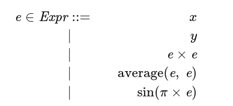
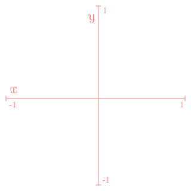
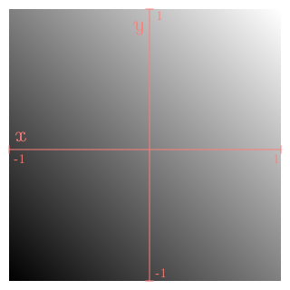
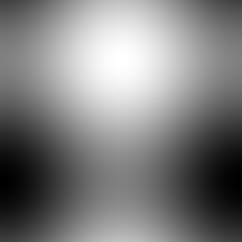
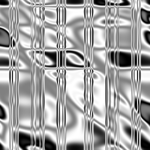

# HW 4: Little Languages (Random Art and Regular Expressions)

This assignment has you build pieces of two **little languages** — small, domain-specific languages, each built for one job. One generates pictures; the other matches patterns in text. The unifying idea, as always, is **programs as structured data** — and you'll lean heavily on laziness along the way. There's also real room for creativity here: part of your grade is literally "make something you think looks cool."

!!! note "How you'll get materials and submit this assignment"
    We're still finalizing the workflow for distributing starter code and collecting submissions for this course. Instructions for both will be posted here once they're ready — for now, this page covers what the assignment actually asks of you.

This assignment (and future ones) asks you to read and understand a lot, in order to write comparatively little code — a common experience in programming-languages work. It's entirely reasonable to finish this assignment with around 50 lines of Haskell total. Getting each of those lines *right* is where the real work is.

## What You'll Do

- Represent a small graphics language as an AST, and write an evaluator for it.
- Generate genuinely interesting pictures by randomly building expressions in that language — and extend the language yourself.
- Implement a lazy, list-based regular-expression matcher — no DFAs or NFAs, just laziness.

## Checklist

- [ ] Get the assignment materials *(details coming soon)*
- [ ] Implement the random-art expression evaluator
- [ ] Implement `build`, to generate interesting random art
- [ ] Add at least three new expression constructors of your own
- [ ] Pick your favorite generated picture (and its expression)
- [ ] Implement lazy regular-expression matching for `Letter`, `Alt`, and `Concat`
- [ ] Turn in the assignment *(details coming soon)*

## Collaboration

You can work with a partner on this assignment — if you do, you must cooperate on *every* part, follow the pair-programming rules from the [syllabus](../syllabus.md) at all times (even while writing prose or math), and share roles equally.

---

## A Note on "Little Languages"

The term comes from a [1986 article](https://dl.acm.org/citation.cfm?id=315691) by Jon Bentley, describing the benefits of what we'd now call **domain-specific languages (DSLs)**: languages built for one specific job rather than general-purpose programming. SQL, MATLAB, and LaTeX are all DSLs you may have already met. Bentley's article centered on `pic`, a little language for drawing diagrams — which happens to be exactly the subject of the *next* two assignments after this one.

---

## Part 1: Random Art

### Background: From Expression to Image

We're going to build pictures out of something unexpected: a numeric expression. Suppose we have two floating-point variables, `x` and `y`, restricted to the range [-1, 1]. Define expressions recursively:

{ width="300" }

Read this as: an expression `e` is either the variable `x` or `y`, the product of two expressions, the average of two expressions, or the sine of `π` times an expression. **Every expression must evaluate to a value in [-1, 1]** — which is exactly why `x` and `y` themselves are restricted to that range too.

Now picture a 2-by-2 coordinate grid, `x` and `y` each ranging over [-1, 1]:

{ width="240" }
<br>*Figure 1: A 2-by-2 coordinate system.*

Evaluate an expression at every point `(x, y)` in that grid, scale the result from [-1, 1] to a grayscale value between 0 (black) and 255 (white), and you get a picture. Here's `average(x, y)`:

{ width="240" }
<br>*Figure 2: The picture generated by `average(x, y)`.*

Simple expressions make simple pictures. More complex expressions make more interesting ones — here's `average(cos(π × x), sin(π × y))`:

{ width="240" }
<br>*Figure 3: `average(cos(π × x), sin(π × y))`.*

For *really* interesting pictures, you want really complex expressions — and rather than writing them by hand, the natural move is to **define a data structure representing expressions, then randomly generate instances of it**. Here's a picture generated from one such randomly-built expression (its actual expression is dozens of nested calls deep — not worth reproducing here):

{ width="240" }
<br>*Figure 4: A picture generated from a randomly-built expression.*

(Color pictures work the same way, just with three expressions — one each for red, green, and blue channels.)

To summarize, generating random art needs: a way to represent expressions, a way to evaluate one at a point, a way to turn a result into a pixel value, a way to do that across an entire grid, a way to render the resulting pixels as an image, and a way to generate interesting random expressions in the first place. Most of this is provided for you — you'll fill in the evaluator, extend the expression language, and fix the random generator.

The implementation uses the [JuicyPixels](https://hackage.haskell.org/package/JuicyPixels-3.2.7/docs/Codec-Picture.html) library for image output — you won't need to use it directly, just have it available (it's already installed on the CS131 server).

The AST for this language:

```haskell
data Exp = X                   -- x's value
         | Y                   -- y's value
         | Times Exp Exp       -- product of e1 and e2
         | Avg   Exp Exp       -- average of e1 and e2
         | SinPi Exp           -- sin (pi * e)
         | CosPi Exp           -- cos (pi * e)
  deriving (Show, Read, Eq, Ord)

type Point = (Float, Float)
```

### Evaluating Expressions (25 points)

```haskell
eval :: Exp -> Point -> Float
```

**Your task:** complete `eval` in `RandomArtEvaluation.hs`.

!!! tip
    Run `ghci` for this assignment as `ghci -fobject-code` — that compiles the code you're using interactively instead of interpreting it, which matters a lot for an assignment this compute-intensive.

!!! example
    ```
    DOCKER > cd randomart
    DOCKER /randomart > ghci -fobject-code
    Prelude> :l RandomArt
    Prelude Main> eval X (1, 0)
    ```
    Expected output: `1.0`.

You can also generate the actual Figure 4 picture as a sanity check:

```
Prelude Main> toPNGgray "test" 300 (eval sampleExp)
```

which should produce a `test.png` matching Figure 4 above. **Make sure you `cd` into the `randomart` directory before testing** — it's easy to forget, since each part of this assignment lives in its own subdirectory.

**Testing:** from the `randomart` directory, `runhaskell -itest test/EvaluationSpec.hs`.

### A Note on Laziness

You'll be working with infinite lists in this part of the assignment — if it's been a while, it's worth a quick review of [lazy lists](../modules/03.1-lists-tuples-pattern-matching-and-parameterized-types.md#lists-are-lazy-too) from Module 03.1.

### Generating Random Art (30 points)

Compile and run the random-art program (see the comments at the top of `RandomArt.hs`), and you'll get a boring picture — `build` is supposed to generate interesting random expressions, but doesn't yet.

```haskell
build :: Int -> RandomFloats -> Exp
```

**Your task:** fix `build`. Its first argument is a maximum nesting depth; its second is an infinite list of random floats between 0.0 and 1.0.

A few tips:

- Giving every expression kind equal probability tends to produce mostly `X`, `Y`, or tiny expressions like `Times X Y` — small expressions make boring pictures, so you need to actively discourage them.
- Think about how to use the depth bound and the random numbers together to *push toward* deep, nested expressions rather than shallow ones.
- `splitRandomFloats` is provided to give you multiple independent streams of random numbers, useful when an operation needs more than one.

Don't expect every generated picture to be a masterpiece — looking through 100 pictures and finding 90 mediocre, 9 okay, and 1 genuinely striking is a completely normal outcome.

**Testing:** load the code with `ghci -fobject-code` then `:load RandomArt`, and try something like:

```haskell
sequence_ [doGray 300 seed depth | seed <- [100..115], depth <- [4..10]]
```

which generates 112 grayscale pictures (plus matching `.txt` files with the expressions that made them) — plenty to get a feel for whether depth is helping. You don't have to wait for the whole batch to finish before looking at results as they appear.

### Enhance the Expressiveness of Your Language (25 points)

Now make it yours: **add at least three new constructors** to `Exp`, and update `build` and `eval` to match.

A few guidelines:

- At least one new constructor must take **three** subexpressions.
- Every new expression must still produce a value in [-1, 1] given inputs in [-1, 1] — watch out for floating-point imprecision pushing you just outside the range even when the math looks safe on paper.
- Aim for genuinely different ideas, not simple variants of what's already there (e.g. `(e+e+e)/3` or `sin(2π×e)` don't count as new ideas). Your new expressions don't need to be complicated — "does something visually interesting" is the actual bar.
- Generate a lot of pictures with your new expressions to see whether they're actually making a difference. Iterate if the first idea doesn't move the needle.

**Testing:** from the `randomart` directory, `runhaskell -itest test/StructureSpec.hs` (these tests can't fully judge subjective/creative qualities — see below for more on that).

### Additional Commentary and Helpful Hints

**Is `build` "interesting"?** Roughly, the autograder checks that: different seeds produce different depth-10 trees, average depth is at least 2/3 of the maximum, the maximum depth bound is respected (or nearly so), and all outputs land in [-1, 1].

**Visualizing an expression directly** can help you debug, beyond just generating whole pictures:

```haskell
plotOneArg SinPi
plotTwoArg Avg
```

(There's also a `plotThreeArg`, for once you've added a three-argument constructor of your own.) Or, as a histogram:

```haskell
histoOneArg SinPi
```

If a histogram shows `<<<` or `>>>`, your function is producing out-of-range values — a bug. If some output values never appear at all (other than possibly zero), your function may have a design flaw worth reconsidering.

**On creativity:** we're happy to accept a wide range of ideas, as long as your new expressions stay in range, aren't just recombinations of the existing four, and spread their output across the range rather than clustering. A good-faith attempt should be enough.

If you want to see where this idea goes with real sophistication, [random-art.org](https://www.random-art.org/) represents expressions as directed graphs rather than trees — worth a look after you're done.

### Submit Your Favorite Picture (15 points)

Once everything's working, generate a bunch of pictures and pick **exactly one** favorite (if you're working with a partner, each of you picks your own). You'll submit both the image and the `.txt` file containing the expression(s) that generated it — submission details are covered above.

---

## Part 2: Regular Expressions

### Background: Regular Expressions

A **regular expression** (regexp) is a pattern that describes a set of strings. `a*`, for example, describes every string of zero or more `a`s: `{"", "a", "aa", "aaa", ...}`.

More formally, given an alphabet `Σ` of characters:

- The **empty string** `ε` is a regexp, matching only the empty string.
- Any **single character** in `Σ` is a regexp, matching only that character.
- **`.`** is a regexp matching *any* character.
- If `e1` and `e2` are regexps, `e1 | e2` is a regexp — **alternation** — matching anything `e1` matches, or `e2` matches, or both.
- If `e1` and `e2` are regexps, `e1 · e2` is a regexp — **concatenation** — matching a string that starts with a match for `e1`, immediately followed by a match for `e2`.
- If `e` is a regexp, `e*` is a regexp — **repetition** — zero or more concatenations of matches for `e`.

A match is successful if some (possibly empty) *prefix* of the input string matches. So `a` matches `aaab` (which starts with `a`) but not `baaa` (which doesn't). And `a*` matches `aaab` in multiple ways at once — `""`, `a`, `aa`, and `aaa` are all valid prefix matches, since each represents some number of leading `a`s.

We'll come back to many of these same ideas when this course covers parsing, in Module 6.

### Lazy Regular-Expression Matching (30 points)

Most regex engines use finite automata (DFAs or NFAs) under the hood. This one doesn't — it leans entirely on Haskell's laziness instead.

The provided `regex` directory has a partial implementation. The AST (which you won't modify) and the test cases are both worth reading closely before you start. A few pointers on the evaluator:

- The main function is `rexpMatches`, which takes a `RegExp` pattern and a `Text` string, and returns every possible match found at the start of the text.
- You'll complete the cases for **`Letter`**, **`Alt`**, and **`Concat`**.
- `rexpMatch` (singular) builds on `rexpMatches` to return just the first match, wrapped in `Maybe` — you'll learn more about `Just`/`Nothing` in Module 7, so don't worry about the details there yet.
- The helper `prependAllMatches` will likely be useful for building `rexpMatches`.

**Your task:** in `RegexEvaluation.hs`, complete `rexpMatches` for these three cases.

#### `Letter`

Matches exactly one character.

!!! example
    ```
    DOCKER > cd regex
    DOCKER /regex > ghci
    Prelude> :l RegexEvaluation
    *RegexEvaluation> rexpMatches (Letter 'a') "aaab"
    ```
    Expected output: `[("a","aab")]` — the match, and what's left over. `("aa","ab")` would *not* be valid, since `Letter` only ever matches a single character.

    ```
    *RegexEvaluation> rexpMatches (Letter 'a') "baaa"
    ```
    Expected output: `[]` — `Letter 'a'` only matches at the very start of the string, and `"baaa"` doesn't start with `'a'`.

#### `Alt`

Matches anything either of two given regexps matches.

!!! example
    ```
    *RegexEvaluation> rexpMatches (Alt (Letter 'a') (Letter 'b')) "ab"
    ```
    Expected output: `[("a","b")]` — the first character matches `Letter 'a'`; `Alt` doesn't go on to also try matching `'b'` afterward, since it means *or*, not *then*.

    ```
    *RegexEvaluation> rexpMatches (Alt (Star (Letter 'a')) (Letter 'b')) "aab"
    ```
    Expected output: `[("aa","b"),("a","ab"),("","aab")]` — three separate matches from the `Star (Letter 'a')` side (matching zero, one, or two leading `a`s), and none from the `Letter 'b'` side, since `"aab"` doesn't start with `b`.

    ```
    *RegexEvaluation> rexpMatches (Alt (Star (Letter 'a')) (Letter 'b')) "b"
    ```
    Expected output: `[("","b"),("b","")]` — `Star (Letter 'a')` matches the empty prefix (zero `a`s is always valid), and `Letter 'b'` matches the whole string.

#### `Concat`

Matches a string that starts with a match for the first regexp, immediately followed by a match for the second.

*Hint: `concatMap` is worth knowing for this one.*

!!! example
    ```
    *RegexEvaluation> rexpMatches (Concat (Letter 'a') (Letter 'b')) "ab"
    ```
    Expected output: `[("ab","")]`.

    ```
    *RegexEvaluation> rexpMatches (Concat (Star (Letter 'a')) (Letter 'b')) "aaa"
    ```
    Expected output: `[]` — `Star (Letter 'a')` happily matches the leading `a`s, but there's no `'b'` left over afterward for the second half of the `Concat` to match.

**Testing:** from the `regex` directory, `runhaskell -itest test/EvaluationSpec.hs`.

---

## Turning It In

!!! note "Coming soon"
    Instructions for submitting HW4 will be posted here once the new submission system is ready.

Before then: double-check you've completed *both* parts (Random Art and Regular Expressions) — it's easy to finish one and forget the other lives in a separate directory.
