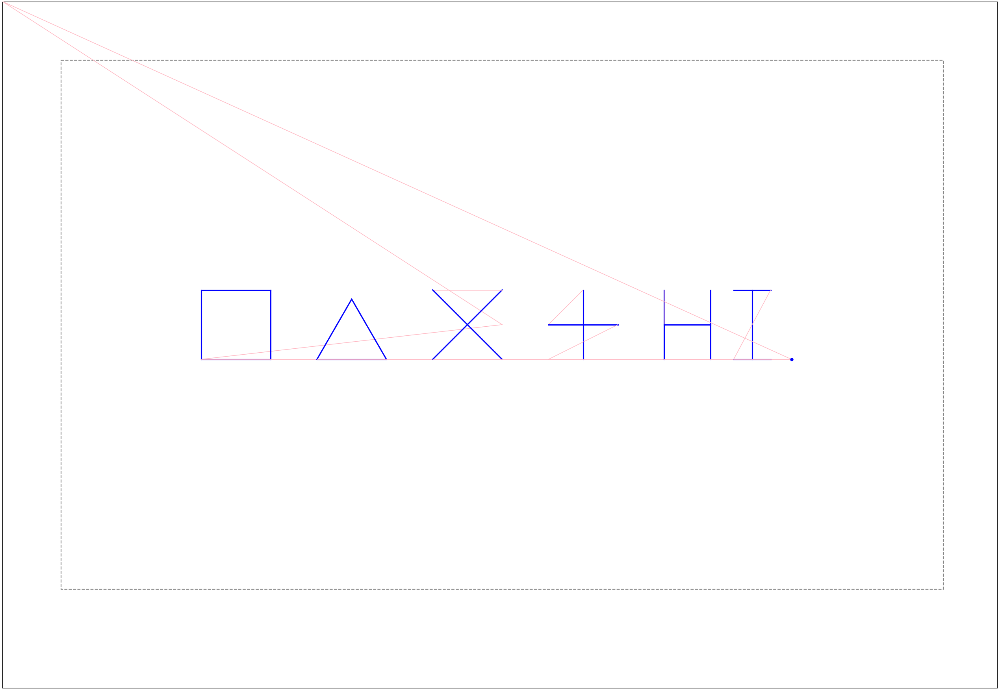

# Lab 5: Two Ways to Draw: Plotter Python and piq

In this course we build a compiler for **piq**, a small drawing language for a pen plotter. The compiler translates a piq program into a **Python** program made of just five low-level plotter commands. In this lab you'll use **both** languages and compare them: first the target language, raw plotter Python, then the source language, piq — looking at the Python the compiler makes from piq programs, and extending a drawing using piq's loops and procedures. Both parts draw the **same stick person**, so you can see how much work each language takes.

You don't need a plotter. Every drawing is saved as a **preview picture (PNG)**. About 50 minutes in all.

## Objectives

- Run and modify low-level plotter-Python programs built from five primitive commands.
- Run, read, and extend programs in `piq`, a small drawing language that compiles to that Python.
- Compare compiler-generated Python to hand-written Python for the same drawing.
- See firsthand what a small language and its compiler buy you over programming directly against the low-level target.

!!! note "How you'll get the starter code"
    The starter code is a small public repository, [`hmc-cs-131-fa-2026/piq-lab`](https://github.com/hmc-cs-131-fa-2026/piq-lab), containing everything for both parts of this lab. On the course server, clone it directly — no need to make your own copy first:

    ```bash
    cd cs131
    git clone https://github.com/hmc-cs-131-fa-2026/piq-lab.git
    cd piq-lab
    ```

    **Run every command below from this `piq-lab` folder.**

    See [Connecting to the Server with VS Code](../how-to/connecting-with-vscode.md) if you haven't gotten to a terminal on the server yet.

!!! note "Gradescope"
    As you work, keep notes in `answers.md` — its headings match the corresponding Gradescope questions below. When you're done, paste your answers into the **Lab 05** assignment on Gradescope and upload the pictures and code files it asks for. The [What to Submit](#what-to-submit) table at the end of this page lists everything.

    Boxes labeled **Gradescope question** need a submitted answer. Boxes labeled **Things to notice** don't — they're just there to point your attention at something.

## Setup

In this lab you'll use three tools, already installed on the server:

| Usage | What it does |
|---|---|
| `py2png <file.py> [-o <output.png>]` | Runs a plotter **Python** program on a pretend plotter and saves the drawing as a PNG picture (by default next to the `.py`, with the same name) |
| `piq2png <file.piq> [-o <output.png>]` | Compiles a **piq** program to Python (a `.py` next to it), then draws it as a PNG |
| `piq2py <file.piq> [-o <output.py>]` | Only compiles: writes the Python program, so you can read it |

**Don't run these yet.** We'll introduce them one at a time below, as you get to know the Python target language and piq.

To look at a PNG, open it in your editor (VS Code shows images), or copy it to your own computer.

### Reading a Preview

Here is the preview of the simple-shapes program you'll run in Part 1:



In the preview, **blue** paths are motions with the pen **down** — the marks that would appear on paper. **Pink** paths show motion with the pen **up**: the plotter still has to physically travel along these paths, but it doesn't draw them.

- The two long **pink** lines to the top-left corner are the trip from the plotter's home corner to the centre of the paper at the start, and back home at the end.
- The **grey dashed box** is the **safe area**: the pen must stay at least 1 inch from the edges of the 17 × 11 inch paper. Anything that goes outside it is drawn in **red**, with a warning. The real plotter refuses to draw such a drawing at all.
- **Units are millimetres.** **x points right, y points up.** Drawing starts at the **centre** of the paper. The safe area is **190.5 mm left/right and 114.3 mm up/down** of the centre.

---

## Part 1: The Target Language (about 20 minutes)

### The Five Commands

| Command | Meaning |
|---|---|
| `start()` | Start a drawing. The pen is **up**, at the **centre of the paper**. |
| `pen_up()` | Lift the pen. Moves after this do **not** draw. |
| `pen_down()` | Lower the pen. Moves after this **do** draw. |
| `move_rel(dx, dy)` | Move `dx` mm right and `dy` mm up **from where the pen is now**. Negative numbers go left or down. |
| `finish()` | Check that the whole drawing stays in the safe area, draw it, then lift the pen and go home. |

A **dot** is `pen_down()` followed straight away by `pen_up()`.

Every program has the same outline. The commands between `start()` and `finish()` are only **recorded**; `finish()` checks the whole drawing and then draws it. The `try`/`finally` makes sure `finish()` runs even if the drawing code crashes (then the real plotter draws nothing, and a preview shows what was recorded):

```python
import sys
sys.path.insert(0, "/opt/piq/python")     # where the plotter commands live on the server
from plotter_runtime import start, finish, pen_up, pen_down, move_rel

start()
try:
    ...drawing commands...
finally:
    finish()
```

**Moves are relative.** `move_rel(10, 0)` means "10 mm to the right of wherever the pen is now," not "go to x = 10." So every line's effect depends on all the lines before it. The programs below use one rule to stay sane: each shape **starts and ends at its anchor point**, with the pen up.

**Before each change below, write your prediction in `answers.md`. Then run it and check.** A wrong prediction that you then explain is worth as much as a right one.

### 1.1 Run It

Open `part1/shapes.py` and read it. Then run:

```bash
py2png part1/shapes.py
```

and open `part1/shapes.png`. You should see, left to right: a square, a triangle, an X, a plus sign, the letters "HI," and a dot.

!!! note "Things to notice"
    1. Skim `part1/shapes.py` and compare how many `pen_down()` calls you see with how many shapes appear in the preview. You don't need to count carefully — just notice how the shapes you see relate to the low-level pen operations that draw them.
    2. Think about why drawing the **X** requires lifting the pen between its two diagonal strokes, while drawing the square doesn't require lifting the pen between its four sides.

### 1.2 One Number, Everywhere

In `part1/shapes.py`, change **only** the square's last stroke, `move_rel(0.0, -30.0)`, to `move_rel(0.0, -40.0)`.

- **Predict first:** what happens to the square? What happens to **every shape after it**?
- Run `py2png part1/shapes.py` again and check.
- **Save this picture for Gradescope:** `cp part1/shapes.png part1/shapes_1_2.png`. Then change the line back to `-30.0`.

!!! question "Gradescope: 1.2 — one number, everywhere"
    Submit your prediction, what actually happened, and in one or two sentences, why one number changed the whole rest of the drawing.

### 1.3 Bug Hunt: The Missing `pen_up()`

In the X block, delete the `pen_up()` on the line right after the **first diagonal**.

- **Predict first:** what extra line will appear, and exactly where?
- Run it and check. Then put the `pen_up()` back.

!!! question "Gradescope: 1.3 — bug hunt"
    Submit your prediction and what happened.

A missing `pen_up()` is the most common plotter bug. On paper, that line can't be erased!

### 1.4 Dress Up the Stick Person

Run `py2png part1/stick_person.py` and look at the picture. Read the code: each body part starts and ends at the **neck** (the middle of the bottom of the head).

Work in a copy, so the original stays unchanged for Part 2:

```bash
cp part1/stick_person.py part1/dressed.py
```

In `part1/dressed.py`, fill in the two sections marked `# === TODO (1.4)` at the end of the drawing (just above `finally:`), using only the five commands. The same instructions are in the comments there:

1. **A hat:** a **brim**, a 40 mm horizontal line lying on top of the head, centred, plus a **crown**, a 20 mm wide, 15 mm tall box standing on the middle of the brim.
2. **A face:** two **eyes** (dots) 20 mm above the neck and 7 mm to either side, and a **mouth**, a 12 mm horizontal line 8 mm above the neck, centred.

Here the top of the head is 30 mm above the neck, and the head is 30 mm wide.

Tips: sketch it first, and label each move with its `(dx, dy)`. Do the hat, run `py2png part1/dressed.py`, then do the face, and run it again. End each part back at the neck with the pen up. Comments (`# …`) help.

!!! question "Gradescope: 1.4 — dress up the stick person"
    Submit how many lines of code you added (don't count blank lines or comments), plus `part1/dressed.py` and `part1/dressed.png`.

---

## Part 2: piq (about 25 minutes)

### piq in One Table

| piq | Meaning |
|---|---|
| `square 30` | A 30 × 30 square **centred on the pen**. The pen ends where it started. |
| `rectangle 40 20` | A 40 wide, 20 tall rectangle, centred on the pen |
| `circle 15` | A circle of **radius** 15, centred on the pen |
| `dot` | A dot where the pen is |
| `line right 20` | Draw a line 20 mm to the right. The pen **ends at the far end.** Directions: `left`, `right`, `up`, `down`. |
| `move up 10` | Travel 10 mm up **without** drawing |
| `x = 20` | Set a variable. Expressions use `+ - * /` and parentheses, e.g. `square x * 2 + 5`. |
| `for i from 1 to 4 { … }` | Repeat the block with `i` = 1, 2, 3, 4 |
| `define box(s) { … }` | Define a procedure with a parameter `s` (definitions go **first** in the file) |
| `box(20)` | Call it |

Also worth knowing:

- The pen is up between statements, and all shapes return to where they started.
- Lines and moves can only go left, right, up, or down. **piq has no diagonal lines.**
- Spacing and newlines don't matter, and piq has **no comments**.
- If a program has a mistake, `piq2png` prints an error with a line and column number, like `error: part2/shapes.piq:3:3 -- …`. The problem is at that spot or just before it. No picture is made.

### 2.1 Run It, and Look at What the Compiler Made

Read `part2/shapes.piq`, then run:

```bash
piq2png part2/shapes.piq
```

and open `part2/shapes.png`. Then open the Python file the compiler wrote, `part2/shapes.py`. It uses the same five commands you used in Part 1.

!!! question "Gradescope: 2.1a — the right-most shape"
    Which lines of `shapes.piq` drew the right-most shape?

!!! question "Gradescope: 2.1b — the for loop"
    Find the `for` loop in `shapes.piq`, then look through `shapes.py`. Is there a Python `for` loop that corresponds to it? What did the compiler do instead?

!!! question "Gradescope: 2.1c — counting lines"
    Count the lines of the piq program and of the Python the compiler made from it:

    ```bash
    wc -l part2/shapes.piq part2/shapes.py
    ```

    How many lines does each file have?

!!! question "Gradescope: 2.1d — finding the circle"
    Find the Python for `circle 15`. Hint: it comes right after the rectangle's code. Look for `move_rel(15.0, 0.0)` (the pen travels out to the circle's edge), then `pen_down()`, then a long run of `move_rel` calls with long decimal numbers. Approximately how many `move_rel(...)` calls draw this one circle?

### 2.2 Predict, Then Change

Make each change, predict what will happen, and run `piq2png part2/shapes.piq` after each.

!!! note "Things to notice"
    - **(a)** Change the loop to `for i from 1 to 8 {` and its body to `square i * 5`. Run it and notice what the right-most shape looks like now. Is it bigger, smaller, or the same size overall? Make sure you can see why.
    - **(b)** In the `flower` procedure, change the last line, `move up 3 * r`, to `move up 2 * r`. Run it and notice which shapes move, and in which direction. Confirm for yourself which question from Part 1 this is like. Afterwards, change it back.

### 2.3 The Same Stick Person, in piq

Run `piq2png part2/stick_person.piq`. It draws **exactly the same** stick person as `part1/stick_person.py` (the original, without your hat and face).

First count the lines of each file:

```bash
wc -l part1/stick_person.py part2/stick_person.piq part2/stick_person.py
```

(The hand-written Python has lots of comments, so the plotter commands are a fairer comparison.) The compiled `part2/stick_person.py` and the hand-written `part1/stick_person.py` draw the same picture. Count the plotter commands in each:

```bash
grep -cE 'pen_up|pen_down|move_rel' part1/stick_person.py part2/stick_person.py
```

!!! question "Gradescope: 2.3a — comparing the versions"
    Which one uses more plotter commands? Look inside the compiled file: where do the extra commands come from?

### 2.4 Extend the Drawing

Now you'll grow the piq stick person into a scene. Work in a copy, `part2/scene.piq`:

```bash
cp part2/stick_person.piq part2/scene.piq
```

and run `piq2png part2/scene.piq` often to preview your work.

**2.4a Finish the person.** Give the person a **face** and a **hat**. They're up to you, though reusing the sizes from 1.4 makes the comparison in Reflection question 1 fairer. Preview it.

!!! question "Gradescope: 2.4a — finishing the person"
    Submit how many lines of piq you added for the hat and face.

**2.4b Make it a procedure.** Define a procedure with no parameters:

```text
define person() {
    ...
}
```

Move the code that draws **one** person, including your hat and face, into the body of `person()`. Then, below the definition, call it:

```text
person()
```

and preview it: you should see the same single person as before.

!!! note "Procedure definitions must appear first"
    **Procedure definitions must appear at the top of a piq program, before the ordinary statements that run the drawing.** A `define` after a statement is an error.

**2.4c A crowd.** Use a `for` loop to draw **several people** side by side. Inside the loop: call `person()`, then move some distance to the right, then the loop repeats. Hints:

- A procedure is only easy to repeat if it **ends where it started**. `stick_person.piq` starts by moving up to the neck and ends at the neck. What must you add or remove so that `person()` ends where it began?
- About 90 mm between people keeps their arms and hats from overlapping.
- Move left before the loop, so the group ends up centred. If anything turns red in the preview, it's outside the safe area.

Preview the group of people.

**2.4d Add one thing of your own.** Add at least **one other thing** to the drawing besides the people. That's the only requirement. It can be anything reasonable, for example:

- a sun or clouds;
- the ground, a tree, or a house;
- circles or other decoration, or a pattern;
- another style of person, or another repeated object;
- something completely different.

You may use another procedure, a loop, variables, arithmetic, shapes, or lines, but none of these is required. Experiment! Just keep everything inside the safe area (no red in the preview).

!!! question "Gradescope: 2.4 — the scene"
    Submit `part2/scene.piq` and `part2/scene.png`.

---

## Reflection (5 minutes)

!!! question "Gradescope: reflection"
    Answer each of the following in 2–4 sentences:

    1. For the hat and face, how many lines did Python (1.4) and piq (2.4a) each take? Why was the difference small there, but huge for the crowd and for circles? Use numbers from `wc -l`, or from `grep -c move_rel`, to support your answer.
    2. Name two things the piq compiler does for you that you had to do by hand in Part 1.
    3. What's one feature you would add to piq, and why? (For example: diagonal lines, comments, a "go back to the start" command, colours, …)

---

## What to Submit

Upload to Gradescope:

| Question | Submit |
|---|---|
| 1.2–1.3 | Your answers, and `part1/shapes_1_2.png` |
| 1.4 | Your line count, `part1/dressed.py`, and `part1/dressed.png` |
| 2.1a–2.1d | Your answers |
| 2.3a | Your answer |
| 2.4 | Your line count (2.4a), `part2/scene.piq`, and `part2/scene.png` |
| Reflection | Your answers |

---

!!! note "Optional: on the real plotter"
    Your instructor may plot some of the best scenes on the real NextDraw plotter. The Python the compiler writes is exactly what drives it, so a drawing that looks right in the preview is what ends up on paper, pink travel and all.
