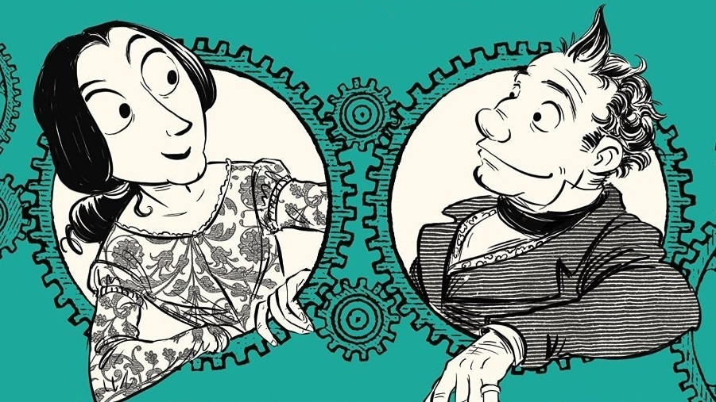

# Module 01.1: Welcome to Programming Languages

Welcome! This module sets the stage for the whole semester. We're not going to teach you syntax yet — instead, we want to zoom out and ask some bigger questions: *What is a programming language, really? Where did this whole idea come from? And why does it matter who designs them?*

By the end of this module, you'll have met the three big ideas that run through the entire course:

- **Functions. Are. Awesome.** Functional programming gives you a genuinely new way to think about computation.
- **Programs = Data.** A program isn't just instructions for a computer — it's a piece of data you can build, take apart, and transform, just like a number or a string.
- **Programming languages are all about people.** Languages are designed by people, for people, and that shapes everything from syntax to who gets to participate in computing.

Keep those three threads in mind — you'll see them again and again.

---

## What Even *Is* a Programming Language?

Before we tell you anything, we want to hear from you.

!!! question "Think about it"
    On your own, try to write a definition of the term "programming language" that you think *everyone* would agree with.

    Can't find one everyone would agree with? That's fine — instead, write a definition you agree with, but that you suspect others might push back on.

We're asking on purpose, not to be coy. Programming languages are a surprisingly slippery thing to define, and part of what this course does is let that definition get richer as the semester goes on. (You'll get another crack at this in HW1.)

---

## A Little History (and Herstory)

!!! note "Image credit"
    The illustrations in this section are panels from Sydney Padua's graphic novel [*The Thrilling Adventures of Lovelace and Babbage: The (Mostly) True Story of the First Computer*](https://www.penguinrandomhouse.com/books/223672/the-thrilling-adventures-of-lovelace-and-babbage-by-sydney-padua/), used here for educational purposes. It's a wonderful, historically-researched, and very funny read — highly recommended if this section grabs you.

### When "Computer" Meant a Person

It's easy to forget, but the word *computer* didn't always mean a machine. In the 1800s, "computers" were **people** — usually working in teams — whose job was to compute tables of numbers by hand: logarithms, planetary positions, trigonometric functions. It was slow, tedious, and, crucially, *error-prone*.

Charles Babbage, an English mathematician and engineer, looked at this process and thought: this is a mechanical process, so why not build a machine to do it?

{ width="360" }
<br>*Tables like this one used to be computed by teams of human "computers," by hand.*

### Babbage's Engines

Babbage designed (though never fully built in his lifetime) two remarkable machines:

- The **Difference Engine** — a mechanical calculator purpose-built to compute polynomial tables, automating exactly the kind of tedious, error-prone work human computers had been doing.
- The **Analytical Engine** — a much bigger idea. This wasn't just a calculator: it had a way to store data, branch based on conditions, and loop. In other words, it was a *general-purpose* mechanical computer, a century before electronic computers existed.

Babbage's own energy stayed close to the machine itself — the gears, the mechanics, the nuts and bolts of making the thing actually run. (If you've taken, or will take, a systems or hardware-focused course, that down-in-the-weeds feeling is the same one.) Lovelace, as you're about to see, was drawn to the more abstract, mathematical side of the very same project — much closer to the kind of thinking this course is built around. Neither mindset is more important than the other; they're two sides of the same coin.

{ width="320" }
<br>*Ada Lovelace, examining the Analytical Engine.*

### Ada Lovelace: The First Programmer

Ada Lovelace, a mathematician who corresponded with Babbage, saw something in the Analytical Engine that Babbage himself hadn't fully articulated: it didn't have to be limited to *numbers*. If you could represent something else — words, music, symbols of any kind — as data the engine could manipulate, then the engine could operate on *that*, too. Babbage had started out thinking about computing tables and solving difference equations; Lovelace immediately saw further — that the same machine could, in principle, numerically solve much harder problems, like higher-order partial differential equations.

{ width="320" }
<br>*"The bounds of arithmetic have been overstepped!"*

That single insight — that a computing machine could manipulate more than just numbers — is a direct ancestor of everything in this course. Lovelace went on to write what's widely considered the first published algorithm intended to be run on a machine (a method for computing Bernoulli numbers on the Analytical Engine), which is why she's often called the first computer programmer.

{ width="480" }
<br>*Ada Lovelace ("our mathematician") and Charles Babbage ("our engineer").*

!!! question "Think about it"
    Do you find yourself identifying more with Lovelace's abstract, "what *could* this represent" mindset, or Babbage's engineering, "how do I actually build this" mindset? Neither is better — but which one is more natural to you?

If you want the full story — and it's a great one — Padua's book is a nice weekend read (see the credit above for a link).

---

## Could We Compute *Everything*?

Lovelace and Babbage's insight — that a machine could manipulate symbols, not just numbers — raises an enormous question: is there a *limit* to what can be computed? People had been circling this question long before anyone built a computer.

- **Gottfried Leibniz** (1600s) dreamed of an "alphabet of human thought" — some universal symbolic system that could represent any idea.
- **John Locke** (1600s) argued that thinking itself was really about combination, relation, and abstraction of ideas — which sounds a lot like data manipulation.
- **George Boole** (1800s) wrote *An Investigation of the Laws of Thought*, giving logic an algebra of its own — the Boolean algebra you'll recognize from `and`, `or`, and `not`.

By the early 1900s, this had crystallized into a very sharp question: **what can we know, prove, and compute?**

> "We must know. We will know."
> — David Hilbert

Hilbert believed that, in principle, every precise mathematical statement should be provably true or provably false. It's a beautiful, optimistic claim. It's also wrong.

> "No."
> — Kurt Gödel

Gödel's incompleteness theorems showed that any sufficiently powerful formal system contains statements that are true but can never be proven within that system. Here's the flavor of how: take the sentence *"this statement is false."* Suppose it's true — then, by what it says of itself, it must be false. Suppose instead it's false — then it must be true. Either way you land in a contradiction; the sentence can be neither true nor false. Gödel's actual proof is far more careful than this (you may see the full details in a later course), but the core trick is exactly this one: he found a way to encode a self-referential sentence like this directly into mathematics itself.

Around the same time, two more "no"s arrived, from two people whose names you'll hear constantly this semester — each finding their own way to build the same kind of self-reference into a different system entirely:

> "No." — Alonzo Church
> "No." — Alan Turing

### Turing Machines

Alan Turing proposed a simple abstract machine — a **Turing machine** — as a model of computation: a tape, a read/write head, and a table of rules for what to do based on the current state and symbol. In 1936, Turing showed that there's no general procedure that can determine whether an arbitrary Turing machine will ever finish running (the *halting problem*). Notice how *engineering-minded* this approach is — it's a machine, built out of concrete steps. Very Babbage.

### Lambda Calculus

Around the same time, Alonzo Church introduced the **lambda calculus** — a formal system for manipulating symbols, built entirely around *functions*. Church showed, independently, that there's no general algorithm to determine whether two lambda expressions are equivalent. Notice how *mathematical* this approach is — no machine, no state, just symbols and functions. Very Lovelace.

### The Same Idea, Twice

Here's the remarkable part: **Turing machines and the lambda calculus turn out to be equally powerful.** You can write a lambda calculus interpreter using a Turing machine, and you can simulate a Turing machine using the lambda calculus. Anything one can compute, the other can compute too. This observation — that two very different-looking systems are secretly "the same" in an important sense — is called the **Church-Turing thesis**, and it's the working definition computer scientists use for "computable."

This kind of move — finding that two seemingly unrelated things are secretly equivalent — turns out to be one of the most powerful moves in all of mathematics and computer science. Graph theory and linear algebra turn out to have deep connections. Logic and type theory turn out to have deep connections (you'll see this again later in the course!). Finding the "sameness" between two systems often reveals the true essence of an idea.

---

## Up and Down the Ladder of Abstraction

Programming languages live at many different "altitudes." Some are very close to the machine and very stateful (think: flipping bits). Others are very close to pure mathematics and involve no state at all (think: evaluating an expression). As you go through this course, it helps to know where a language sits on this ladder.

| Rung | What it looks like | Example(s) |
|---|---|---|
| Lambda calculus | Only anonymous functions — nothing else | `(λx. x) (λy. y)` |
| Pure functional languages | No mutable state at all | Haskell |
| Functional languages | Functions are data too | Racket |
| Higher-level languages | No manual memory management | Python |
| Imperative languages | Manual memory management | C, C++ |
| Assembly language | Direct machine instructions | HMMM, x86 |
| von Neumann architecture | The hardware model most computers are built on | — |
| Turing machine | Extremely simple, low-level, very stateful | — |

Roughly speaking: **the further up the ladder, the more mathematical and abstract; the further down, the more stateful and engineering-flavored.** It's also, roughly, a timeline — the ideas at the bottom came first historically, and the ideas at the top are comparatively recent. This course spends most of its time in the upper half of the ladder, because that's where you learn to think about computation in genuinely new ways.

---

## So, What Even *Is* CS 131?

A fair question! Here's what CS 131 is **not**: it's not a "one new language every week" survey course. You will not spend week 1 on Haskell, week 2 on C#, week 3 on F#, and so on down a long list of languages, briefly touching syntax and moving on.

!!! question "Think about it"
    Why might learning a new *language* every single week be a bad way to actually learn about programming *languages* as a subject?

One good reason: that kind of course goes stale fast. Pull up a list of "must-know" languages from about 30 years ago, and most of the names have quietly vanished from everyday use — C is still going strong, and "C with classes" grew up into C++, but the rest of the list has mostly faded from modern development. A course chasing whichever languages happen to be popular *this year* is a course that expires. Ideas outlast any particular language's popularity.

Instead, this course teaches you a set of durable *ideas* — ideas that show up across many languages — using one language, **Haskell**, as the vehicle to explore them. This is *not* a Haskell class. Haskell is just an unusually good tool for seeing these ideas clearly, because it strips away a lot of incidental complexity (no mutable state to track, no manual memory management, no null pointers) so the underlying concepts are easier to see.

Here are the ideas — the "bumper stickers" for the semester:

- **Functional programming** — functions are data too!
- **Pattern matching** — using the structure of data for fun and profit
- **Representing data** — functional-style data structures
- **Parsing** — turning characters into programs (it's not im*parsable*!)
- **Interpreters** — turning programs into computation
- **Abstraction** — doing more with less code
- **Types** — computing the right "kind" of thing
- **Lambda calculus** — functions are all you need
- **peoPLe** — programming languages, by people, for people

### Why Functional Programming, Specifically?

A few reasons this is worth your time, beyond "it's on the syllabus":

- There's no mutable state to track, which forces (and rewards!) a genuinely different way of thinking about problems.
- It complements what you likely already know from object-oriented and imperative programming, assembly, and the web.
- It's increasingly showing up in industry, especially in correctness-critical domains like security and finance.
- Mainstream languages keep adding functional features — C++, Java, and Python have all borrowed heavily from functional programming, and frameworks like React and Redux lean on the "no shared state" idea directly.

---

## Programs = Data

Here's the "secret sauce" that ties Gödel, Church, and Turing's ideas back to something you can use directly: **there is no fundamental difference between programs and data.**

Look back at what each of them actually built. Gödel used logic to write *theorems that reason about other theorems*. Church used the lambda calculus to write *functions that take other functions as arguments*. Turing used his machines to write *machines that take other machines as input*. Theorems about theorems, functions about functions, machines about machines — three different fields, converging on the same move: **self-reference**. Today we'd collapse all three into a single sentence: there's no real difference between the thing you're reasoning about and the thing doing the reasoning. That observation was devastating for Hilbert's dream of a fully provable mathematics — and it's also the exact insight that gave rise to computer science as we now know it.

That might sound abstract, so here's a version you already believe. Open an app store on your phone and download something: for a moment, it just sits there as a file — data, plain and simple. Tap it open, and that same data becomes a running program. Same bytes; two different roles, depending on what you do with them.

Let's make it concrete with actual code, building up in two steps. First, a simple word-counting program: it takes a file as input, counts the words, and prints the number. Feed it the sentence *"There is no difference between programs and data,"* and it prints `8` — nothing mysterious yet, just a program operating on ordinary text data. Now consider a tiny arithmetic program:

```
1 + (2 * 3)
```

If you type that into a calculator, or into Python, something takes that program as input and produces `7` as output. We call that something an **interpreter** — it takes a program and *runs* it.

There's another option, too: a **compiler** takes a program as input and produces *another program* as output (possibly in a different language) — for example, `clang` takes C++ source code and produces an assembly-language program.

!!! question "Think about it"
    What's the essential difference between an interpreter and a compiler?

    ??? note "One way to put it"
        Both take a program as input. An interpreter *runs* the input program directly. A compiler *translates* the input program into another program, which can then be run separately.

### How Do We Represent a Program as Data?

If we want to write programs that take other programs as input (like a compiler or interpreter does), we need some way to represent a program *as data*. There are (at least) two natural options for our example `1 + (2 * 3)`:

**Option 1: A string.** Just the literal list of characters:

```
"1+(2*3)"
```

**Option 2: A tree.** A structure whose nodes are values and operations:

```
        +
       / \
      1   *
         / \
        2   3
```

!!! question "Think about it"
    What are the pros and cons of representing a program as a string versus as a tree? (Hint: think about how easy each representation is to *check for correctness*, and how easy each is to *operate on*.)

You'll spend real time with both representations later in the course — strings when you write a parser, and trees (usually called *abstract syntax trees*, or ASTs) pretty much everywhere after that.

---

## Programming Languages, by People, for People

We've talked about the mathematical and mechanical side of programming languages. But languages don't design themselves — they're built by people, and that has consequences.

### Three Paradigms

Most languages fall into (or blend) one of three broad paradigms, each with its own theoretical roots:

| Paradigm | The model | Theoretical roots | Examples |
|---|---|---|---|
| **Imperative** | "Update the state" | Turing machines | Assembly, C, C++, Java, Python |
| **Functional** | "Evaluate expressions" | Lambda calculus | Racket, ML, Haskell |
| **Declarative** | "Describe *what*, not *how*" | Predicate logic, relational calculus, type theory | SQL, Prolog, HTML |

Notice that several languages (Python, Java, C++) show up in more than one row — modern languages increasingly blend paradigms rather than committing to just one.

Take SQL as an example of what "declarative" really buys you: a SQL query describes *what* data you want out of a database, not *how* to go find it — the search algorithm is the database's problem, not yours. Languages built this way, to solve one specific kind of problem well (querying a database, laying out a page of text) rather than being general-purpose, are often called **domain-specific languages (DSLs)**.

You'll sometimes hear functional purists argue that a language like Java or JavaScript can never be "truly" functional, since it's fundamentally imperative underneath. This course isn't interested in drawing that line. We care about these paradigm distinctions because they explain *why* certain programs are easier to write in one language than another — not to hand out purity badges.

### Design Choices Reflect Their Designers

Programming languages are not just syntax rules to memorize — they're technologies, built by people, that shape how we think about problems and which solutions feel natural to reach for. It's worth knowing a little about who built the tools you use every day: C (Dennis Ritchie), Python (Guido van Rossum), JavaScript (Brendan Eich), Java (James Gosling), and so on.

!!! question "Think about it"
    If you look at a list of the designers of the most widely-used programming languages, you'll notice it skews heavily toward one demographic. What effect, if any, do you think a language designer's background and identity can have on the language they design — and on who finds that language easy to pick up?

There's no single right answer here, and we'll return to this question — the **peoPLe** thread — throughout the semester. It's one of the three big ideas for a reason: programming languages are a human technology, and thinking carefully about who gets to build them (and who they're built for) is part of thinking carefully about programming languages at all.

---

## Where This Leaves Us

Three themes, one course:

1. **Functions. Are. Awesome.** — a genuinely different way to think about computation.
2. **Programs = Data.** — the insight that powers interpreters, compilers, and everything in between.
3. **PLs + People.** — languages are built by people, for people, and that matters.

Hang onto your answers to the reflection questions above — you'll want them again in **HW1: peoPLe**.

---

!!! note "Module completion"
    Record your answers to the "Think about it" prompts in this module and submit them on [Gradescope](https://www.gradescope.com) for module-completion credit, by 9:30am before class on the day this module is listed on the [schedule](../schedule.md). Completion is graded on good-faith effort, not correctness.
