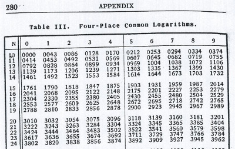
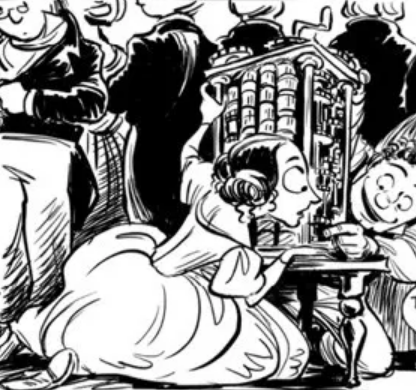
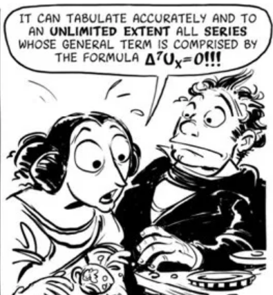
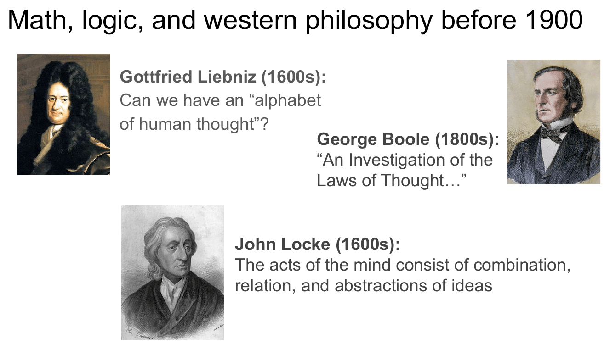
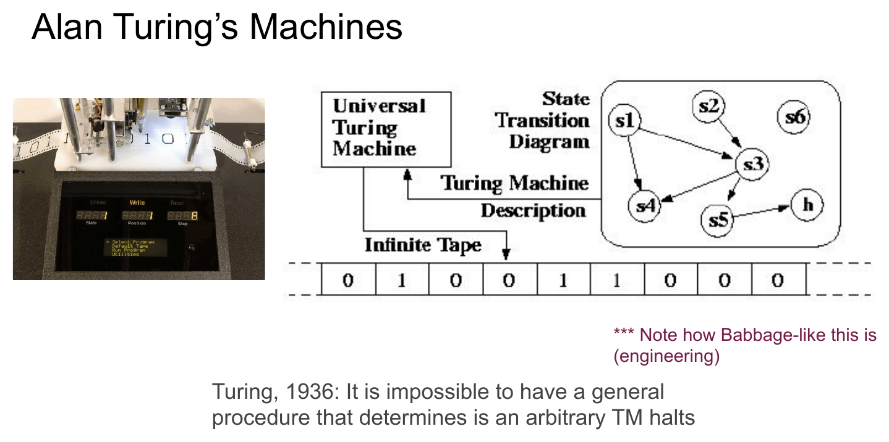
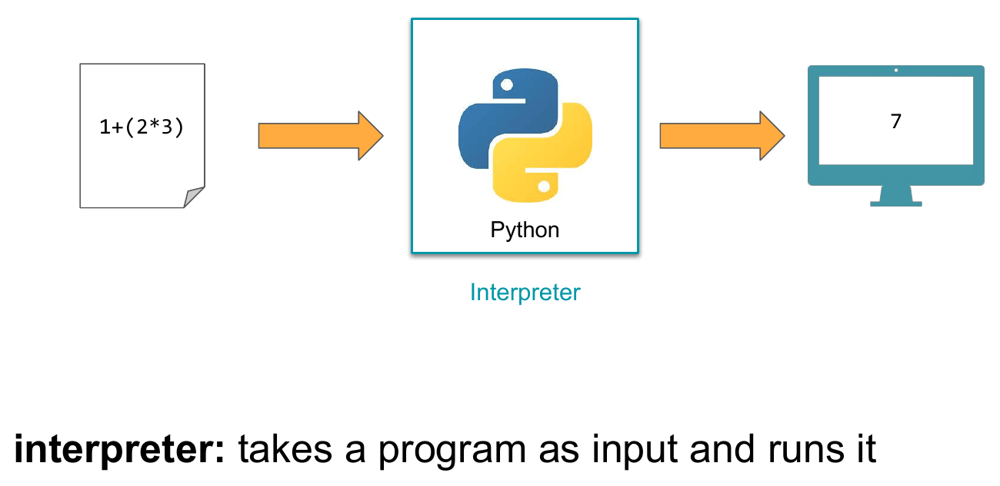
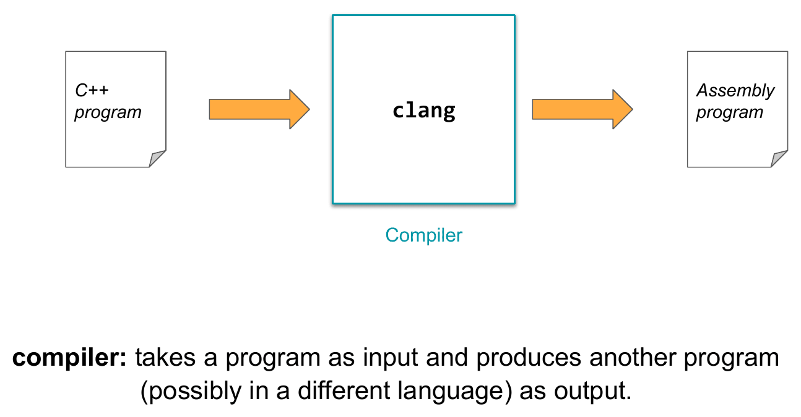
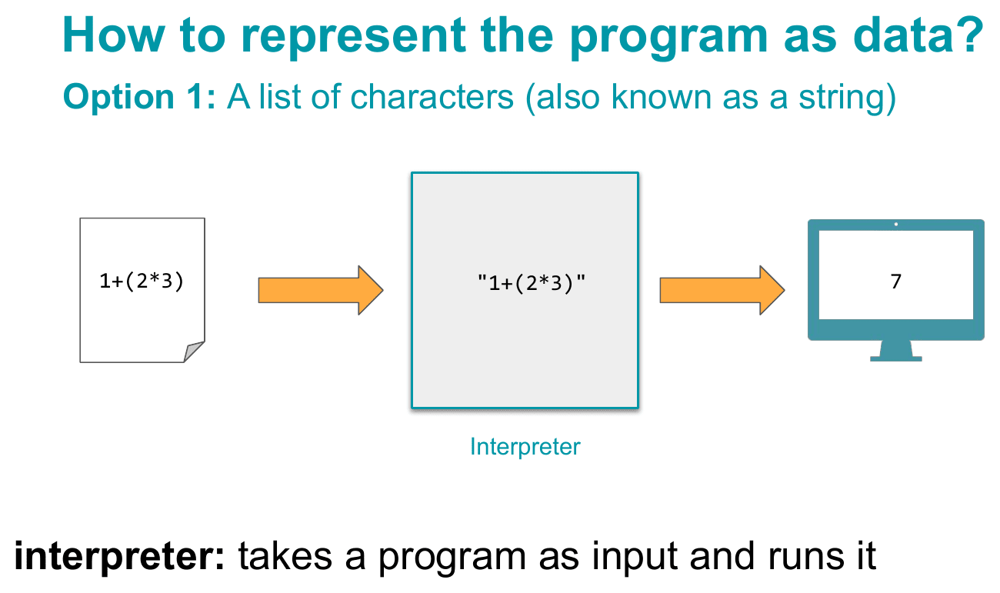
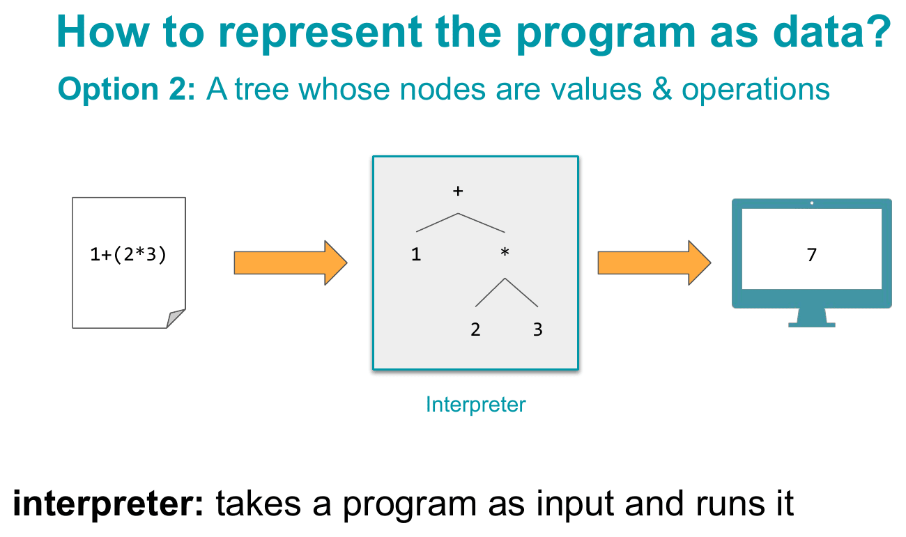

# Module 01.1: Welcome to Programming Languages

Welcome to programming languages.

This first module is meant to give you a picture of the *subject* before we start learning its machinery. We will begin with a surprisingly hard question: **what even is a programming language?** From there, we will work backward through some of the ideas that made programming languages possible, then forward again to the questions we will study throughout the course.

Three themes will keep returning:

- **Functions. Are. Awesome.** Functional programming gives us a different model of computation and a different way to think about programs.
- **Programs = Data.** Programs can be represented, inspected, transformed, and even produced by other programs.
- **Programming languages are all about people.** Languages are designed by people, for people, and those design choices shape what is easy to express and how we think about computation.

You do **not** need to memorize the names and dates in this module. The goal is to see how these ideas connect.

!!! note "How the Gradescope questions work"
    As you read, you will see boxes labeled **Gradescope question**. Those are the questions you will answer in the **Module 1.1 Completion** assignment on [Gradescope](https://www.gradescope.com).

    You will also occasionally see boxes labeled **Pause and think**. Those are there to help you engage with the material, but **you do not need to submit an answer to them on Gradescope**.

---

## What Even *Is* a Programming Language?

Before we build up a definition, start with your own.

!!! question "Gradescope question: What is a programming language?"
    **Submit this response on Gradescope.**

    What is a programming language? Try to write a definition of the term **programming language** that you think everyone would agree with.

    Alternatively, write a definition of **programming language** that you agree with but that you think others may not.

This is harder than it first appears. Does a programming language have to be executable by a computer? Does HTML count? Does a spreadsheet formula language count? What about the notation used on a calculator? What about a formal system such as the lambda calculus?

You do not need a final answer yet. In fact, part of the point of this course is that your answer should become more sophisticated as you learn more about syntax, semantics, interpreters, compilers, types, and different models of computation.

---

## A Little History, Herstory, Theirstory

We will tell part of the pre-history of programming languages through **Ada Lovelace** and **Charles Babbage**. Both were mathematically and mechanically sophisticated, but it is useful for our story to treat them as representing two complementary ways of thinking:

- **Babbage, the engineer:** How can we build a machine that actually carries out a computation, step by step?
- **Lovelace, the mathematician:** What kinds of things could such a machine represent and manipulate in principle?

Programming languages will repeatedly move between these two perspectives: concrete mechanisms and abstract mathematical descriptions.

!!! note "Image credit"
    Several illustrations in this section come from Sydney Padua's graphic novel [*The Thrilling Adventures of Lovelace and Babbage: The (Mostly) True Story of the First Computer*](https://www.penguinrandomhouse.com/books/223672/the-thrilling-adventures-of-lovelace-and-babbage-by-sydney-padua/). It is historically researched, very funny, and worth checking out if this story interests you.

### When "computer" meant a person

In the 1800s, a *computer* was often a **person whose job was to compute**. Teams of human computers produced tables of logarithms, trigonometric values, planetary positions, and other numerical results. The work was repetitive, slow, and vulnerable to human error.

Charles Babbage looked at this situation and saw an engineering problem: if the work consists of a mechanical sequence of operations, perhaps a machine could do it instead.

{ width="360" }
<br>*Tables like this one used to be computed by teams of human "computers," by hand.*

### Babbage's engines: making mathematics mechanical

Babbage designed two famous machines:

- The **Difference Engine**, a mechanical calculator intended to automate the production of numerical tables.
- The **Analytical Engine**, a much more general design that included ideas corresponding to stored data, conditional behavior, and repeated operations.

The Analytical Engine was never completed in Babbage's lifetime, but the idea was much larger than a special-purpose calculator.

Babbage regularly demonstrated his work to members of the scientific and social circles around him. Lovelace encountered the Engine through this world and became intensely interested in what it might make possible.

{ width="320" }
<br>*Ada Lovelace examining the Analytical Engine.*

### Lovelace's leap: computation is more than numbers

Babbage had begun from numerical problems: tables, difference equations, and mechanical calculation. Lovelace saw a broader possibility.

If numbers in the machine could **stand for other things**, then the machine's operations need not be understood as merely arithmetic. Symbols might represent quantities, words, music, logical objects, or something else entirely. If those objects could be represented appropriately, then a sufficiently general machine might manipulate them too.

That is a very programming-languages-like idea. Computation depends not just on physical machinery, but also on **representation**: what our symbols mean and what operations we allow ourselves to perform on them.

{ width="320" }
<br>*"The bounds of arithmetic have been overstepped!"*

Lovelace went on to describe an algorithm for computing Bernoulli numbers on the Analytical Engine, which is why she is often described as the first computer programmer. Remarkably, she was writing programs for a general-purpose computer before such a computer had actually been built.

Her broader question was even more ambitious: **if we can represent things symbolically, how far can mechanical computation go?** Could we, in some sense, compute everything?

!!! question "Gradescope question: Ada and Charles"
    **Submit this response on Gradescope.**

    Do you identify more with Ada's more abstract way of looking at things, Charles's more engineering-oriented mindset, or somewhere in between? Explain.

---

## From Thought to Symbol to Computation

Lovelace and Babbage were not the first people to wonder whether thought or reasoning could be represented by formal operations. For centuries, philosophers and mathematicians had been circling related ideas.

- **Gottfried Leibniz** imagined an "alphabet of human thought": a symbolic language rich enough to represent ideas so that reasoning could become a kind of calculation.
- **George Boole** developed an algebra of logic in *An Investigation of the Laws of Thought*. Boolean values and Boolean operations in programming languages descend from this tradition.
- **John Locke** described mental activity in terms such as combining, relating, and abstracting ideas.

These are different projects, and we should not collapse them into a single theory. But they share a striking possibility: **perhaps some aspects of thinking can be represented symbolically and manipulated according to rules.** Once mechanical computation enters the story, this philosophical possibility starts to look like a technological one.

{ width="480" }
<br>*Leibniz, Boole, and Locke, circling the same question from different directions: can thought itself be reduced to symbols and rules?*

!!! question "Gradescope question: Is thought computation?"
    **Submit this response on Gradescope.**

    Do you think that human thought can be described as a form of computation, similar to how Ada, Leibniz, Boole, and Locke had suggested?

    There is no single intended answer. Explain your reasoning.

---

## What Can We Know? What Can We Prove? What Can We Compute?

The question *Can we compute everything?* belongs to a longer sequence of increasingly precise questions.

### What can we know?

This is an enormous philosophical question. One useful problem-solving move is to replace a question that is too broad with a narrower one that we can formalize.

### What can we prove?

By the late nineteenth and early twentieth centuries, mathematics was becoming increasingly formalized. **David Hilbert** was an especially strong advocate for the idea that mathematics could, in principle, be placed on a complete formal foundation.

> "We must know. We will know."
> — David Hilbert

Then came **Kurt Gödel**.

Gödel showed that sufficiently expressive formal systems have unavoidable limitations. Very roughly, the key move involved a formal system becoming capable of expressing statements that, in effect, refer to themselves.

The familiar sentence

> *This statement is false.*

is **not Gödel's theorem**, but it gives a useful taste of why self-reference can be dangerous. If the sentence is true, then what it says makes it false; if it is false, then what it says appears to make it true. Gödel found a much more careful way to build self-reference into mathematics itself.

### What can we compute?

Once computation became a formal object of study, the same kind of question appeared again: are there limits to what an algorithm can do?

Two answers arrived at almost the same time from **Alan Turing** and **Alonzo Church**. Their approaches looked radically different.

{ width="480" }
<br>*Hilbert's optimism, answered in turn by Gödel, Church, and Turing — three different "no"s, arrived at three different ways.*

### Turing: computation as a machine

Turing described an abstract machine with:

- a tape containing symbols,
- a head that reads and writes those symbols,
- a finite set of states, and
- rules telling the machine what to do next.

A **Turing machine** is extremely simple and extremely mechanical. You can imagine it operating one tiny step at a time: read a symbol, write a symbol, change state, move left or right.

Turing showed that there is no general algorithm that can determine whether an arbitrary Turing machine will eventually halt. Some questions are therefore **not computable in general**.

This is the Babbage-like side of the story: concrete operations, explicit state, and computation as the evolution of a machine.

### Church: computation as functions

Church approached the problem very differently. He developed the **lambda calculus**, a formal system whose central objects are functions.

The notation will look strange right now. That is fine. We will learn it much later. For now, the important point is the model: instead of imagining a machine updating state one step at a time, imagine computation as the manipulation and evaluation of mathematical expressions.

Church proved his own impossibility result: there is no general algorithm for determining whether two arbitrary lambda-calculus expressions compute the same function.

This is the Lovelace-like side of the story: symbolic, mathematical, and abstract.

### Different things that turn out to be "the same"

The remarkable result is that Turing machines and the lambda calculus have the **same computational power**. A Turing machine can implement a lambda-calculus evaluator, and the lambda calculus can simulate a Turing machine.

That equivalence supports what we now call the **Church-Turing thesis**: anything that is effectively computable can be computed by a Turing machine, and therefore by any equivalent general model of computation.

This is a recurring intellectual move in computer science: two systems may look completely different on the surface, but discovering the right notion of equivalence reveals what they share at a deeper level. Similar connections appear between graph theory and linear algebra, and later in the course we will see surprising connections between logic, types, and programs.

!!! note "Pause and think — nothing to submit"
    Turing machines and the lambda calculus look almost opposite: one resembles an extremely simple machine and the other resembles pure mathematics. Why might it be useful to know that they can nevertheless compute exactly the same things?

---

## A Ladder of Abstraction

We can now arrange several models and languages along a rough spectrum. At one end, computation looks like a machine changing state. At the other, computation looks like mathematics: evaluate an expression and obtain another expression or value.

{ width="500" }
<br>*Up and down the ladder of abstraction: older, more machine-like models near the bottom; newer, more mathematical ones near the top.*

| More abstract / expression-oriented | | More machine-like / state-oriented |
|---|---|---|
| Lambda calculus | only anonymous functions | |
| Pure functional languages | Haskell | |
| Functional languages | Racket, ML | |
| Higher-level multiparadigm languages | Python | |
| Imperative languages with manual memory management | C, C++ | |
| Assembly / machine language | x86, HMMM | |
| von Neumann architecture | stored-program hardware | |
| Turing machine | simple state + tape | |

This is only a **rough conceptual ladder**, not a ranking of better and worse languages. Real languages mix ideas, and the historical ordering is not perfectly clean. The useful point is that programming languages let us choose the *level and style of abstraction* in which we describe computation.

---

## What Kind of Programming Languages Course Is This?

One possible programming-languages course would teach a new language every week: one week of Haskell, one week of C#, one week of F#, one week of Prolog, and so on.

That would certainly expose you to many languages. But it risks confusing the **subject of programming languages** with a collection of particular programming languages.

Languages come and go. A list of "important languages" from thirty years ago looks very different from a list today. The durable ideas underneath those languages change much more slowly.

!!! question "Gradescope question: Why not one language per week?"
    **Submit this response on Gradescope.**

    Why might it **not** be a good idea to study programming languages by learning the syntax and semantics of a different programming language every week?

This course therefore uses particular languages to get at broader principles. **Haskell is a vehicle, not the destination.** It is especially useful because functional programming makes some ideas unusually visible: functions as values, immutable data, recursive structure, pattern matching, types, and expression-oriented computation.

Some of the ideas we will encounter include:

- **Functional programming:** functions are data too.
- **Pattern matching:** use the structure of data directly.
- **Representing data:** build data structures in a functional style.
- **Parsing:** turn characters into programs.
- **Interpreters:** turn programs into computation.
- **Abstraction:** package recurring structure so we can do more with less code.
- **Types:** reason about what kinds of values computations can produce.
- **Lambda calculus:** investigate just how far we can get with functions alone.
- **peoPLe:** study programming languages as human technologies.

### Why functional programming?

Functional programming is useful here because it gives you a model of computation that probably differs from the imperative style you already know.

In an imperative program, you often understand execution by asking: **what is the current state, and how does this statement change it?** In functional programming, you more often ask: **what expression am I evaluating, and what value does it produce?**

That shift matters. It gives you another way to structure problems, makes certain kinds of reasoning about programs easier, and exposes ideas that have spread far beyond languages usually labeled "functional." Modern C++, Java, Python, JavaScript, Rust, and many other languages incorporate functional features. Functional techniques are also useful in settings where programmers care deeply about reasoning about correctness.

We will see the benefits and tradeoffs by actually programming this way.

---

## Programs = Data

Now we can return to one of the central ideas from the history above.

Gödel encoded statements about mathematics *inside mathematics*. Church built functions that can operate on functions. Turing studied machines that can take descriptions of machines as input. These examples all depend on a powerful move: **the thing doing the computation can itself be represented as something that computation can operate on.**

In programming, the compact version is:

> **Programs can be data.**

You already rely on this every day. When you download an application, it exists on your device as data in a file. When you execute it, those same stored bits participate in a running computation. The distinction between "program" and "data" depends partly on how we use and interpret a representation.

But the deeper consequence is that we can write **programs that consume, analyze, transform, or produce other programs**.

### First step: an ordinary program consuming data

Imagine a word-counting program. It takes a text file as input and returns the number of words.

```text
"There is no difference between programs and data"
                         |
                         v
                  [word counter]
                         |
                         v
                         8
```

Nothing unusual yet. The input is ordinary text data.

### Next step: a program consuming a program

Now consider this expression:

```text
1 + (2 * 3)
```

That is not merely text. In Python, for example, it is also a valid **program**.

Python can take that program and produce:

```text
7
```

A program that takes another program as input and runs it is an **interpreter**.

```text
program  --->  interpreter  --->  result
1+(2*3)       Python              7
```

{ width="420" }
<br>*An interpreter takes a program as input and runs it.*

A **compiler** also takes a program as input, but instead of directly running it, the compiler produces **another program** as output. For example, a compiler might translate a C++ source program into an assembly-language program that can be assembled and executed later.

```text
source program  --->  compiler  --->  another program
C++                   clang          assembly
```

{ width="420" }
<br>*A compiler takes a program as input and produces another program (possibly in a different language) as output.*

!!! question "Gradescope question: Interpreter vs. compiler"
    **Submit this response on Gradescope.**

    What is the difference between an **interpreter** and a **compiler**?

---

## How Do We Represent a Program as Data?

Saying that an interpreter "takes a program as input" hides an important implementation question:

**What data structure does the interpreter actually receive?**

Suppose our input program is:

```text
1 + (2 * 3)
```

There are many possible representations. Two will matter a great deal in this course.

### Option 1: represent the program as a string

The most direct representation is simply the characters that appeared in the source file:

```text
"1+(2*3)"
```

This representation has obvious advantages. It is close to what the programmer typed, easy to store in a file, and easy to read as raw input.

It also has a problem: the *structure* of the program is implicit. An algorithm that receives the string has to figure out that the `+` is the outermost operation, that `1` is its left operand, and that `2 * 3` is its right operand. It also has to distinguish valid program strings from nonsense.

The process of recovering program structure from a sequence of characters is called **parsing**.

{ width="420" }
<br>*Option 1: the program as a list of characters.*

### Option 2: represent the program as a tree

We can instead make the structure explicit:

```text
        +
       / \
      1   *
         / \
        2   3
```

Now the root says "addition." Its left child is `1`. Its right child is another operation, multiplication, whose children are `2` and `3`.

This kind of representation is an **abstract syntax tree**, usually abbreviated **AST**.

{ width="420" }
<br>*Option 2: the program as a tree whose nodes are values and operations.*

Once we have a tree, many operations on the program become easier because the structure we care about is represented directly. The tradeoff is that we first have to obtain the tree, usually by parsing the original source text, and a tree representation may omit some details of how the source was originally written.

Later in the course, you will work with both sides of this process:

```text
source characters  --->  parser  --->  abstract syntax tree  --->  interpreter
```

!!! question "Gradescope question: Representing programs"
    **Submit this response on Gradescope. Answer EITHER (a) OR (b).**

    **(a)** Why might it be a good idea for an interpreter to represent an input program as a **string**? Why might it be a bad idea to use a string representation?

    **OR**

    **(b)** Why might it be a good idea for an interpreter to represent an input program as a **tree**? Why might it be a bad idea to use a tree representation?

---

## Programming Languages, by People, for People

So far, programming languages may sound like a purely mathematical or engineering subject. They are also **human technologies**.

People design programming languages. People use them. People choose what problems a language should make easy, what abstractions it should provide, what syntax it should use, what kinds of mistakes it should prevent, and what tradeoffs it should accept.

Those choices are visible in different **programming paradigms**: broad models of what programming is supposed to look like.

### Imperative: update the state

In an imperative model, we often imagine a machine with memory. A program changes that memory over time.

```text
state_0  ->  state_1  ->  state_2  ->  ...
```

Assembly, C, C++, Java, Python, Rust, JavaScript, and many other languages support this style.

### Functional: evaluate expressions

In a functional model, computation looks more like mathematics: evaluate an expression and obtain a value.

```text
expression  ->  expression  ->  ...  ->  value
```

Haskell is strongly associated with this model. Racket and ML also support it, and functional features now appear throughout mainstream languages.

### Declarative: describe what you want

A declarative language tries to let you specify a desired result without spelling out every step used to obtain it.

A SQL query, for example, describes **what data** you want from a database. It normally does not specify the exact search algorithm the database should use to find those records.

Many declarative languages are **domain-specific languages**: languages designed for a particular class of problems rather than every possible programming task. SQL, HTML, and LaTeX are useful examples of languages whose design reflects the domain in which people use them.

These categories overlap. We are not interested in issuing purity certificates for whether JavaScript or Python is "really" functional. The categories matter because they expose **different models of computation and different design choices**. A representation or paradigm can make one task natural and another awkward.

### Design choices have consequences

The ten most widely used programming languages at a given moment were not handed down by nature. People designed them. The designers brought particular goals, experiences, preferences, assumptions, strengths, and blind spots to the process.

The original lecture makes this visible by placing several prominent languages beside photographs of their designers. The group is strikingly homogeneous, especially in gender and race. That observation does **not** imply that a language is good or bad because of the identity of its designer. It gives us a reason to ask a broader question: **when a small and relatively homogeneous group designs technologies used by enormous and diverse populations, can their experiences affect what gets built and for whom it works well?**

Programs have a large effect on people's lives. Programs are written in programming languages. Programming languages therefore matter socially as well as technically.

{ width="520" }
<br>*The ten most-used programming languages (by the TIOBE index), beside photographs of the people who designed them. Notice who's in this picture, and who isn't.*

!!! question "Gradescope question: Programming languages and society"
    **Submit this response on Gradescope.**

    What effect, if any, can programming-language designers have on society?

---

## Where This Leaves Us

We began with the deceptively simple question **What is a programming language?** and ended up touching mathematics, engineering, philosophy, representation, software implementation, and social design.

The important threads to carry forward are these:

1. **Functions. Are. Awesome.** There are different models of computation, and functional programming gives us an especially useful one to study.
2. **Programs = Data.** Once programs can be represented as data, programs can inspect, interpret, translate, and generate other programs.
3. **PLs + People.** Programming languages encode human choices about how computation should be expressed and what should be easy or difficult to do.

You will spend the rest of the course making these ideas much more concrete.

---

## Finish the Module 1.1 Completion

At this point, you should have encountered every substantive question in the **Module 1.1 Completion** assignment on [Gradescope](https://www.gradescope.com).

Before submitting, Gradescope also asks you for two pieces of feedback that are **not content questions**:

!!! question "Gradescope: Time spent"
    **Submit this response on Gradescope.**

    Approximately how much time did you spend on this module?

!!! question "Gradescope: Remaining questions and thoughts"
    **Submit this response on Gradescope.**

    What lingering questions or thoughts do you have about this module?

That is the end of Module 01.1.

---

## Reference Slides

[Slides for this module (Google Slides)](https://docs.google.com/presentation/d/129PWL4suP0MvP-gb0ytC4pcqdBCw0jqnEqDIj6RPt1Y/edit?usp=sharing)

!!! note "About the slides"
    When possible, a corresponding slide deck will be linked for a module. These slides are **for reference only**: they come from a previous iteration of the course, may be out of date, and will not always be provided. **This module page is the ultimate source of truth** for what you are responsible for.
