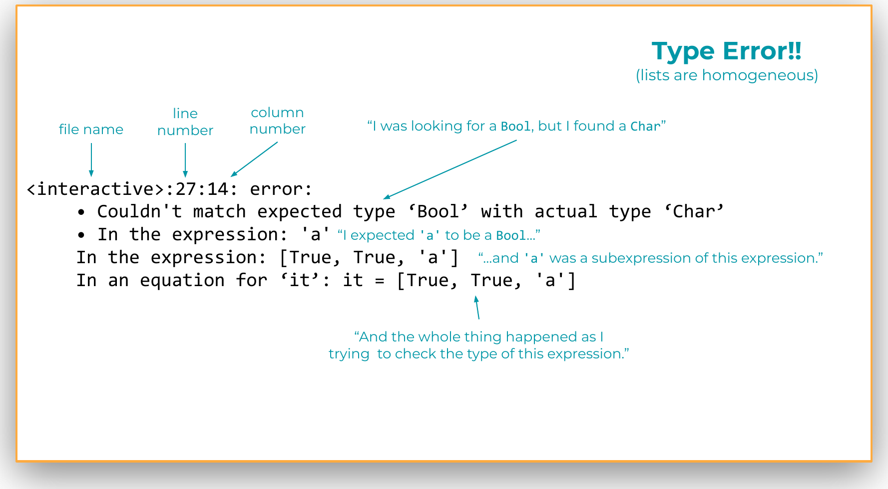

# Module 02.1: Introduction to Haskell and Functional Programming

Now we start programming in Haskell.

The point of this module is not to memorize a pile of Haskell syntax. It is to establish a working mental model that we will use throughout the course: **expressions evaluate to results, names are bound to expressions rather than repeatedly updated, and functions let us package recurring computations into reusable abstractions.**

By the end of this module, you should be able to:

- experiment with Haskell expressions in `ghci`,
- recognize some basic Haskell values and types,
- call functions and read ordinary function applications,
- explain the difference between a binding and an imperative-style assignment,
- reason about simple scopes and `let` expressions,
- define and load functions from a `.hs` file,
- read simple Haskell function types,
- use basic pattern matching, and
- explain the basic contrast between imperative and functional programming.

!!! note "How to use this module"
    When you see a box labeled **Gradescope question**, answer that question in the **Module 2.1 Completion** assignment on Gradescope.

    When you see **Try it in ghci** or **Pause and predict**, the activity is there to help you understand the material. **There is nothing to submit for those boxes unless the box explicitly says Gradescope question.**

---

## Learning a New Programming Language

A new programming language creates two kinds of work at once.

The first is superficial but unavoidable: new punctuation, new names, new conventions, and new error messages. The second is more interesting: a language may embody a different idea of what programming *is*.

Haskell will do both. Some things will look familiar. You will see integers, Boolean values, strings, lists, function calls, and local variables. But some familiar-looking things behave differently enough that your existing intuition can mislead you.

That is especially true for **variables**. In an imperative language, you may think of a variable as a box whose contents change over time. That is not the model we will use in Haskell. Later in this module we will see that a Haskell name is **bound** to an expression, and ordinary Haskell programming does not work by repeatedly changing that binding.

!!! note "Pause and think — nothing to submit"
    As you work through the examples, pay attention to places where your first guess comes from another programming language. Those mismatches are useful evidence about what is different in Haskell.

!!! question "Gradescope question: A short reflection"
    **Submit this response on Gradescope.**

    How does it feel when you're learning a new programming language?

---

## Start by Experimenting: `ghci`

The fastest way to learn the surface of Haskell is to experiment with it.

Haskell comes with an interactive environment called **`ghci`**, the Glasgow Haskell Compiler Interactive environment. `ghci` is a **REPL**:

- **Read** an expression,
- **Evaluate** it,
- **Print** the result,
- **Loop** back for another expression.

{ width="140" }

If you type:

```haskell
1 + 2 * 3
```

`ghci` reads the expression, evaluates it, prints:

```text
7
```

and gives you another prompt.

That makes `ghci` ideal for this module. When you encounter a small expression and wonder what Haskell will do, **make a prediction and then try it**.

!!! example "Try it in ghci — nothing to submit"
    Evaluate a few expressions before reading further:

    ```haskell
    42
    1 + 2 * 3
    10 - 4
    1 / 2
    "hello" ++ " world"
    ```

    Try to predict each result first.

---

## Basic Values and Types

When learning a new language, one of the first questions is: **what kinds of values does this language have?**

A **value** is a piece of data that an expression can produce. A **type** classifies values according to the kinds of operations that make sense for them.

For now, these are useful basic examples:

| Type | Example values |
|---|---|
| `Integer` | `1`, `2`, `100000000000`, `-42` |
| `Double` | `3.14`, `3.2831`, `-2.718` |
| `Bool` | `True`, `False` |
| `Char` | `'a'`, `'z'` |
| `String` | `"hello"`, `"world"` |

A naming convention worth noticing immediately:

> **Type names begin with an uppercase letter.**

But the converse is not true. `True` and `False` also begin with uppercase letters, and they are values rather than type names.

!!! note "A small simplification for now"
    Haskell's numeric type system is more general than this introductory table suggests. For this first pass, treating whole-number examples as `Integer` and decimal examples as `Double` gives us the right working picture. We will become more precise about types later.

### Operators

Many familiar operators work approximately as you would expect:

```haskell
1 + 2
5 - 3
4 * 10
1 / 2
3 == 3
4 /= 5
10 > 2
True && False
False || True
"hello" ++ " world"
```

There are two early syntax details worth learning now.

First, `/` is division for fractional numeric types. If you specifically want integer division, use the function `div`:

```haskell
4 / 2      -- 2.0 in the examples we are using
4 `div` 2  -- 2
1 `div` 2  -- 0
```

We will soon see why `div` can also be written as `div 4 2`.

Second, negative numbers sometimes need parentheses when they appear inside a larger expression:

```haskell
2 * (-1)
```

Writing `2 * -1` produces a parse error. This is one of those Haskell-specific details that becomes easy to recognize after you have seen it a few times.

### Lists and tuples

Haskell has both **lists** and **tuples**, but they make different promises about their contents.

A list uses square brackets:

```haskell
[]
[1]
[1, 2, 3, 4]
[True, False, True]
```

A list is **homogeneous**: every element must have the same type.

```haskell
[1, 2, 3, 4] :: [Integer]
```

Read `[Integer]` as "list of `Integer`."

A tuple uses parentheses and commas:

```haskell
(True, 0.5)
(True, 0.5, "hello")
```

A tuple can be **heterogeneous**: different positions can have different types.

```haskell
(True, 0.5) :: (Bool, Double)
```

A useful way to remember the distinction is:

- a **list** can have many elements, but they share one element type;
- a **tuple** has a fixed number of positions, and each position has its own type.

!!! example "Try it in ghci — nothing to submit"
    Try each expression. Predict which ones should work before pressing Enter.

    ```haskell
    [1, 2, 3]
    [True, False, True]
    (True, 0.5)
    (True, 0.5, "hello")
    [True, False, 'a']
    ```

    The final expression should produce a type error. Keep that error on your screen for the next section.

---

## Reading a Haskell Type Error

Haskell's error messages can initially look much larger than the mistake that caused them. Learning to extract useful information from them is part of learning the language.

Suppose we try:

```haskell
[True, True, 'a']
```

and `ghci` reports something like:

```text
<interactive>:27:14: error:
    • Couldn't match expected type ‘Bool’ with actual type ‘Char’
    • In the expression: 'a'
      In the expression: [True, True, 'a']
      In an equation for ‘it’: it = [True, True, 'a']
```

Read this in layers.

1. **Where did the problem occur?**  
   `<interactive>:27:14` identifies the interactive session, line, and column.

2. **What kind of mismatch did Haskell find?**  
   It **expected a `Bool`** but actually found a **`Char`**.

3. **Which subexpression caused the mismatch?**  
   The character `'a'`.

4. **What larger expression contained that subexpression?**  
   `[True, True, 'a']`.

5. **Why was a `Bool` expected there?**  
   The other elements led Haskell to treat the expression as a list of Boolean values, and list elements must all have the same type.

You can also read the bottom portion in the opposite direction: Haskell was checking the whole list, found the subexpression `'a'`, and discovered that its type did not match the type required at that position.



!!! note "Pause and explain — nothing to submit"
    In your own words, explain the phrase:

    > `Couldn't match expected type 'Bool' with actual type 'Char'`

    Then identify the smallest subexpression that caused the problem and the larger expression that explains *why* Haskell expected a `Bool`.

---

## Calling Functions

Haskell is a functional programming language. We should expect to call functions constantly, so Haskell makes ordinary function application unusually lightweight.

In many languages you might write:

```text
sqrt(4)
```

In Haskell, write the function name, then a space, then the argument:

```haskell
sqrt 4
```

No parentheses around the argument. No comma after the function name.

More examples:

```haskell
sqrt 4
show 42
min 0 42
max 0 42
not True
```

For a function with more than one argument, keep adding arguments separated by spaces:

```haskell
min 0 42
max 100 42
```

The low-punctuation syntax is convenient, but it creates an important question: **where does a function argument end when the argument itself is an expression?**

Consider:

```haskell
max 100 42 + 1
```

There are at least two plausible readings:

```haskell
max 100 (42 + 1)
```

or:

```haskell
(max 100 42) + 1
```

Haskell chooses the second one. **Function application binds more tightly than ordinary operators such as `+`.**

So:

```haskell
max 100 42 + 1
```

means:

```haskell
(max 100 42) + 1
```

and evaluates to `101`.

If you want `42 + 1` to be the second argument to `max`, write:

```haskell
max 100 (42 + 1)
```

When this is new, using extra parentheses is completely reasonable. You can remove them as the parsing rules become familiar.

### Negative arguments

A negative argument also needs parentheses:

```haskell
max (-42) 42
```

Without the parentheses, Haskell does not interpret `-42` as the argument you intended.

### `not`, `div`, and `mod` are functions

Some operations that may look like special operators in another language are ordinary named functions in Haskell:

```haskell
not False

div 4 2
mod 4 3
```

`mod` is useful for cyclic arithmetic. For example, seven hours after 10 o'clock on a 12-hour clock is:

```haskell
mod (10 + 7) 12
-- 5
```

You may also see named two-argument functions written between their arguments using backticks:

```haskell
4 `div` 2
17 `mod` 12
```

We will say more about operators and function notation in Module 02.2.

!!! example "Try it in ghci — nothing to submit"
    Predict the result of each expression, then check it.

    ```haskell
    max 100 42 + 1
    max 100 (42 + 1)
    max (-42) 42
    not False || not True
    div 1 2
    div 4 2
    mod 4 3
    mod (10 + 7) 12
    ```

    For each expression involving both a function call and an operator, try adding parentheses that make Haskell's grouping explicit.

!!! question "Gradescope question: Calling functions"
    **Submit these responses on Gradescope.**

    1. Write a Haskell expression to compute the maximum of the square root of `2` and `1.4`.

    2. Write a Haskell expression that uses functions and operations to convert `pi` (a built-in name) to a string with the `show` function, and add an exclamation point.

---

## Variables, Bindings, and Scope

This section contains one of the most important shifts in the module.

When programmers learn a new language, they often ask: **How do variables and assignment work?** That question imports an imperative model in which variables are storage locations whose contents can be updated.

Haskell uses different vocabulary because the underlying idea is different.

### Some precise vocabulary

- **Binding / bind**: associate a name with an expression.
- **Reference**: use a bound name inside another expression.
- **Scope**: the region of the program in which a particular binding can be referenced.
- **Lookup / resolve**: determine which binding a name refers to.

The lecture materials use **value** for the expression associated with a binding. Later we will distinguish more carefully between an expression and the result obtained by evaluating it. For now, the important relationship is **name → bound expression**.

!!! question "Gradescope question: What is the value of `x`?"
    **Submit this response on Gradescope.**

    After the following binding, what is the value of `x`?

    ```haskell
    x = sqrt 4
    ```

    Choose from the options given on Gradescope.

Consider:

```haskell
x = 21
y = 2 * x
```

Read these as:

- "bind `x` to the expression `21`,"
- "bind `y` to the expression `2 * x`."

Inside `2 * x`, the `x` is a **reference**. To evaluate `y`, Haskell resolves `x`, finds the expression `21`, and evaluates `2 * 21`.

Variable names such as `x` and `y` begin with lowercase letters. Recall the contrast: type names begin with uppercase letters.


### Top-level bindings

A binding written at the top level of a Haskell file is roughly analogous to a global definition:

```haskell
x = 21
y = 2 * x
```

Its scope is the surrounding module/file. A binding entered interactively in `ghci` remains available in the interactive session until it is shadowed or the session changes.

Now consider this code in a `.hs` file:

```haskell
x = 24
x = 41
x = x + 1
```

An imperative-programming instinct may suggest that `x` finishes with the value `42`.

That is **not** what this Haskell file means.

A top-level scope cannot contain three independent bindings for the same variable name. The file produces a `Multiple declarations of 'x'` error.

The key idea is:

> **Ordinary Haskell bindings are not variable updates.**

Or, as a useful first approximation:

> **Haskell "variables" behave like constants.**

That matters for more than syntax. In an imperative program, if a global variable suddenly contains the wrong value, you may need to inspect every place that could have changed it. If the binding cannot be mutated, the possible explanations are much narrower.

The cost is equally important: programs that cannot update ordinary variables require a different way of thinking about computation. That difference is one of the main reasons we are using Haskell.

!!! question "Gradescope question: Haskell variables, bindings, and scope"
    **Submit this response on Gradescope. Try to answer before running the code in Haskell.**

    Consider the following code:

    ```haskell
    x = 24
    x = 41
    x = x + 1
    ```

    At the end of this code, what do you think is the value of `x`?

!!! note "What about `ghci`?"
    `ghci` can make this look more like reassignment than it really is. If you enter `x = 24` and later enter `x = 41`, the newer interactive binding can **shadow** the older one.

    That is not mutation of a single storage location. It is a new binding becoming the one that the name `x` resolves to in the current interactive context.

    The expression `x = x + 1` is especially revealing. It is not an instruction to "take the old `x` and increment it." It creates a self-referential definition. If Haskell tries to evaluate that definition, evaluation does not terminate.

### Local bindings with `let`

We also need local names. A `let` expression creates them:

```haskell
let x = 21 in x + x
```

It has three pieces:

```text
let  x = 21  in  x + x
     -------      -----
      binding      body
```

The result of the entire `let` expression is the result of evaluating its body. Here, `x` is bound to `21`, so the body `x + x` evaluates to `42`.

A `let` may contain more than one binding:

```haskell
let x = 21
    y = x
in x + y
```

Haskell's `let` bindings are in scope throughout the binding group and the body, so `y` can refer to `x` here.

If you type a multi-line expression directly into `ghci`, use `:{` and `:}`:

```text
:{
let x = 21
    y = 7 * 2
in x + y
:}
```

Indentation matters. Bindings that belong to the same group should line up.

### Nested scopes

Scopes can nest:

```haskell
let x = 21 in
  let x = 10000 in
    x
```

This is legal because the two bindings occur in **different scopes**.

When Haskell resolves the final reference to `x`, it searches from the innermost relevant scope outward. The inner binding wins, so the expression evaluates to:

```text
10000
```

!!! example "Try it in ghci — nothing to submit"
    Try these one at a time. Predict each result first.

    ```haskell
    let x = 21 in x + x

    let x = 21 in
      let x = 10000 in
        x

    let x = 21 in
      let y = x + 1 in
        y
    ```

    For each reference to a name, identify the binding it resolves to.

---

## Moving Between a File and `ghci`

Typing tiny expressions directly into `ghci` is excellent for exploration, but we also need to write reusable definitions in source files.

Haskell source files use the extension `.hs`.

```haskell
-- A single-line comment

{-
   A multiline
   comment
-}

x = 21
favorite = 42
```

A source file normally contains **definitions**. A bare expression such as `1 + 2` does not simply sit at the top level of the file in the same way it can be entered at the `ghci` prompt.

To load definitions from a file into `ghci`:

```text
:load MyFile.hs
```

or the short form:

```text
:l MyFile.hs
```

Once a file is loaded, edit and save it, then tell `ghci` to load the changes:

```text
:reload
```

or:

```text
:r
```


This gives us a useful workflow for the rest of the course:

1. write or edit definitions in a `.hs` file,
2. save the file,
3. load or reload it in `ghci`,
4. call the functions interactively on small examples,
5. return to the file and revise.

!!! example "Try it in ghci — nothing to submit"
    Create a tiny `.hs` file containing:

    ```haskell
    favorite = 42
    ```

    Load the file in `ghci`, evaluate `favorite`, then change the definition, save the file, use `:reload`, and evaluate it again.

---

## Defining Functions

We have called Haskell functions. Now we can define our own.

A function definition gives a name, parameter names, and a body:

```haskell
successor n = n + 1
average x y = (x + y) / 2
```

A corresponding function call supplies arguments:

```haskell
successor 1
average 0 10
```

A **parameter** is a name that appears in a function definition, such as `n` in `successor n = n + 1`. An **argument** is the expression supplied when the function is called, such as `1` in `successor 1`.

A parameter's scope is the function body.

!!! question "Gradescope question: Parameters and arguments"
    **Submit this response on Gradescope.**

    What is the difference between a parameter and an argument?

### There is no `return` here

Notice what is missing:

```haskell
successor n = n + 1
```

There is no `return` statement.

That is because the function body **is an expression**. Calling the function means evaluating that expression with the argument bound to the parameter name.

For:

```haskell
successor 1
```

we can reason:

```text
parameter n is bound to argument 1
body: n + 1
      ↓
      1 + 1
      ↓
      2
```

The result of the function call is the result of evaluating the body.

The same idea applies to multiple parameters:

```haskell
average x y = (x + y) / 2
```

For now, it is fine to read this as a function taking two arguments. Module 02.2 will refine that description in an important way.


### Local definitions inside functions

Suppose we want to compute:

```text
x² + 1/x²
```

We could repeat `x * x`:

```haskell
f x = x * x + 1 / (x * x)
```

Or bind that repeated expression to a local name:

```haskell
f x = let value = x * x
      in value + 1 / value
```

Haskell also provides a `where` clause:

```haskell
f x = value + 1 / value
  where value = x * x
```

These forms express essentially the same calculation. The choice between `let` and `where` is often a matter of readability and convenience.

The broader lesson matters more than which syntax you prefer: **a local name can expose the conceptual role of a repeated expression.**

!!! question "Gradescope question: `let` and `where`"
    **Submit this response on Gradescope.**

    Why do you think the designers of Haskell provided both `let` expressions and `where` clauses?

---

## Pattern Matching

Pattern matching is one of the Haskell features we will use repeatedly.

Consider factorial written with `if` / `then` / `else`:

```haskell
fact n = if n == 0
         then 1
         else n * fact (n - 1)
```

That is a perfectly reasonable definition. But Haskell also lets us describe the cases by the *shape of the argument*:

```haskell
fact 0 = 1
fact n = n * fact (n - 1)
```

At first this may look like we violated the earlier rule about binding a name more than once. We did not.

These two equations are **two pattern clauses belonging to one function definition**. They are not two unrelated top-level bindings that overwrite one another.

When Haskell evaluates a call to `fact`, it considers the patterns from top to bottom.

For:

```haskell
fact 0
```

the first pattern matches the literal value `0`, so Haskell uses:

```haskell
fact 0 = 1
```

For:

```haskell
fact 5
```

`5` does not match the literal pattern `0`. The variable pattern `n` matches anything, so Haskell uses:

```haskell
fact n = n * fact (n - 1)
```

and binds `n` to `5` for that function body.

This example only uses a literal pattern and a catch-all variable pattern. Later, pattern matching becomes much more powerful when our data itself has structure.

!!! example "Try it in ghci — nothing to submit"
    Put the pattern-matching definition of `fact` in your `.hs` file, reload it, and try:

    ```haskell
    fact 0
    fact 1
    fact 5
    ```

    For each call, identify which pattern matches first.

---

## Types in Haskell

Haskell is a **statically typed** language.

That means type checking happens without needing to run the program. If Haskell finds a type error while compiling a source file, the program does not successfully compile.

Contrast this with a **dynamically typed** language, where many type-related checks happen as expressions execute. A program may run successfully for some time before reaching an operation whose runtime values do not make sense together.

A few terms:

- **type check**: determine whether expressions are used consistently with their types;
- **static**: determined without executing the program;
- **dynamic**: determined during execution;
- **type annotation**: type information written explicitly by the programmer;
- **type inference**: determining types without requiring the programmer to annotate everything.

Haskell combines **static typing** with substantial **type inference**. We often do not *need* to write a type annotation, but annotations are useful documentation and become especially valuable as functions get larger.

!!! question "Gradescope question: Type annotations"
    **Submit this response on Gradescope.**

    Why do you think it's a good idea to write type annotations, even if we don't have to?

In `ghci`, ask for the type of an expression with:

```text
:type <expression>
```

or:

```text
:t <expression>
```

For example:

```haskell
:t True
:t not
:t "hello"
```

### Function types

We can annotate our functions:

```haskell
successor :: Integer -> Integer
successor n = n + 1

average :: Double -> Double -> Double
average x y = (x + y) / 2
```

Read `::` as **has type**.


So:

```haskell
successor :: Integer -> Integer
```

can be read, for now, as:

> `successor` takes an `Integer` and produces an `Integer`.

And:

```haskell
average :: Double -> Double -> Double
```

can be read, for now, as:

> `average` takes two `Double` arguments and produces a `Double`.

That second type contains a deeper idea that we are deliberately postponing. In Module 02.2, we will discover that every Haskell function actually takes one argument at a time.

!!! question "Gradescope question: A function type"
    **Submit this response on Gradescope.**

    What is a valid type for this function?

    ```haskell
    predecessor n = n - 1
    ```

!!! example "Try it in ghci — nothing to submit"
    After loading your function definitions, ask `ghci` for their types:

    ```text
    :t successor
    :t average
    :t fact
    ```

    Compare the inferred types with any annotations you wrote.

---

## So What Is Functional Programming?

We can now make one of the big ideas from Module 01.1 concrete.

In **imperative programming**, computation is often understood as a sequence of commands that **update state**:

```text
state₀ → state₁ → state₂ → ...
```

A variable may contain one value now and another value later. To understand the program, we often ask:

> What is the current state, and what does this next statement change?

In **functional programming**, computation instead proceeds by **evaluating expressions**.

```text
expression → expression → ... → result
```

In **pure functional programming**, expression evaluation is the mechanism of computation rather than mutation of ordinary program state.

Haskell is a pure functional programming language.

The facts we have already seen are pieces of the same picture:

- function bodies are expressions;
- the result of a function is the result of evaluating its body;
- ordinary variable bindings are not repeatedly updated;
- names let us refer to expressions without treating them as mutable boxes.

This is why Haskell is useful in a programming-languages course. It forces us to practice a model of computation that is different from the imperative model many programmers learn first.

!!! note "Pause and compare — nothing to submit"
    Suppose you wanted to describe the difference between imperative and functional programming to someone who already knows Python or C++.

    Try to explain the contrast using the phrases **update state** and **evaluate expressions**.

---

## Abstraction: Turning a Repeated Expression into a Function

The lecture ends by connecting these Haskell mechanics to one of the central ideas of the course: **abstraction**.

Suppose a larger program contains expressions with the same recurring shape:

```haskell
2 * 2 + 1
3 * 2 + 1
4 * 2 + 1
5 * 2 + 1
```

The particular number changes, but the structure does not:

```text
_ * 2 + 1
```

We can factor that structure into a function:

```haskell
f :: Integer -> Integer
f n = n * 2 + 1
```

and replace the repeated expressions with:

```haskell
f 2
f 3
f 4
f 5
```

The computation has not fundamentally changed. What changed is the **representation of the repeated idea**.

We noticed a recurring expression, identified the part that varies, turned that varying part into a parameter, and gave the whole pattern a name.

This suggests a useful way to think about functions:

> **Functions are parameterized expressions.**

!!! question "Gradescope question: Functional programming and abstraction"
    **Submit this response on Gradescope.**

    Functions are parameterized ____. *(Fill in the blank with a single word.)*

And it suggests a useful first picture of abstraction:

> **Find repeated structure, separate what changes from what stays the same, give the structure a name, and reuse it.**

That move will appear at much larger scales later in the course.


!!! example "Try it in ghci — nothing to submit"
    Define:

    ```haskell
    f :: Integer -> Integer
    f n = n * 2 + 1
    ```

    Then evaluate `f` on several arguments. Finally, invent a different family of repeated arithmetic expressions and factor its repeated structure into your own function.

---

## Where This Leaves Us

The syntax in this module is basic. The ideas behind it are not.

You have now seen several pieces of the functional-programming model working together:

1. **Expressions evaluate.** `ghci` lets us experiment with that process directly.
2. **Types constrain which expressions make sense.** Type errors give us information about mismatches.
3. **Function application is central and lightweight.** `f x` is the basic shape of a call.
4. **Names are bound, not repeatedly updated.** Scope determines which binding a reference means.
5. **Function bodies are expressions.** There is no ordinary `return` statement at the end of the body.
6. **Pattern matching chooses behavior from the structure of an input.** We have seen only the simplest version so far.
7. **Functions are abstractions over expressions.** They capture recurring structure and make the varying parts explicit as parameters.

Module 02.2 will build directly on this foundation. In particular, it will make precise several claims we have only hinted at here: what it means for expressions to be pure, how Haskell can evaluate lazily, why operators are functions, and why a Haskell function that appears to take several arguments is actually built from one-argument functions.

---

## Finish the Module 2.1 Completion

At this point, you should have encountered every substantive question in the **Module 2.1 Completion** assignment on Gradescope.

Before submitting, Gradescope also asks you for two pieces of feedback that are **not content questions**:

!!! question "Gradescope: Time spent"
    **Submit this response on Gradescope.**

    Approximately how much time did you spend on this module?

!!! question "Gradescope: Remaining questions and thoughts"
    **Submit this response on Gradescope.**

    What lingering questions or thoughts do you have about this module?

That is the end of Module 02.1.

---

## Reference Slides

[Slides for this module (Google Slides)](https://docs.google.com/presentation/d/18KkrzAKBNsBSbqIoAJ3cpAqnVVi3uep_jynLj_UnS0U/edit?usp=sharing)

!!! note "About the slides"
    When possible, a corresponding slide deck will be linked for a module. These slides are **for reference only**: they come from a previous iteration of the course, may be out of date, and will not always be provided. **This module page is the ultimate source of truth** for what you are responsible for.
