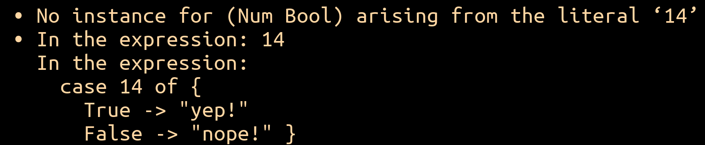
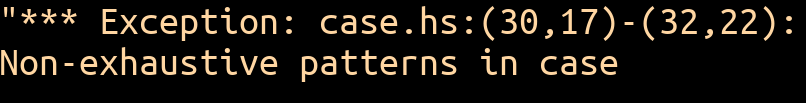

# Module 03.1: Lists, Tuples, Pattern Matching, and Parameterized Types

Every language needs a way to group data together. This module introduces Haskell's two basic ways to do that — **lists** and **tuples** — and along the way you'll meet **pattern matching** properly for the first time, see the abstraction move from Module 02.1 pay off again, and pick up the vocabulary for **parameterized types**, which will keep showing up for the rest of the course.

---

## Why Lists?

There's a practical reason and a pedagogical reason to care about lists.

**Practically**, collecting related data into one structure is just convenient — think of arrays in Java or C++, or lists in Python. Instead of juggling `first_val`, `second_val`, `third_val`, you write `vals = [5, 3, 19]`.

**Pedagogically**, lists are a **recursive** data structure: a list is either empty, or an element followed by another list. Functional languages lean heavily on recursion, so lists — combined with pattern matching — turn out to be one of the best tools for showing recursion at its most natural. That combination (functional languages + recursive data structures + pattern matching) is genuinely powerful, and lists are the simplest place to see it in action.

---

## Building Lists in Haskell

### Basic Syntax

Lists use square brackets, with elements separated by commas:

```haskell
[4, 9, -13, 5, 1]
[False, True, False, False]
[]                          -- the empty list
[[1,2,3], [4,5,6,7], [8,9]] -- a list of lists
```

Haskell lists are **homogeneous** — every element must share the same type. Mix types, and you get a type error:

![A GHCi session showing the error message when evaluating [15, True], a list mixing an Integer and a Bool.](img/03.1/homogeneous-list-error.png){ width="480" }
<br>*Mixing an `Int` and a `Bool` in one list — Haskell won't allow it.*

Reading these error messages is a skill that gets better with practice — you already got some reps in Module 02.1.

### The Cons Operator

The **cons operator** (`:`) builds a list by attaching an element to the front of an existing one:

```haskell
3 : [7, 15, 4]   -- [3, 7, 15, 4]
```

`:` is right-associative, so `3 : 7 : [15, 4]` means `3 : (7 : [15, 4])` — and you can fully parenthesize a whole list this way: `(3 : (7 : (15 : (4 : []))))`.

This gives us a precise, recursive definition of a Haskell list: **a list is either `[]` (empty), or `x : xs`** — some value `x` consed onto another list `xs`.

!!! question "Think about it"
    In `x : xs`, what type does the left side (`x`) have? What about the right side (`xs`)?

    ??? note "The answer"
        If `x :: Integer`, then `xs :: [Integer]` — a list of `Integer`s, and the result is also `[Integer]`. But this works for *any* type, not just `Integer`: if `x :: Char`, then `xs :: [Char]`. Haskell captures this with a **type variable**: `(:) :: a -> [a] -> [a]`. Here `a` stands for *any* type — but the two `a`s must agree. This is your first taste of a **parameterized type**, which we'll come back to at the end of this module.

### Concatenation

The `++` operator concatenates two lists of the same element type:

```haskell
[1, 3] ++ [7, 15, 4]   -- [1, 3, 7, 15, 4]
```

Its type is `(++) :: [a] -> [a] -> [a]` — same type-variable story as `:`.

A neat observation: **`[]` is the identity element for `++`**, the same way `0` is the identity element for `+`:

```haskell
some_list ++ [] == some_list
[] ++ some_list == some_list
```

!!! question "Think about it"
    What do each of the following evaluate to? If one produces an error, why? (Try them in `ghci` if you're not sure.)

    ```haskell
    [1,2,3] : 5
    ["hi"] : [["my"], ["name"], ["is"]]
    9 ++ [12, 15, 18, 21, 24]
    (4 : []) ++ (3 : 2 : 1 : [])
    [] : []
    [True] ++ []
    'H' : "ello," ++ "friend!"
    ```

---

## Functions on Lists

Haskell ships with a rich set of built-in list functions. A few of the essentials:

**`length`** — counts elements:

```haskell
length ["Hello", " world", "!"]   -- 3
length []                         -- 0
```

Worth noticing: `length [] == 0` and `length (xs ++ ys) == length xs + length ys`. In other words, `length` is a **linear map** from the world of lists to the world of integers — the same kind of structural "sameness" you saw back in Module 01.1's Church-Turing discussion. Formal systems having useful algebraic properties isn't unique to math — functional data structures have them too, and noticing them can help convince you (or even prove) your code is correct.

**`head`** and **`tail`** — the first element, and everything after it:

```haskell
head ["Hello", ",", "world", "!"]   -- "Hello"
tail ["Hello", ",", "world", "!"]   -- [",", "world", "!"]
```

Following the recursive definition from before: `head (x:xs) == x` and `tail (x:xs) == xs`.

**`take`** and **`drop`** — the first *n* elements, or everything after the first *n*:

```haskell
take 3 [5, 8, 9, 1, 13, 20, 3, 2]   -- [5, 8, 9]
drop 2 [5, 8, 9, 1, 13, 20, 3, 2]   -- [9, 1, 13, 20, 3, 2]
```

**`null`** — is the list empty?

```haskell
null []       -- True
null [3, -7]  -- False
```

**`elem`** — is an element present?

```haskell
elem 10 [30, 33, 37]   -- False
elem '3' "CS131"       -- True
10 `elem` [5, 10, 15, 20]  -- True (infix style)
```

!!! question "Think about it"
    Before reading on: how would you write your own version of `elem`, using only `null`, `head`, `tail`, and recursion? Try sketching a base case and a recursive case first.

    ??? note "One way to build it"
        Thinking recursively about the list gives you three cases, in order:

        - If the list is empty (`null`), the element you're looking for definitely isn't in it — return `False`. That's the base case.
        - Otherwise, if the `head` of the list *is* the element, return `True`.
        - Otherwise, the answer depends on the rest of the list — recurse on the `tail`.

        ```haskell
        inList :: Eq a => a -> [a] -> Bool
        inList e list = if null list
                        then False
                        else if head list == e
                             then True
                             else inList e (tail list)
        ```

        It's worth deriving this yourself even though `elem` already exists — wrestling with recursion over a list using only `null`, `head`, and `tail` is exactly the kind of exercise that makes the *next* recursive list function easier to write. And it's a nice confirmation that the code you'd write by hand really is equivalent to what Haskell already gives you for free.

And a handful more that do exactly what their names suggest: `minimum`, `maximum`, `sum`, `product`. Before writing your own version of something list-related, it's always worth asking: *is this common enough that Haskell already has it?* Usually, it does.

---

## From Repetition to Abstraction: `map` and `filter`

Here's a sequence of three little functions:

```haskell
add3list      :: [Integer] -> [Integer]
add3list list = if null list
                 then list
                 else (+ 3)    (head list) : add3list      (tail list)

doubleList    :: [Integer] -> [Integer]
doubleList list = if null list
                   then list
                   else (* 2)    (head list) : doubleList    (tail list)

emphasizeList :: [String] -> [String]
emphasizeList list = if null list
                      then list
                      else (++ "!") (head list) : emphasizeList (tail list)
```

!!! question "Think about it"
    What actually varies between these three functions? Everything else is identical scaffolding.

    ??? note "The pattern"
        The only thing that changes is *which function* gets applied to each element — `(+ 3)`, `(* 2)`, `(++ "!")`. Everything else — the empty-list check, the recursion, the shape of the whole thing — is boilerplate. That's exactly the "spot the pattern, factor it out" move from Module 02.1's refactoring example, just one level up: instead of factoring out a repeated *expression*, we're factoring out a repeated *function structure*, by making the applied function itself a parameter.

        It's worth stating as a general motto, because it'll keep paying off all course: **where there's a pattern, there's an opportunity for abstraction.** Once you can name the thing that's repeating, you can almost always factor it into a parameter — and it doesn't matter whether what's repeating is a value, an expression, or (as here) an entire function shape.

Pulling that shared structure out gives:

```haskell
applyFuncToList f list = if null list
                          then list
                          else f (head list) : applyFuncToList f (tail list)
```

This is exactly what Haskell's built-in **`map`** does:

```haskell
map :: (a -> b) -> [a] -> [b]

doubler x = x * 2
map doubler [19, 7, 21]   -- [38, 14, 42]
```

A close cousin is **`filter`**, which keeps only the elements satisfying a predicate (a function returning `Bool`):

```haskell
filter :: (a -> Bool) -> [a] -> [a]

filter even [8, -13, 25, 16, 0, 2]           -- [8, 16, 0, 2]
filter (< 3) [8, -13, 25, 16, 0, 2]          -- [-13, 0, 2]
filter ((< 3) . length) ["oh", "hi", "there!"]  -- ["oh", "hi"]
```

`map` and `filter` are two of the most-used tools in your Haskell toolbox — you'll reach for them constantly.

---

## Pattern Matching for Lists

You've used `:` to *build* lists. Used the other way, in a pattern, it *takes them apart*:

```haskell
first_int : other_ints = [13, 10, 20, 7]
-- first_int  == 13
-- other_ints == [10, 20, 7]
```

Haskell matches the pattern `first_int : other_ints` against `13 : 10 : 20 : 7 : []`, binding `first_int` to the head and `other_ints` to the rest.

### Case Expressions

A `case` expression pattern-matches on a value and picks a branch:

```haskell
case b of
  True  -> "yep!"
  False -> "nope!"

case n of
  5  -> "I love 5!"
  10 -> "10 is okay"
  _  -> "I do not know that number"   -- wildcard: matches anything
```

Two ways this can go wrong, both worth being able to recognize:

{ width="600" }
<br>*Every branch of a `case` must produce the same type — mixing `case 14 of { True -> ...; False -> ... }` doesn't type-check, since `14` isn't a `Bool`.*

{ width="480" }
<br>*This one compiles fine, but crashes at runtime — the patterns didn't cover every possible input.*

### Three Ways to Write the Same Function

Recall `myLength` and `myFilter` from your Module 02.1 pattern-matching introduction. Here they are, written three different ways — watch how each version gets shorter and more idiomatic:

```haskell
-- if / then / else
myLength lst = if lst == [] then 0
               else 1 + myLength (tail lst)

-- case expression
myLength lst = case lst of
  []     -> 0
  (x:xs) -> 1 + myLength xs

-- pattern matching directly in the function definition
myLength []     = 0
myLength (_:xs) = 1 + myLength xs
```

```haskell
-- if / then / else
myFilter test lst = if lst == [] then []
                     else if test (head lst) then (head lst) : myFilter test (tail lst)
                     else myFilter test (tail lst)

-- case expression
myFilter test lst = case lst of
  []     -> []
  (x:xs) -> if test x then x : myFilter test xs else myFilter test xs

-- pattern matching directly in the function definition
myFilter _    []     = []
myFilter test (x:xs)
  | test x    = x : myFilter test xs
  | otherwise = myFilter test xs
```

All three do the same thing. The last version — pattern matching straight in the function definition, with guards (`|`) for the conditional logic — is the idiomatic Haskell style you'll see (and write) most often.

---

## Lists Are Lazy Too

Remember laziness from Module 02.2? Haskell lists are lazy, too — a list's cons cells are only forced as they're needed. That's what lets you write things like `[1..]`, an honest-to-goodness infinite list of integers, and still get useful work out of it:

```haskell
take 5 [1..]   -- [1, 2, 3, 4, 5]
```

Haskell never tries to build the *whole* infinite list — it only ever constructs as much of it as `take 5` actually asks for.

---

## Tuples and Pattern Matching

Lists require every element to share a type. Sometimes you want to combine *different* types into one structure instead — that's what **tuples** are for. Unlike lists, tuples have a fixed number of elements, each of which can have its own type:

```haskell
prof1 = ("Lucas Bang", 131, False)
prof2 = ("Ben Wiedermann", 131, True)
```

Pattern matching destructures tuples just like it destructures lists:

```haskell
(name, course, acted) = prof1
-- name   == "Lucas Bang"
-- course == 131
-- acted  == False
```

You can pattern-match on a tuple right in a function definition, too:

```haskell
isRightTriangle :: (Int, Int, Int) -> Bool
isRightTriangle (a, b, c) = a^2 + b^2 == c^2

isRightTriangle (3, 4, 5)   -- True
isRightTriangle (3, 4, 6)   -- False
```

And the wildcard `_` works here too, for parts of the tuple you don't care about:

```haskell
getCourse (_, course, _) = course
getCourse prof2   -- 131
```

---

## Parameterized Types

Let's bring the type-variable idea from earlier back into focus, now that you've seen a few more examples. In `ghci`, `:type` (or `:t`) shows you the type of anything:

| Expression | Type |
|---|---|
| `(:)` | `a -> [a] -> [a]` |
| `(++)` | `[a] -> [a] -> [a]` |
| `map` | `(a -> b) -> [a] -> [b]` |
| `filter` | `(a -> Bool) -> [a] -> [a]` |

Every lowercase letter here (`a`, `b`) is a **type variable** — a placeholder that can stand for any concrete type, as long as every occurrence of the *same* letter within one signature is filled in *consistently*. `map`'s signature is a good one to sit with: it takes a function from `a` to `b`, a list of `a`s, and hands back a list of `b`s — and that's exactly why `map` can turn a `[Integer]` into a `[String]`, or a `[Char]` into a `[Bool]`, using the same one function.

This is what people mean by a **parameterized type**: `[a]` isn't one type, it's a *family* of types — `[Integer]`, `[Char]`, `[Bool]`, `[(String, Int)]` — all built from the same `[]` shape, parameterized by whatever `a` turns out to be.

---

## Where This Leaves Us

Lists and tuples give you two complementary ways to group data — one homogeneous and open-ended, one fixed-size and mixed-type — and pattern matching gives you a clean way to take either one apart. `map` and `filter` show the abstraction habit from Module 02.1 paying dividends on real data. Module 03.2 continues with Haskell's own datatypes, building on parameterized types to let you define data shapes of your own, on the way to **HW3: Lists, Datatypes, and a Stack Machine**.
