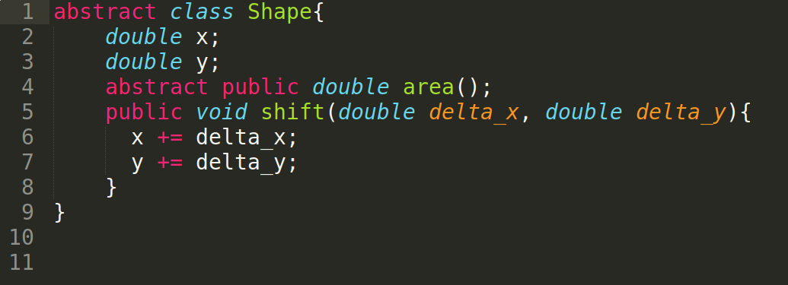
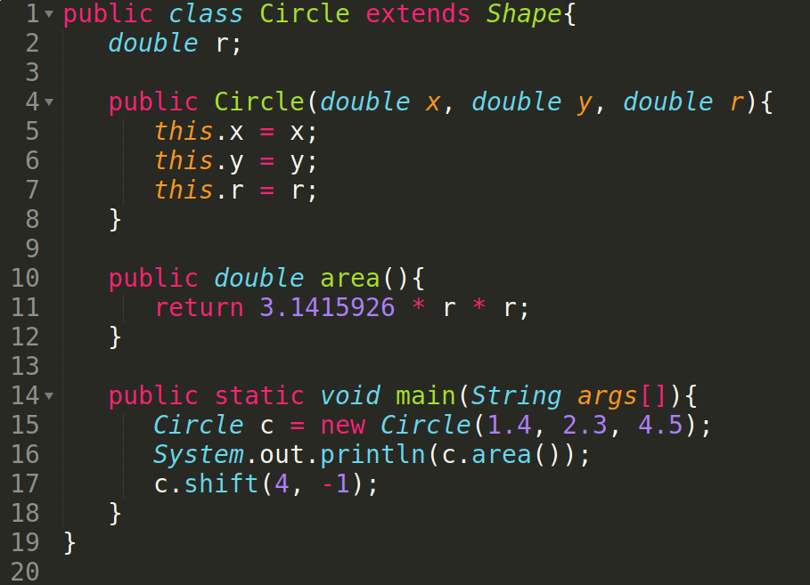
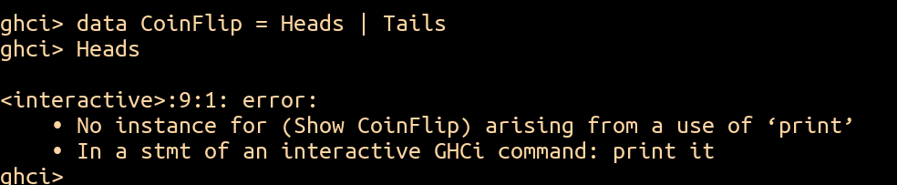
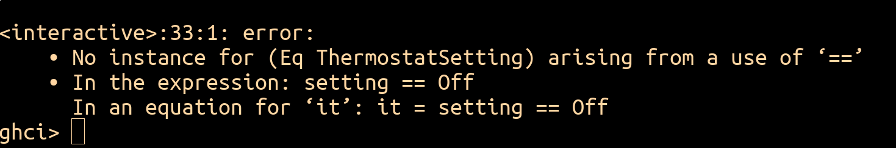

# Module 03.2: Haskell Data Types, Pattern Matching, and Type Classes

Module 03.1 gave you lists and tuples — Haskell's built-in ways to group data. This module shows you how to define data shapes of your **own**, using the `data` keyword. Along the way you'll get a clean, side-by-side look at object-oriented thinking versus functional thinking, applied to the exact same problem.

One concept to keep in the back of your mind as you go: today we're laying the foundation for something bigger. Once you can represent your *own* data, the door opens to representing **programs themselves** as data — which is exactly where this course heads next.

---

## A Design Problem: Representing Shapes

Suppose you need to represent circles, squares, and right triangles, and support two operations on any of them: computing the **area**, and **shifting** the shape's position by some `(Δx, Δy)`.

!!! question "Think about it"
    Before reading on: how would you represent circles, squares, and right triangles in an object-oriented language like Java or Python? How would you implement `area` and `shift`? Sketch a solution before comparing it to what follows.

### The Object-Oriented Way

A natural OOP solution defines an abstract `Shape` base class holding the position, with each subclass filling in its own `area`:

{ width="480" }
<br>*The shared `Shape` base class — position lives here, `area` is left abstract.*

{ width="480" }
<br>*`Circle` fills in its own `area`; `Square` and `RightTriangle` follow the same pattern.*

### The Functional Way

In Haskell, we use the `data` keyword to define a new type as a set of **constructors**. Each shape needs a position and its own dimensions:

```haskell
data Shape
  = Circle        Double Double Double  -- x, y, radius
  | Square        Double Double Double  -- x, y, side
  | RightTriangle Double Double Double Double  -- x, y, base, height
  deriving Show
```

Computing the area pattern-matches on which constructor we have:

```haskell
area :: Shape -> Double
area shape = case shape of
  Circle        _ _ r   -> pi * r * r
  Square        _ _ s   -> s * s
  RightTriangle _ _ b h -> 0.5 * b * h
```

And shifting rebuilds the shape with an updated position:

```haskell
shift :: Shape -> Double -> Double -> Shape
shift shape dx dy = case shape of
  Circle        x y r   -> Circle        (x + dx) (y + dy) r
  Square        x y s   -> Square        (x + dx) (y + dy) s
  RightTriangle x y b h -> RightTriangle (x + dx) (y + dy) b h
```

### Two Points of View

Same problem, genuinely different mental models:

- **Object-oriented:** *"A circle **knows** how to compute its own area and perform a shift."* Each object carries its own behavior.
- **Functional:** *"The `shift` function **knows** how to compute a shifted circle, square, or right triangle."* Each function knows how to operate across every shape.

It's tempting to treat these two as opposites, but they're better thought of as **orthogonal** — two independent axes in the space of possible programming languages, not two ends of the same one. Picture object-oriented and functional thinking as two vectors at right angles to each other, rather than as pointing in opposite directions. That distinction matters, because it means a language (or a codebase) can lean on both at once, and understanding one point of view doesn't require rejecting the other — it just means turning your head ninety degrees to look at the same problem from a different angle.

!!! warning
    "Data types" in Haskell are **not** the same thing as "classes" in OOP, even though `Circle`, `Square`, and `RightTriangle` might *feel* class-shaped. They just happen to share some surface vocabulary — the underlying concepts are genuinely different.

---

## Simple Data Types

The `Shape` type's constructors all carried data. The simplest data types don't carry anything at all — they're just a fixed menu of named values:

```haskell
data CoinFlip = Heads | Tails

data CardSuit = Clubs | Diamonds | Hearts | Spades

data ThermostatSetting = Off | Cooling | Heating
```

This should look familiar — it's exactly how Haskell's own built-in `Bool` is defined: `data Bool = True | False`. `Heads` is a value of type `CoinFlip`, the same way `True` is a value of type `Bool`.

There's a catch, though. Try printing a `CoinFlip` value in `ghci`, and:

{ width="560" }
<br>*Haskell doesn't automatically know how to display values of a type you just made up.*

The fix is to **derive** the `Show` type class, which we'll come back to properly at the end of this module:

```haskell
data CoinFlip = Heads | Tails
  deriving Show
```

Now `Heads` prints as `Heads`, just as you'd hope.

---

## Functions on Simple Data Types: `isRunning`, Seven Ways

Let's write a function `isRunning :: ThermostatSetting -> Bool` that's `False` when the setting is `Off`, and `True` otherwise. There's more than one reasonable way to write it — seeing all of them side by side is a good way to get a feel for Haskell's style options.

```haskell
-- 1. Pattern match the arguments directly
isRunning Off     = False
isRunning Cooling = True
isRunning Heating = True

-- 2. Pattern match inside a case expression
isRunning setting = case setting of
  Off     -> False
  Cooling -> True
  Heating -> True

-- 3. Pattern match the arguments, with a wildcard
isRunning Off = False
isRunning _   = True

-- 4. Case expression with a wildcard
isRunning setting = case setting of
  Off -> False
  _   -> True

-- 5. if / then / else
isRunning setting = if setting == Off then False else True

-- 6. A one-liner using (/=)
isRunning setting = setting /= Off

-- 7. Point-free, treating (/=) as a curried function
isRunning = (/= Off)
```

Style 5 has a catch: `==` requires an `Eq` instance, and we haven't derived one.

{ width="560" }
<br>*Just like `Show`, equality comparison isn't automatic — `deriving (Show, Eq)` fixes this.*

!!! question "Think about it"
    Which of these seven styles do you personally prefer? Is there a situation where one is clearly better (or worse) than another? Think about **readability**, **writability**, and **maintainability** — and whether your answer changes with how experienced you are with Haskell. If you were handed just the *behavior* of `isRunning` with no source code, could you tell which style had been used to write it?

---

## Data Types with Associated Values

Simple enumerations only get you so far. Real thermostats need actual temperatures:

```haskell
data ThermostatSetting
  = Off
  | CoolTo Int
  | HeatTo Int
  | OutOfService String
  deriving (Show, Eq)
```

Here's a useful way to think about the constructors: **`Off` is a value**, but **`CoolTo` is a function** — specifically, a function of type `Int -> ThermostatSetting`. Applying it to an `Int` is what produces an actual `ThermostatSetting` value:

```haskell
setting1 = Off              -- a value, directly
setting2 = CoolTo 20        -- CoolTo applied to 20
setting3 = OutOfService "Under repair"
```

The general shape of a Haskell datatype declaration is:

```
data <TypeName>
  = <Constructor1> <Type> <Type> ... <Type>
  | <Constructor2> <Type> <Type> ... <Type>
  | ...
  deriving (<TypeClass1>, <TypeClass2>, ...)
```

(If this reminds you of formal-grammar notation, hang on to that thought — you'll see something very similar again when this course gets to parsing.)

### Pattern Matching on Associated Values

Pattern matching extracts the values a constructor is carrying, not just which constructor was used:

```haskell
isRunning :: Int -> ThermostatSetting -> Bool
isRunning _    Off              = False
isRunning _    (OutOfService _) = False
isRunning temp (CoolTo t)       = temp > t
isRunning temp (HeatTo t)       = temp < t
```

The `_` wildcard shows up twice here for different reasons: in the first two lines, we don't need `temp` at all; in the second line, we don't need the out-of-service message either.

---

## Recursive Data Types

Just like lists, a data type can refer to *itself* — that's what makes it recursive. In fact, you can build your own list type from scratch:

```haskell
data IntList = Empty | Cons Int IntList
  deriving Show

myList = Cons 10 (Cons 20 (Cons 6 Empty))   -- [10, 20, 6], essentially
```

Every operation you'd expect follows the same recursive shape:

```haskell
intListLength :: IntList -> Int
intListLength Empty        = 0
intListLength (Cons _ xs)  = 1 + intListLength xs

intListSum :: IntList -> Int
intListSum Empty       = 0
intListSum (Cons x xs) = x + intListSum xs

intListMap :: (Int -> Int) -> IntList -> IntList
intListMap _ Empty        = Empty
intListMap f (Cons x xs)  = Cons (f x) (intListMap f xs)
```

Not every case has a sensible answer, though. What should `intListHead Empty` return — the first element of a list that has no elements? There isn't one. Recall `undefined` from Module 02.2: it's the idiomatic way to mark "this case should never actually be reached, and if it is, crash loudly instead of returning something misleading":

```haskell
intListHead :: IntList -> Int
intListHead Empty        = undefined
intListHead (Cons x _)   = x

intListTail :: IntList -> IntList
intListTail Empty        = undefined
intListTail (Cons _ xs)  = xs
```

This is a genuinely common pattern — plenty of built-in Haskell functions (`head` and `tail` on ordinary lists, for instance) do exactly this for their empty-list case.

The same idea scales to shapes that aren't lists at all — a binary tree, for instance, where a node has *two* recursive children instead of one:

```haskell
data StringBinaryTree
  = Leaf String
  | Node String StringBinaryTree StringBinaryTree
  deriving Show

exampleTree = Node "root" (Leaf "left") (Node "right" (Leaf "a") (Leaf "b"))
```

```haskell
treeSize :: StringBinaryTree -> Int
treeSize (Leaf _)          = 1
treeSize (Node _ left right) = 1 + treeSize left + treeSize right

treeHeight :: StringBinaryTree -> Int
treeHeight (Leaf _)            = 0
treeHeight (Node _ left right) = 1 + max (treeHeight left) (treeHeight right)

treeMap :: (String -> String) -> StringBinaryTree -> StringBinaryTree
treeMap f (Leaf s)            = Leaf (f s)
treeMap f (Node s left right) = Node (f s) (treeMap f left) (treeMap f right)
```

Notice `treeSize` and `treeHeight` have the exact same shape as `intListLength` — one case for the base constructor, one recursive case that combines the sub-results. That shape, not the specific data type, is the real pattern worth internalizing.

---

## Type Classes

You've now used `deriving Show` and `deriving Eq` several times without a full explanation — time to fix that.

Recall that **values have types**: `'C' :: Char`, `True :: Bool`, `[True, False] :: [Bool]`. **Type classes** go one level up: they're families of *types* that all support some shared set of operations.

- **`Eq`** — defines `==` and `/=`.
- **`Ord`** — defines comparisons like `<`; anything in `Ord` must also be in `Eq`. By default, ordering follows the order constructors were listed in.
- **`Show`** — defines `show`, converting a value to a `String` (this is what lets `ghci` print your values).
- **`Read`** — defines `read`, converting a `String` into a value. Haskell needs to know what type to expect, so `read "4" + 2` or `(read "4") :: Int` works, but bare `read "4"` doesn't.
- **`Num`** — defines `+`, `-`, `*`, and friends.

!!! tip "Watch out: `read` needs a type, and the type needs `Read`"
    Suppose you have `data CardSuit = Clubs | Diamonds | Hearts | Spades deriving (Show, Eq, Ord)`. Calling `read "Clubs"` on its own fails with a **`no parse`** error — Haskell has no way of knowing what type `"Clubs"` is supposed to turn into, so it can't even attempt the conversion. Annotating the type, `read "Clubs" :: CardSuit`, still fails with the same error, for a different reason this time: `CardSuit` never derived `Read`. Add it — `deriving (Show, Eq, Ord, Read)` — and `read "Clubs" :: CardSuit` finally succeeds, giving back the value `Clubs`.

There are more type classes than this, and you'll meet them as they become useful.

!!! warning
    Despite the name, Haskell's **type classes are not classes from object-oriented programming.** They both happen to use the word "class," but they're unrelated concepts — the same trap as "data types aren't OOP classes" from earlier in this module, just one level up.

---

## Bonus: Combining Data Types

Data types compose. Here's a deck of cards built from two simple types and one recursive one:

```haskell
data CardSuit = Clubs | Diamonds | Hearts | Spades
  deriving (Show, Eq, Ord)

data FaceValues
  = Two | Three | Four | Five | Six | Seven | Eight
  | Nine | Ten | Jack | Queen | King | Ace
  deriving (Show, Eq, Ord)

type Card = (FaceValues, CardSuit)

data CardList = Empty | Hand Card CardList
  deriving (Show, Eq, Ord)

myHand = Hand (Two, Hearts) (Hand (Ace, Diamonds) (Hand (Ten, Spades) Empty))
```

That `type` line is doing something different from `data` — it's a **type alias**: a new name for an existing type (here, the tuple `(FaceValues, CardSuit)`), rather than a brand-new type of its own. `myCard = (Two, Hearts)` has type `Card`, but ask `ghci` for its type with `:t myCard` and you'll get back the more verbose `(FaceValues, CardSuit)`, not the alias — Haskell always shows you the underlying type. You've actually been using a type alias all along without knowing it: `String` is nothing more than an alias for `[Char]`.

Nothing else here is new conceptually — just the same tools (simple types, associated values, recursive structure, `deriving`) put together.

One more thing worth noticing: because both `FaceValues` and `CardSuit` derive `Ord`, a comparison like `(Three, Diamonds) < (Five, Hearts)` — `True` — works automatically on tuples built from them, comparing element-by-element (the `FaceValues` first, falling through to the `CardSuit` only on a tie). Deriving `Ord` on your own component types isn't just useful by itself — it's exactly what lets tuples (and, here, `CardList`) built out of those types derive `Ord` too, for free.

---

## Where This Leaves Us

You can now define your own data shapes — simple enumerations, constructors carrying values, and recursive structures like lists and trees — and you've seen `deriving` connect a type to the shared behaviors (`Show`, `Eq`, `Ord`, and more) that type classes provide. Remember that "important concept alert" from the start of this module? Module 4 is where it pays off: **Interpreting Programs**, where you'll use exactly these tools to represent *programs themselves* as data, on the way to **HW3: Lists, Datatypes, and a Stack Machine**.
