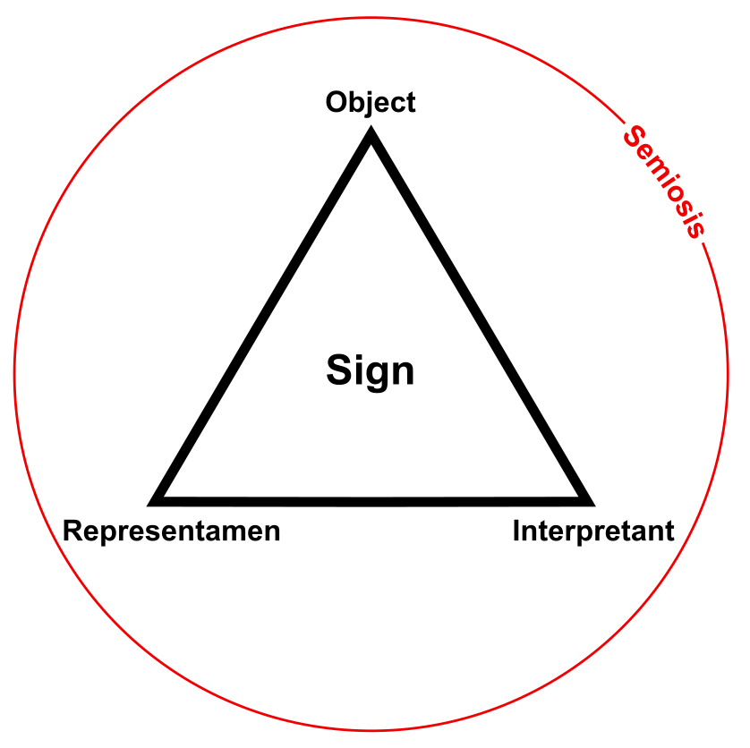
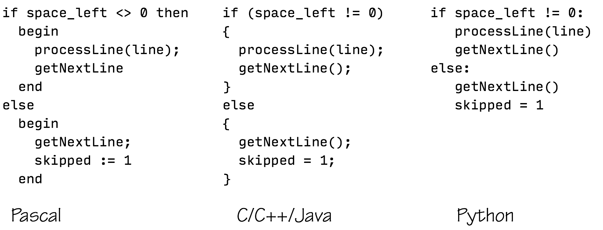
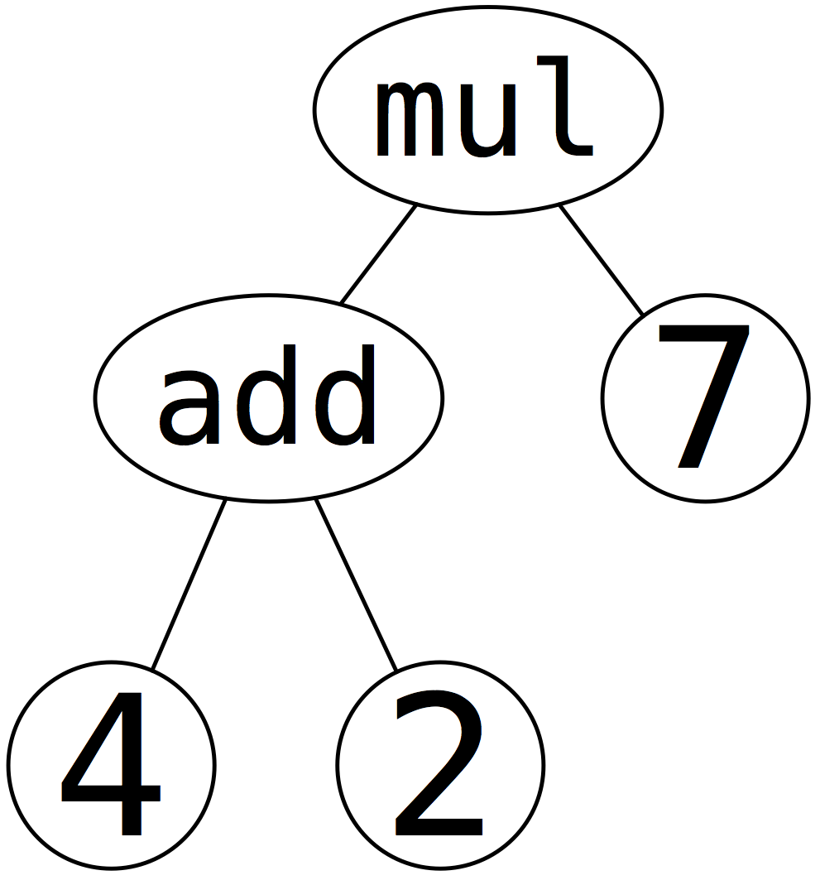
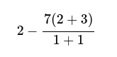
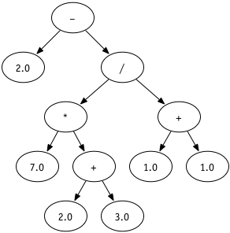

# Module 04.1: Code as Data, Evaluating Expressions

HW3 had you build a stack machine — representing an arithmetic expression as data, then writing a function to evaluate it. This module steps back and makes that idea explicit and general: **code is data**. Once you can represent a program as a data structure, all the tools you already have — pattern matching, recursion, recursive data types — become tools for *understanding and running programs themselves*.

---

## Programs That Operate on Programs

Most programs you've written take some input and produce some output: a list of numbers in, an average out; coordinates in, a shortest path out; a text file in, a list of spelling errors out.

But nothing stops the *input* (or output) from being **source code**:

- A program that counts lines of code.
- A program that reformats source code for readability.
- A program that translates source code into lower-level machine code — a **compiler**.
- A program that runs source code directly, producing a value — an **interpreter**.

!!! question "Think about it"
    What other programs can you think of that take code (or produce code) as their input or output? (Hint: what does your text editor's syntax highlighter do? What about a plagiarism checker?)

Once code is just another kind of data, all of this becomes possible — and it's exactly the idea this module (and much of the rest of the course) builds on.

---

## Expressions and Statements

Two words worth pinning down precisely:

- **Expression** — a computation that calculates a value. Functional programming is built around evaluating expressions.
- **Statement** — a computation performed for its *effect*, typically changing some state. Statements don't have a value of their own. Imperative programming is built around executing a sequence of statements.
- **Side effect** — anything a piece of code does *besides* calculating a value. Functional languages minimize side effects — Racket allows a few, Haskell allows essentially none.

A few C/C++ examples to sharpen the distinction:

!!! question "Think about it"
    For each of these, is it an expression, a statement, or (interestingly) both?

    ```c
    10 * z + 4

    x++;

    while (x > 3) { x = x - 1; y = y + 1; }
    ```

    ??? note "Sorting them out"
        `10 * z + 4` is purely an **expression** — several smaller expressions (`10 * z`, `z`, `4`) combining into a larger one, and the whole thing evaluates to a value.

        `x++;` is a **statement** — its job is to change `x`. But it's a sneaky case: `x++` is *also* an expression, since it evaluates to the original value of `x` before incrementing. The line between expression and statement can blur.

        `while (x > 3) { x = x - 1; y = y + 1; }` is purely a **statement**. It wouldn't make sense to write `x = (while (...) { ... })` — a `while` loop has no value to assign.

This is exactly why Haskell feels different: with no statements and (essentially) no side effects, *everything* is an expression, and computation is nothing but expression evaluation, all the way down.

---

## Syntax and Semantics

Two more words, easy to blur together but worth keeping separate:

- **Syntax** — what the programmer is allowed to write. The *rules of the language*.
- **Semantics** — what that writing *means*. The *behavior*.

!!! question "Think about it"
    For each of these, is it syntax, semantics, or both?

    1. According to the C++ standard, `^` is a valid binary operator.
    2. When applied to two integers, `^` computes bitwise exclusive-or.
    3. If you add two `int`s and the sum overflows, the result is undefined behavior.
    4. A semicolon by itself (`;`) is a legal, do-nothing statement.

    ??? note "Sorting them out"
        (1) is pure **syntax** — it says what you're *allowed* to write, not what it does. (2) is pure **semantics** — it tells you what `^` actually computes. (3) is **semantics** — it describes what happens (or, in this case, what's left undefined). (4) is genuinely **both**: it's a fact about what you're allowed to write (an empty statement is legal) *and* a fact about what it does (nothing).

Attaching meaning (semantics) to symbols (syntax) isn't unique to programming — it's the same question philosophers, linguists, and semioticians ask about language and representation in general. One classic way of picturing it is the **semiotic triangle**: a *sign* connects a physical *representamen* (the symbol itself), the *object* it refers to, and the *interpretant* (the meaning a mind constructs from it).

{ width="360" }
<br>*The semiotic triangle: a sign is not the same thing as what it represents.*

(If you've seen René Magritte's painting of a pipe captioned *"Ceci n'est pas une pipe"* — "This is not a pipe" — that's the same idea: the painted symbol of a pipe is not, itself, a pipe. Symbols and the things they denote are genuinely different, and mixing them up causes real confusion — including, as you're about to see, in how we represent code.)

This same question — how does a symbol ever come to *mean* something, rather than just being an arbitrary shape — shows up well beyond programming. Two related ideas worth knowing the names of, if you enjoy this kind of thing:

- **The symbol grounding problem** — a philosophical puzzle about how symbols (in spoken language, in thought, in a computer) ever get attached to real meaning in the first place, rather than just referring to *other* symbols in an endless, ungrounded chain.
- **The physical symbol system hypothesis** — the claim, from early AI research, that being able to manipulate symbols is both *necessary* and *sufficient* for intelligence.

Neither is something you need to resolve to write a working interpreter — but they're the same syntax/semantics distinction you just learned, showing up in philosophy of mind and AI instead of programming languages. (The same syntax/semantics split shows up in the philosophy of *art*, too — criticism and aesthetics both turn on the gap between a work and what it represents.)

---

## Concrete and Abstract Syntax

- **Concrete syntax** — code exactly as the programmer writes it: keywords, punctuation, specific characters, in a specific order, with rules for resolving ambiguity (what does `3 - 7 * 2` mean?). Concrete syntax is what a **grammar** describes.
- **Abstract syntax** — the *essential structure* of the code, with the incidental details stripped away. Abstract syntax represents a program as a tree.

The same logic, in wildly different concrete syntax, still has the same underlying structure:

{ width="600" }
<br>*Three concrete syntaxes, one abstract structure.*

An **abstract syntax tree** (AST) throws away exactly the details that don't matter — keywords, punctuation, whitespace — and keeps only the structure that determines meaning:

{ width="240" }
<br>*The AST for `(4 + 2) * 7`. No parentheses needed — the tree shape already says what groups with what.*

### A Bigger Syntax Exercise

!!! question "Think about it"
    Take the expression below and write it in as many different ways as you can — different notations, different languages, even plain English.

    { width="180" }

    ??? note "A few options"
        - Standard infix: `2 - 7(2+3)/(1+1)`
        - S-expression (prefix) style: `(- 2.0 (/ (* 7.0 (+ 2.0 3.0)) (+ 1.0 1.0)))`
        - Curried function application: `(-) 2 ((/) ((*) 7 ((+) 2.0 3.0)) ((+) 1.0 1.0))`
        - Plain English: "add two and three and multiply that by seven, dividing the result by one plus one, and then subtract that result from 2"
        - Formal English: "SUBTRACT FROM TWO THE RESULT OF DIVIDING SEVEN TIMES THE SUM OF TWO AND THREE BY THE SUM OF ONE AND ONE"
        - Postfix (RPN) — the same notation your HW3 stack machine speaks: `2 7 2 3 + * 1 1 + / -`

Every one of those is wildly different concrete syntax. All of them share the exact same abstract syntax tree:

{ width="360" }
<br>*One tree, six (or more) concrete notations — including the postfix form your stack machine already understands.*

---

## Representing Abstract Syntax in Haskell

How should we actually encode an expression tree as a Haskell datatype? It's worth seeing a few tempting-but-flawed options before landing on a good one.

**Option 1 (wrong):**
```haskell
data Exp = Double
         | Plus   Exp Exp
         | Minus  Exp Exp
         | Times  Exp Exp
         | Divide Exp Exp
```
This compiles, but it's broken: `Double` here is just a nullary constructor *named* `Double` — it doesn't actually carry a `Double` value. There's no way to represent an actual number.

**Option 2 (inelegant):**
```haskell
data Exp = Num Double
         | Plus   Exp Exp
         | Minus  Exp Exp
         | Times  Exp Exp
         | Divide Exp Exp
```
This one works, but every function over `Exp` needs four nearly-identical cases for the four operators, even when the operator itself doesn't matter to the logic.

**Option 3 (nice):**
```haskell
data Op  = PlusOp | MinusOp | TimesOp | DivOp
data Exp = Num   Double
         | BinOp Exp Op Exp
```
One constructor for "binary operation," parameterized by *which* operation. No redundancy, and pattern matching stays concise.

**Option 4 (too far):**
```haskell
type Op  = String
data Exp = Num   Double
         | BinOp Exp Op Exp
```
Using a bare `String` for the operator sacrifices type safety — nothing stops you from writing `BinOp (Num 1) "banana" (Num 2)`.

**Option 5 (not abstract enough):**
```haskell
data Paren = LeftParen | RightParen
data Exp   = Num           Double
           | BinOp         Exp Op Exp
           | Parenthesized Paren Exp Paren
```
Adding a constructor for parentheses is redundant — the *tree structure itself* already encodes grouping, which is precisely the point of an abstract syntax tree. Precedence and parenthesization are concrete-syntax concerns, not abstract-syntax ones. Worse, this representation allows nonsense like `Parenthesized RightParen (Num 2.0) RightParen` — mismatched parens that should never be constructible in the first place.

**Option 3 is the one we'll use.**

---

## Pretty Printing and Evaluation

With `Op` and `Exp` settled:

```haskell
data Op  = PlusOp | MinusOp | TimesOp | DivOp
  deriving Show

data Exp = Num   Double
         | BinOp Exp Op Exp
  deriving Show
```

**Pretty printing** turns an `Exp` back into a readable `String` — essentially the reverse of parsing:

```haskell
format :: Exp -> String
format (Num x) = show x
format (BinOp left op right) =
  "(" ++ format left ++ opString op ++ format right ++ ")"

opString :: Op -> String
opString PlusOp  = " + "
opString MinusOp = " - "
opString TimesOp = " * "
opString DivOp   = " / "
```

**Evaluation** computes the actual value, recursively:

```haskell
eval :: Exp -> Double
eval (Num x) = x
eval (BinOp left PlusOp  right) = eval left + eval right
eval (BinOp left MinusOp right) = eval left - eval right
eval (BinOp left TimesOp right) = eval left * eval right
eval (BinOp left DivOp   right) = eval left / eval right
```

Both functions share the same shape: a base case for `Num`, and a recursive case for `BinOp` that processes the two subexpressions and combines the results. That shape — not the specific code — is the real takeaway.

### A Fully Worked Example

Small examples are good for showing the *shape* of `format` and `eval`, but it's worth seeing both run on something bigger — a genuinely nested tree, not just one or two levels — to convince yourself the recursion really does handle arbitrary depth. Take the expression `((2.0 + 3.0) * (5.0 - 8.0)) - 0.5`. As an `Exp` value:

```haskell
bigExp :: Exp
bigExp = BinOp
           (BinOp (BinOp (Num 2.0) PlusOp (Num 3.0))
                  TimesOp
                  (BinOp (Num 5.0) MinusOp (Num 8.0)))
           MinusOp
           (Num 0.5)
```

`format bigExp` walks the tree and reconstructs the concrete syntax: `"(((2.0 + 3.0) * (5.0 - 8.0)) - 0.5)"`.

`eval bigExp` walks the same tree, but reduces it to a `Double` instead of a `String`. Tracing the recursion from the leaves up:

1. The innermost left branch: `eval (BinOp (Num 2.0) PlusOp (Num 3.0))` → `2.0 + 3.0` → `5.0`
2. The innermost right branch: `eval (BinOp (Num 5.0) MinusOp (Num 8.0))` → `5.0 - 8.0` → `-3.0`
3. Combining those two with the middle operator: `5.0 * (-3.0)` → `-15.0`
4. Combining that with the outermost operator: `-15.0 - 0.5` → **`-15.5`**

Every step of that trace is just one application of the `BinOp` case of `eval` — the same one-line pattern match, applied recursively until the tree bottoms out at `Num` leaves. No matter how deep or wide the tree gets, `eval` never needs a new case to handle it.

---

## Evaluating Expressions with Variables

Real expressions have variables. We add a `Symbol` constructor to `Exp`:

```haskell
data Exp = Symbol String
         | Num    Double
         | BinOp  Exp Op Exp
  deriving Show
```

To evaluate a `Symbol`, we need somewhere to look up what it's currently bound to — a **symbol dictionary**, mapping symbols to the expressions they stand for:

```haskell
type SymbolDictionary = [(Exp, Exp)]

symbolLookup :: Exp -> SymbolDictionary -> Exp
symbolLookup symb [] = error "Symbol not found in dictionary."
symbolLookup symb ((key, val):rest)
  | symb == key = val
  | otherwise   = symbolLookup symb rest
```

And `eval` grows a second parameter — the dictionary — threaded through every recursive call:

```haskell
eval :: Exp -> SymbolDictionary -> Double
eval (Num x) _ = x
eval (Symbol x) dict =
  let expr = symbolLookup (Symbol x) dict
  in eval expr dict
eval (BinOp left PlusOp  right) dict = eval left dict + eval right dict
eval (BinOp left MinusOp right) dict = eval left dict - eval right dict
eval (BinOp left TimesOp right) dict = eval left dict * eval right dict
eval (BinOp left DivOp   right) dict = eval left dict / eval right dict
```

When `eval` hits a `Symbol`, it looks up the expression that symbol is bound to, then evaluates *that* — recursively, using the same dictionary, in case the looked-up expression itself contains more symbols.

---

## Where This Leaves Us

You now have a name for what HW3 already had you doing — representing a program as data, then writing recursive functions that traverse that structure — and a first taste of a **symbol table**, which is exactly how a real interpreter keeps track of variables. Module 04.2 continues by asking the natural next question: what about functions themselves? How do you represent *applying* a function as part of this same data structure?
