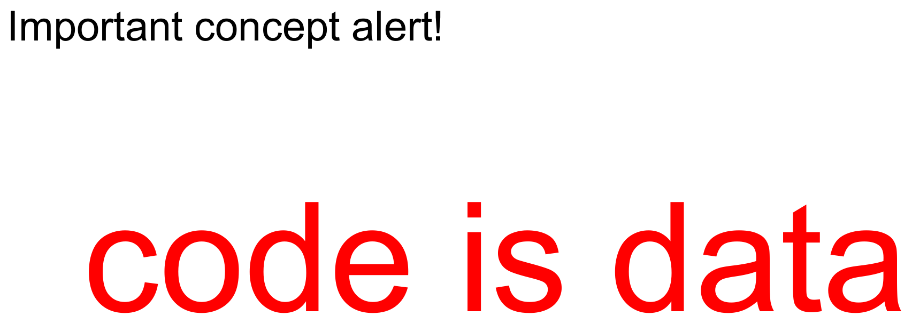

# Module 04.1: Code as Data, Evaluating Expressions

For the first few weeks of CS 131, Haskell has been our vehicle for learning a collection of ideas: **functions as values**, **higher-order functions**, **pattern matching**, **recursion**, and **recursive data structures**.

Now those pieces start coming together around one of the central ideas of the course:

> **Code is data.**

A program can take numbers, lists, coordinates, or text as input. But a program can also take **another program** as input. Once we represent code as ordinary structured data, the tools you already know for processing recursive data become tools for processing programs.

This module builds that bridge. We will distinguish **expressions from statements**, **syntax from semantics**, and **concrete syntax from abstract syntax**. Then we will represent arithmetic expressions as recursive Haskell data and write functions that **pretty-print** and **evaluate** those expressions.

This is also closely connected to HW3: the stack-machine representation gives you one way to treat an arithmetic expression as data. Here we step back and make the general idea explicit.

By the end of this module, you should be able to:

- explain what it means to say **code is data**,
- distinguish expressions, statements, and side effects,
- distinguish syntax from semantics,
- distinguish concrete syntax from abstract syntax,
- explain what an **abstract syntax tree** (AST) keeps and what it deliberately throws away,
- represent a small expression language using recursive Haskell data types,
- explain why some seemingly plausible representations of syntax are better than others,
- recursively traverse an AST,
- write and understand a simple pretty printer,
- write and understand a simple evaluator, and
- explain why evaluating variables requires some representation of their bindings.

!!! note "How to use this module"
    When you see a box labeled **Gradescope question**, answer that question in the **Module 4.1 Completion** assignment on Gradescope.

    Other boxes labeled **Pause and think**, **Try it**, or **Practice** are there to help you understand the material. There is nothing to submit for those unless the box explicitly says **Gradescope question**.

---

## Where We Have Been, and Where We Are Going

It is worth locating this module in the larger arc of the course.

We started with some historical and social context for programming and computation: Babbage, Lovelace, Turing, Church, and different ways of thinking about what computation is.

Then we developed functional-programming ideas:

- functions are values,
- higher-order functions,
- pattern matching,
- recursion,
- recursive data structures.

At the same time, we learned enough Haskell to make those ideas concrete.

Now we turn toward **programming languages themselves as things that programs can operate on**.

{ width="640" }

The key transition is:

```text
recursive data structures
        ↓
trees
        ↓
programs represented as trees
        ↓
recursive functions that operate on programs
```

The machinery is not entirely new. What is new is **what the data represents**.

---

## Programs That Operate on Programs

We often picture a program as a box with an input and an output:

```text
list of integers -> program -> average

coordinates      -> program -> shortest path

text file        -> program -> spelling errors
```

But the input can itself be **source code**.

For example:

```text
source code -> program -> number of lines

source code -> program -> nicely formatted source code

source code -> program -> machine code

source code -> program -> value
```

Those middle programs include tools you already know:

- a formatter takes source code and produces reformatted source code,
- a compiler takes source code and produces lower-level code,
- an interpreter takes a representation of code and evaluates it.

{ width="900" }

{ width="420" }

This motivates the central idea:

> If we can represent source code as data, then programs can inspect it, transform it, translate it, format it, analyze it, or execute it.

But saying "code is data" leaves an important design question:

> **What data structure should represent the code?**

Before answering that, we need some vocabulary.

!!! question "Gradescope question: Representing arithmetic expressions"
    **Submit this response on Gradescope.**

    **How can you represent arithmetic expressions using Haskell data types?**

    You do not need to have the final representation yet. Brainstorm a plausible design based on what you learned about Haskell data types in Module 03.2.

Here are some expressions to keep in mind while you think:

```text
(2 + 2) * 7 - 11
15 - 3
5 + 4 + 3 + 2 + 1
```

Or, in a prefix / Racket-style notation:

```text
(minus (times (plus 2 2) 7) 11)
(minus 15 3)
(plus 5 (plus 4 (plus 3 (plus 2 1))))
```

{ width="520" }

Do not worry yet about whether your proposed representation is ideal. We will build one carefully later.

---

## Expressions, Statements, and Side Effects

When we talk about evaluating code, the word **expression** matters.

### Expression

An **expression** is a computation that calculates a value.

For example:

```c
10 * z + 4
```

is an expression. So are its pieces:

```c
10
z
4
10 * z
```

Each one can be evaluated to produce a value.

In functional programming, computation is largely described as **evaluating expressions**.

### Statement

A **statement** is a computation performed primarily for its **effect** on the state of the program.

For example:

```c
while (x > 3) {
    x = x - 1;
    y = y + 1;
}
```

changes program state. The loop is something we **execute**, but the loop itself is not a value that can be inserted into a larger arithmetic expression.

In an imperative language, computation is often described as **executing a sequence of statements**.

### Side effect

A **side effect** is something a computation does besides producing its value, such as modifying mutable state or performing input/output.

For our purposes in this part of the course, the important contrast is:

```text
functional style:   evaluate expressions to values

imperative style:   execute statements that change state
```

!!! note "A small Haskell precision"
    We have been working almost entirely with **pure Haskell functions**, where evaluating the same expression does not secretly mutate ordinary program state.

    Haskell can still perform input/output and other effects, but it represents and controls those effects explicitly rather than allowing arbitrary hidden side effects inside ordinary pure functions. We will not need the machinery for that distinction here.

### Sometimes the line blurs

C and C++ give us an instructive example:

```c
x++;
```

It certainly has an **effect**: it changes `x`.

But the expression `x++` also has a value. For post-increment, that value is the **old value of `x`**, before the increment.

So the same piece of code can be both:

- an expression, because it has a value, and
- used as a statement, because we may execute it just for its effect.

That is a useful reminder that "expression" and "statement" describe language constructs and their roles, not simply two visual shapes of code.

{ width="640" }

!!! question "Gradescope question: Expression or statement?"
    **Submit this response on Gradescope.**

    In C++, is the code

    ```cpp
    int x = 100;
    ```

    an expression, a statement, or both?

    - A. Expression
    - B. Statement
    - C. Both

??? note "After you answer"
    In C++, this is a **declaration statement**. It creates and initializes a variable, but the declaration itself does not evaluate to a value that can be used as a subexpression.

---

## Syntax and Semantics

Two of the most important words in programming languages are **syntax** and **semantics**.

### Syntax

**Syntax** describes what a programmer is allowed to write and how those written pieces may be arranged.

For example:

```text
According to the C++ grammar, `^` is a valid binary operator.
```

This is a claim about syntax. It tells us that a certain symbol may occur in a certain grammatical position.

Syntax answers questions such as:

- Which tokens and keywords exist?
- Where may they appear?
- Which strings count as valid programs?
- How are pieces grouped?

### Semantics

**Semantics** describes what valid code **means** or **does**.

For example:

```text
When applied to two integers in C++, `^` computes bitwise exclusive-or.
```

That is a semantic claim. The character `^` could have been assigned a different meaning. The language gives that syntax this semantics.

Another semantic fact might say what happens if an integer computation overflows, or what storage is allocated by a particular construct.

A programming language therefore needs both:

```text
syntax      what can I write?
semantics   what does it mean?
```

!!! question "Gradescope question: Syntax, semantics, or both?"
    **Submit this response on Gradescope.**

    Is this statement about **syntax**, **semantics**, or **both**?

    > A semicolon by itself is a legal statement, a "no-op" which performs no computation.

    - A. Syntax
    - B. Semantics
    - C. Both

??? note "After you answer"
    It is **both**.

    "A semicolon by itself is a legal statement" tells us something about what may be written: syntax.

    "It performs no computation" tells us what that construct does: semantics.

!!! question "Gradescope question: Syntax, semantics, or both?"
    **Submit this response on Gradescope.**

    Is this statement about **syntax**, **semantics**, or **both**?

    > The expression `new int` allocates an uninitialized integer on the heap, whereas `new int()` allocates the integer `0` on the heap.

    - A. Syntax
    - B. Semantics
    - C. Both

??? note "After you answer"
    The important information here is **semantic**: the statement is primarily telling us what the two constructs do.

    It necessarily also shows us two pieces of valid concrete syntax, but the distinction being explained is a difference in behavior.

    A few more examples classified the same way:

    { width="640" }

### Attaching meaning to symbols

The syntax/semantics distinction is not peculiar to programming.

A symbol is not the same thing as what it denotes. The character sequence:

```text
+
```

is only a mark until a language assigns it a role and meaning.

This connects programming-language semantics to questions in:

- linguistics,
- [semiotics](https://en.wikipedia.org/wiki/Semiotics),
- philosophy of language,
- philosophy of mind,
- artificial intelligence,
- aesthetics and representation.

This connects to René Magritte's *The Treachery of Images* ("This is not a pipe"), the semiotic triangle, the [**symbol grounding problem**](https://en.wikipedia.org/wiki/Symbol_grounding_problem), and the [**physical symbol system hypothesis**](https://en.wikipedia.org/wiki/Physical_symbol_system).

{ width="360" }
<br>*René Magritte, [**The Treachery of Images**](https://en.wikipedia.org/wiki/The_Treachery_of_Images) (1929). © the artist's estate; reproduced here at low resolution for educational commentary.*

You do not need those philosophical ideas in order to implement an interpreter. But they make the underlying distinction vivid:

> The representation is not the thing represented, and syntax is not semantics.

{ width="360" }

---

## Concrete Syntax and Abstract Syntax

"Syntax" itself has two useful levels.

### Concrete syntax

**Concrete syntax** is what the programmer actually writes.

It includes things such as:

- characters and tokens,
- keywords,
- punctuation,
- legal identifiers,
- parentheses,
- operator precedence,
- rules for resolving ambiguity.

For example:

```text
(4 + 2) * 7
```

is concrete syntax.

A grammar describes which concrete strings are legal and how they are structured.

### Abstract syntax

**Abstract syntax** keeps the essential structural information while discarding concrete details that are no longer needed.

We can represent the same expression as a tree:

```text
        *
       / \
      +   7
     / \
    4   2
```

The tree already tells us that `4 + 2` happens as one subexpression before it is multiplied by `7`.

We no longer need parentheses to communicate grouping. The **shape of the tree** records it.

That tree is an **abstract syntax tree**, usually abbreviated **AST**.

{ width="640" }

### Different concrete syntax can describe the same abstract structure

Different languages can express the very same underlying logic with entirely different concrete syntax:

{ width="640" }

The keywords, punctuation, and layout differ across all three. But the underlying structure — an if/else with the same two branches — is identical.

This is why an interpreter or compiler usually does not want to manipulate raw strings forever. A tree gives us a representation where the relevant structure is explicit.

---

## One Tree, Many Concrete Representations

Here is a more substantial abstract syntax tree.

{ width="360" }

!!! question "Gradescope question: Write concrete syntax for an AST"
    **Submit this response on Gradescope.**

    **Write concrete syntax for the abstract syntax tree shown above in as many different ways as you can.**

There is no single required notation. Possible representations include ordinary mathematical notation, programming-language notation, prefix notation, postfix notation, or even carefully written English.

For example, the same tree can be written as:

```text
2 - 7(2 + 3) / (1 + 1)
```

or in an S-expression-style prefix form:

```text
(- 2.0
   (/ (* 7.0 (+ 2.0 3.0))
      (+ 1.0 1.0)))
```

or in postfix notation:

```text
2 7 2 3 + * 1 1 + / -
```

or in English:

> subtract from two the result of dividing seven times the sum of two and three by the sum of one and one

The surface forms differ dramatically. The underlying tree is the same.

??? note "A fuller reveal, once you've tried it yourself"
    { width="720" }

---

## Parsing and Pretty Printing

The "Two views of Syntax" diagram above gives us two directions between concrete and abstract syntax:

```text
source string  ---- parsing ---->  abstract syntax tree

source string  <--- formatting --- abstract syntax tree
```

More precisely:

- **parsing** turns concrete syntax into structured abstract syntax,
- **formatting** or **pretty printing** turns abstract syntax into readable concrete syntax.

We will study parsing in much more detail later. For now, the important point is that these transformations are not equally difficult.

### Why parsing is harder

If you already have an AST, its structure is explicit. A formatter can recursively walk the tree and choose how to print each constructor.

A parser begins with a **linear sequence of characters or tokens** and has to reconstruct that hidden structure.

It may have to answer questions such as:

- Which operator binds more tightly?
- Is an identifier a variable, function name, type name, or something else?
- Where does one subexpression end?
- Are parentheses required here, or merely optional?
- Is the input syntactically valid at all?
- If there are several possible parses, which one is intended?

That is much more information to recover.

!!! question "Gradescope question: Why is parsing harder?"
    **Submit this response on Gradescope.**

    **Can you think of some reasons why parsing is harder than formatting?**

### Are parsing and formatting inverses?

This question has an important asymmetry.

Suppose:

```text
parse   :: String -> AST
format  :: AST -> String
```

Should we expect:

```text
format (parse inputString) == inputString
```

and:

```text
parse (format ast) == ast
```

?

!!! question "Gradescope question: Should parsing and formatting be inverses?"
    **Submit this response on Gradescope.**

    Do you think formatting and parsing should be inverses?

    Remember:

    - parsing takes a string and gives back an abstract syntax tree,
    - formatting takes an abstract syntax tree and gives back a string.

    So should it be the case that:

    ```text
    format(parse(input_string)) == input_string
    ```

    and:

    ```text
    parse(format(abstract_syntax_tree)) == abstract_syntax_tree
    ```

    ?

??? note "After you answer: the two directions are different"
    We often **do** want:

    ```text
    parse (format ast) == ast
    ```

    because formatting an AST and parsing the result should ideally recover the same abstract structure.

    But we usually should **not** expect:

    ```text
    format (parse source) == source
    ```

    character-for-character.

    Parsing intentionally discards concrete details. These may include whitespace, redundant parentheses, comments, or stylistic choices. The formatter may then choose one canonical way to print the same structure.

    For example, both:

    ```text
    (4+2)*7
    ```

    and:

    ```text
    ( 4 + 2 ) * 7
    ```

    might parse to the same AST. A formatter cannot reconstruct which spacing the programmer originally used if that information was deliberately discarded.

This distinction is another consequence of **abstract** syntax being abstract: it forgets some concrete information on purpose.

---

## How Should We Represent an AST in Haskell?

Now we are ready to return to the question from the beginning:

> How can we represent arithmetic expressions as Haskell data?

We will use the data-type design skills from Module 03.2.

There are several plausible answers. Comparing them is useful because the **representation determines how easy later functions will be to write**.

---

## Attempt 1: A Constructor Named `Double`

Here is a tempting first attempt:

```haskell
data Exp
  = Double
  | Plus   Exp Exp
  | Minus  Exp Exp
  | Times  Exp Exp
  | Divide Exp Exp
```

This is valid Haskell, but it does not mean what we want.

The name `Double` here is just a **constructor name**. It carries no associated value.

So we could construct:

```haskell
Double
```

but not a particular numeric literal such as `3.14`.

This is exactly the constructor/value distinction from Module 03.2.

{ width="560" }

---

## Attempt 2: One Constructor per Arithmetic Operator

We can fix the number case:

```haskell
data Exp
  = Num    Double
  | Plus   Exp Exp
  | Minus  Exp Exp
  | Times  Exp Exp
  | Divide Exp Exp
```

This representation works.

For example:

```haskell
Times
  (Plus (Num 4) (Num 2))
  (Num 7)
```

can represent:

```text
(4 + 2) * 7
```

So why not stop here?

Because the four binary-operation constructors have exactly the same structural shape:

```text
Exp -> Exp -> Exp
```

If we later write some function that treats all binary operations similarly, we may have to repeat nearly identical cases four times.

This is not *incorrect*. It is a representation with some redundancy.

{ width="560" }

---

## Attempt 3: Separate Operators from Expression Structure

We can factor out what varies:

```haskell
data Op
  = PlusOp
  | MinusOp
  | TimesOp
  | DivOp
  deriving (Show, Eq)

data Exp
  = Num Double
  | BinOp Exp Op Exp
  deriving (Show, Eq)
```

Now every binary arithmetic expression has the same outer shape:

```haskell
BinOp left operator right
```

and the particular operator is itself a piece of data.

For example:

```haskell
BinOp
  (BinOp (Num 4) PlusOp (Num 2))
  TimesOp
  (Num 7)
```

represents:

```text
(4 + 2) * 7
```

This version is concise, recursive, and easy to traverse.

It is the representation we will use.

{ width="640" }

---

## Attempt 4: Why Not Store the Operator as a `String`?

What about:

```haskell
type Op = String

data Exp
  = Num Double
  | BinOp Exp Op Exp
```

This looks even simpler.

But it makes invalid states easy to construct:

```haskell
BinOp (Num 1) "banana" (Num 2)
```

or:

```haskell
BinOp (Num 1) "please explode" (Num 2)
```

A separate `Op` datatype limits the possible operator values to the ones our language actually supports.

Compare:

```haskell
data Op = PlusOp | MinusOp | TimesOp | DivOp
```

Now every `Op` value is a valid operator by construction.

This is a useful design principle:

> If a data type can rule out impossible or meaningless values, let it.

{ width="640" }

---

## Attempt 5: Should Parentheses Be in the AST?

One more possibility:

```haskell
data Op
  = PlusOp
  | MinusOp
  | TimesOp
  | DivOp

data Paren
  = LeftParen
  | RightParen

data Exp
  = Num Double
  | BinOp Exp Op Exp
  | Parenthesized Paren Exp Paren
```

This seems faithful to the source code.

But that is exactly the problem: it is faithful to **concrete syntax**, not abstract syntax.

Parentheses are used in concrete syntax to tell us how things group. Once we have already built the tree, grouping is encoded structurally.

For example, these two ASTs are different:

```haskell
BinOp
  (BinOp (Num 4) PlusOp (Num 2))
  TimesOp
  (Num 7)
```

```haskell
BinOp
  (Num 4)
  PlusOp
  (BinOp (Num 2) TimesOp (Num 7))
```

No parentheses are needed. The tree tells us whether we mean:

```text
(4 + 2) * 7
```

or:

```text
4 + (2 * 7)
```

The proposed `Parenthesized` constructor also permits nonsense such as:

```haskell
Parenthesized RightParen (Num 2.0) RightParen
```

Abstract syntax should ideally retain what matters and discard what does not.

{ width="720" }

---

## The Representation We Will Use

Our little arithmetic language is therefore:

```haskell
data Op
  = PlusOp
  | MinusOp
  | TimesOp
  | DivOp
  deriving (Show, Eq)

data Exp
  = Num Double
  | BinOp Exp Op Exp
  deriving (Show, Eq)
```

The type `Exp` is recursive:

```haskell
BinOp :: Exp -> Op -> Exp -> Exp
```

A binary expression contains two smaller expressions.

That means functions over `Exp` will naturally be recursive, just like functions over lists and trees.

This should feel familiar:

```text
List:
    []            base case
    x : xs        recursive case

Exp:
    Num x         base case
    BinOp l op r  recursive case
```

The structure of the data tells us the structure of the function.

---

## How Would Another Language Represent the Tree?

Before writing our Haskell traversal, it is useful to connect this representation to languages you already know.

!!! question "Gradescope question: Representing and traversing an AST outside Haskell"
    **Submit this response on Gradescope.**

    **Can you describe in words what code would look like in C++, Java, or Python to represent an abstract syntax tree and then traverse it?**

You might imagine, for example:

- a base `Expression` class,
- subclasses such as `Number` and `BinaryOperation`,
- fields for child expressions,
- perhaps an enum for the operator,
- a recursive method or function that visits child nodes.

The details vary, but the core data structure is still a tree.

Haskell's algebraic data types and pattern matching simply give us a particularly direct way to describe and traverse that tree.

---

## Pretty Printing: AST to Concrete Syntax

Once code is represented as a tree, we can write ordinary functions over it.

One useful function turns our `Exp` back into a string:

```haskell
format :: Exp -> String
```

This is a **formatter** or **pretty printer**.

Start with the base case:

```haskell
format (Num x) = show x
```

A numeric leaf just becomes its textual representation.

For a binary operation:

```haskell
format (BinOp left op right) =
  "(" ++ format left ++ opString op ++ format right ++ ")"
```

and:

```haskell
opString :: Op -> String
opString PlusOp  = " + "
opString MinusOp = " - "
opString TimesOp = " * "
opString DivOp   = " / "
```

Notice the recursion:

```text
format this expression
    =
format the left subtree
    +
format the operator
    +
format the right subtree
```

The data is recursive, so the formatter is recursive.

{ width="640" }

### Example

Suppose:

```haskell
e =
  BinOp
    (BinOp (Num 4) PlusOp (Num 2))
    TimesOp
    (Num 7)
```

Then:

```haskell
format e
```

produces something like:

```text
"((4.0 + 2.0) * 7.0)"
```

Our simple formatter uses parentheses generously. That is okay. Its job is to produce an unambiguous readable representation, not necessarily the shortest one.

---

## Evaluation: Giving the Syntax Meaning

Now we get to semantics.

The `Exp` value:

```haskell
BinOp
  (BinOp (Num 4) PlusOp (Num 2))
  TimesOp
  (Num 7)
```

is just structured data.

To make it *mean arithmetic*, we write an evaluator:

```haskell
eval :: Exp -> Double
```

For a number:

```haskell
eval (Num x) = x
```

A numeric literal evaluates to its numeric value.

For binary operations:

```haskell
eval (BinOp left PlusOp right) =
  eval left + eval right

eval (BinOp left MinusOp right) =
  eval left - eval right

eval (BinOp left TimesOp right) =
  eval left * eval right

eval (BinOp left DivOp right) =
  eval left / eval right
```

{ width="640" }

This tiny function is an **interpreter for our tiny arithmetic language**.

That is worth pausing over.

The constructors:

```haskell
Num
BinOp
PlusOp
MinusOp
TimesOp
DivOp
```

define the **abstract syntax** of our language.

The function:

```haskell
eval
```

assigns a meaning to that syntax.

So we now have a concrete version of the earlier distinction:

```text
syntax:
    what expressions can be represented?

semantics:
    what value does each expression mean?
```

### The tree tells the evaluator what to do

Consider:

```haskell
e =
  BinOp
    (BinOp (Num 4) PlusOp (Num 2))
    TimesOp
    (Num 7)
```

Evaluation proceeds recursively:

```text
eval ((4 + 2) * 7)

= eval (4 + 2) * eval 7
= (eval 4 + eval 2) * 7
= (4 + 2) * 7
= 6 * 7
= 42
```

We do not need explicit parentheses stored in the AST. The tree already tells `eval` which subexpressions belong together.

---

## Two Traversals, Same Tree

Compare:

```haskell
format :: Exp -> String
```

with:

```haskell
eval :: Exp -> Double
```

Both recursively traverse exactly the same tree.

But they interpret that structure differently.

`format` turns:

```haskell
Num 4
```

into:

```text
"4.0"
```

while `eval` turns it into:

```text
4.0
```

For a `BinOp`, both functions recursively process the children and then combine the results:

```text
format: combine Strings

eval:   combine Doubles
```

This is the same recursive-programming pattern you have already seen with lists and trees.

The major conceptual shift is that the tree now represents **code**.

### A larger example

Let:

```haskell
bigExp :: Exp
bigExp =
  BinOp
    (BinOp
      (BinOp (Num 2.0) PlusOp (Num 3.0))
      TimesOp
      (BinOp (Num 5.0) MinusOp (Num 8.0)))
    MinusOp
    (Num 0.5)
```

The tree represents:

```text
((2 + 3) * (5 - 8)) - 0.5
```

`format bigExp` walks the entire tree and reconstructs readable concrete syntax.

`eval bigExp` walks the same tree:

```text
2 + 3    ->   5
5 - 8    ->  -3
5 * -3   -> -15
-15 - .5 -> -15.5
```

No matter how deeply nested the expression becomes, we do not add new cases to `eval`. The same recursive definition handles every depth.

That is the payoff of choosing a recursive representation.

---

## Adding Variables

Arithmetic consisting entirely of literal numbers is useful, but real programs contain names.

Let's extend the syntax:

```haskell
data Exp
  = Symbol String
  | Num Double
  | BinOp Exp Op Exp
  deriving (Show, Eq)
```

Now we can represent:

```text
x + 5
```

as:

```haskell
BinOp (Symbol "x") PlusOp (Num 5)
```

Pretty printing is easy to extend:

```haskell
format :: Exp -> String
format (Symbol x) = x
format (Num x) = show x
format (BinOp left op right) =
  "(" ++ format left ++ opString op ++ format right ++ ")"
```

But evaluation has a new problem.

What is the value of:

```haskell
Symbol "x"
```

?

The syntax alone does not tell us.

{ width="640" }

{ width="480" }

{ width="480" }

---

## A Dictionary of Bindings

To evaluate a variable, we need some additional information that tells us what the name refers to.

The original module calls this a **symbol dictionary**:

```haskell
type SymbolDictionary = [(Exp, Exp)]
```

For example, conceptually:

```text
x -> 10
y -> x + 2
```

might be represented using pairs of expressions.

We can search the dictionary recursively:

```haskell
symbolLookup :: Exp -> SymbolDictionary -> Exp
symbolLookup _ [] = undefined

symbolLookup symb ((key, val) : rest) =
  if symb == key
    then val
    else symbolLookup symb rest
```

Because we compare `Exp` values using `==`, our `Op` and `Exp` definitions above derive `Eq` as well as `Show`.

![A slide titled "Evaluation with a symbol lookup" defining `type SymbolDictionary = [(Exp, Exp)]` and `symbolLookup :: Exp -> SymbolDictionary -> Exp`, with base case `symbolLookup symb [] = undefined` and recursive case `symbolLookup symb ((key, val) : rest) = if symb == key then val else symbolLookup symb rest`.](img/04.1/symbol-dictionary-lookup.png){ width="640" }

This lookup function is just another recursive list function:

```text
empty dictionary:
    not found

(key, value) : rest:
    if this key matches, return the value
    otherwise search the rest
```

Nothing about that recursion is special to interpreters. We are reusing the same structural reasoning from Module 03.1.

---

## Evaluation with Variables

Our evaluator now needs both:

1. the expression to evaluate,
2. the dictionary telling us what symbols mean.

So its type becomes:

```haskell
eval :: Exp -> SymbolDictionary -> Double
```

Numbers ignore the dictionary:

```haskell
eval (Num x) _ = x
```

A symbol performs a lookup and then evaluates whatever expression it finds:

```haskell
eval (Symbol x) dict =
  eval (symbolLookup (Symbol x) dict) dict
```

Binary operations recursively evaluate both children using the **same dictionary**:

```haskell
eval (BinOp left PlusOp right) dict =
  eval left dict + eval right dict

eval (BinOp left MinusOp right) dict =
  eval left dict - eval right dict

eval (BinOp left TimesOp right) dict =
  eval left dict * eval right dict

eval (BinOp left DivOp right) dict =
  eval left dict / eval right dict
```

{ width="720" }

Notice an important new idea:

> Evaluation now depends not only on the syntax tree, but also on some **context** telling us what names mean.

For now that context is just a list of key/value pairs.

Later, this idea becomes much more important. Interpreters need ways to keep track of bindings, scope, and environments. This little dictionary is our first version of that machinery.

### One subtle but powerful detail

Suppose the dictionary says:

```text
x -> y + 1
y -> 10
```

When `eval` encounters `x`, it does not merely expect the dictionary to contain a final `Double`.

It retrieves another **expression**:

```text
y + 1
```

and recursively evaluates that expression using the same dictionary.

So code can refer to names whose meanings are themselves represented as code.

The boundary between "program" and "data structure" is disappearing quickly, which is exactly the point of the module.

---

## Pulling the Main Ideas Together

There is a chain of ideas here that is worth seeing as one story.

### 1. Code can be input to a program

Formatters, compilers, interpreters, static analyzers, and many other tools operate on programs.

### 2. To manipulate code, we need a representation

A raw source string contains the program, but its important structure is not explicit.

### 3. Parsing exposes that structure

Parsing turns concrete syntax into an abstract syntax tree.

```text
"(4 + 2) * 7"
       ↓ parsing
      AST
```

### 4. The AST is ordinary recursive data

In Haskell:

```haskell
data Exp
  = Num Double
  | BinOp Exp Op Exp
```

looks structurally like every other recursive data type we have studied.

### 5. Ordinary recursive functions can process it

```haskell
format :: Exp -> String
eval   :: Exp -> Double
```

Both are tree traversals.

### 6. An evaluator gives syntax semantics

The AST tells us what program we have.

`eval` tells us what that program **means**.

### 7. Variables require context

Once expressions contain names, evaluation needs some representation of what those names mean.

That leads us toward symbol tables, environments, scope, closures, and eventually richer interpreters.

---

## A Compact Mental Model

Here is a useful picture to carry forward:

```text
             concrete syntax
                  String
                    |
                 parse
                    v
              abstract syntax
                    Exp
                 /      \
             format      eval
               |           |
               v           v
             String      Double
```

Once variables appear:

```text
              Exp + bindings
                    |
                   eval
                    v
                  value
```

The central move is the one in the middle:

> **Represent the program as structured data.**

Once we do that, the skills you already have with data types, pattern matching, and recursion become programming-language tools.

---

## Where This Leaves Us

You should now be comfortable distinguishing:

```text
expression       statement
syntax           semantics
concrete syntax  abstract syntax
parsing          pretty printing
syntax tree      evaluation
```

And you should be able to explain the role of:

```haskell
data Op
data Exp
format
eval
Symbol
SymbolDictionary
symbolLookup
```

The especially important connection is not a new piece of Haskell syntax. It is this:

> A program can be represented as a recursive data structure, and an interpreter can be an ordinary recursive function over that structure.

The next modules build on exactly this foundation. As the language grows, the abstract syntax tree grows, and the evaluator grows with it. Variables will lead us toward **bindings and environments**; functions will force us to think carefully about **scope and closures**; and parsing will eventually let us turn source text into these data structures automatically.

---

## Finish the Module 04.1 Completion

The existing Module 4.1 materials identify the following required completion questions, all of which appeared at their relevant points above:

1. How can you represent arithmetic expressions using Haskell data types?
2. In C++, is `int x = 100;` an expression, a statement, or both?
3. Is the semicolon/no-op statement about syntax, semantics, or both?
4. Is the `new int` / `new int()` statement about syntax, semantics, or both?
5. Write concrete syntax for the provided abstract syntax tree in as many different ways as you can.
6. Describe how C++, Java, or Python code might represent and traverse an abstract syntax tree.
7. Why is parsing harder than formatting?
8. Should parsing and formatting be inverses?

Make sure you have submitted your responses to the **Module 4.1 Completion** assignment on Gradescope.
