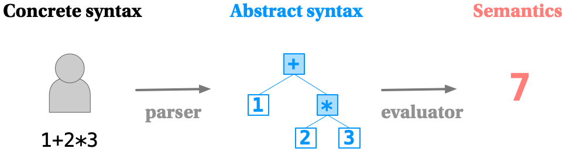

# Module 04.2: Representing Functions

Module 04.1 gave you the tools to represent and evaluate arithmetic expressions as data. This module asks the natural next question: **functions are awesome — so how do we represent them the same way?**

---

## Recap: Where We Left Off

{ width="560" }
<br>*The pipeline: concrete syntax, parsed into abstract syntax, evaluated to produce semantics.*

Three terms from Module 04.1, worth having crisp before continuing:

- **Concrete syntax** — what the programmer writes: a sequence of characters.
- **Abstract syntax** — a tree data structure capturing the code's essential shape, with concrete-syntax noise stripped away.
- **Semantics** — the meaning, produced by evaluating the abstract syntax.

In this course, we write the programmer's concrete syntax in our heads, skip straight to representing abstract syntax using Haskell data types, and write an `eval` function in Haskell to define semantics. (The concrete-syntax-to-abstract-syntax step itself — **parsing** — is still ahead of us, later in the course.)

So far, that's given us a small language of arithmetic expressions — let's call it **Arith**:

```haskell
data Op  = PlusOp | MinusOp | TimesOp | DivOp
  deriving Show

data Exp = Num   Double
         | BinOp Exp Op Exp
  deriving Show
```

with `eval :: Exp -> Double` defining Arith's semantics, and a symbol dictionary letting expressions refer to variables. (From here on, we'll rename that variable constructor from `Symbol` to **`Var`** — shorter, and it matches how most language implementations name it.)

What's missing? Parsing (later), and — today — **representing functions**.

---

## What Can We Do With Functions?

Strip it down, and there are really only two things you ever do with a function:

- **Define it** — specify a parameter and a body expression. (We'll keep things simple and assume every function takes exactly one parameter.)
- **Apply it** — give it an argument, and get a result back. In Haskell, `addFive 22` applies `addFive` to `22`; the argument can be any expression, like `addFive (22 - 4)`.

That's the whole interface. Now let's represent it as data.

---

## Representing Functions as Data

We extend `Exp` with three new constructors:

```haskell
type VarName = String

data Exp = Var    VarName
         | Num    Double
         | BinOp  Exp Op Exp
         | FunDef VarName Exp
         | Apply  Exp Exp
  deriving Show
```

- **`Var`** — a variable reference, by name.
- **`FunDef`** — a function definition: a parameter name, and a body expression.
- **`Apply`** — function application: a function expression, and an argument expression.

Notice what's *missing* from `FunDef`: there's nowhere to put the function's own name. Every `FunDef` we build is, in that sense, **anonymous** — it's a value like any other `Exp`, not a named, permanent fixture of the language. That's convenient right now, but hang on to it — it's going to make one specific thing surprisingly awkward later in this module.

Here's the "plus one" function, defined and then applied to `5`:

```haskell
FunDef "x" (BinOp (Var "x") PlusOp (Num 1))

Apply (FunDef "x" (BinOp (Var "x") PlusOp (Num 1))) (Num 5)
```

In words: "a function that takes a parameter `x` and adds 1 to it," applied to the argument `5`.

---

## Substitution

What does it actually *mean* to apply a function? Informally: find the parameter in the body, replace it with the argument, then evaluate what's left.

We need a precise notion of "replace." **Expression substitution** has standard notation:

```
e[x → e']
```

Read: "substitute `e'` for `x` in `e`." A few examples — note that substitution *only* replaces symbols; nothing gets evaluated yet:

```
(x + 1)[x → 5]         =  5 + 1
(z * z + 7)[z → 2]     =  2 * 2 + 7
(x + y + z)[y → (x/3)] =  x + (x/3) + z
```

Before writing code, it's worth thinking through the base cases:

```
10[x → 5]           = 10   -- nothing to substitute
x[x → 5]            = 5    -- exactly the variable we're replacing
x[y → (1 + 2)]       = x   -- a different variable — untouched
(x + (3/x))[x → 12]  = (x[x → 12]) + ((3/x)[x → 12])   -- recurse on both sides
```

### Implementing Substitution

Translating directly into Haskell (writing `e[x → e']` as `substitute e' (Var x) e`):

```haskell
substitute :: Exp -> Exp -> Exp -> Exp
substitute _    (Var v) (Num n) = Num n
substitute exp' (Var v) (Var w) = if v == w then exp' else Var w
substitute exp' var (BinOp left op right) =
  BinOp (substitute exp' var left) op (substitute exp' var right)
substitute exp' var (FunDef varname body) =
  FunDef varname (substitute exp' var body)
substitute _ _ _ = error "bad substitution"
```

Walking through applying "plus one" to `5`:

1. Start: `Apply (FunDef "x" (BinOp (Var "x") PlusOp (Num 1))) (Num 5)`.
2. Substitute `Num 5` for `Var "x"` in the body: `BinOp (Num 5) PlusOp (Num 1)`.
3. Evaluate that: `Num 6`.

A handy mental picture for that middle step: once you've hunted down the parameter and plugged the argument in everywhere it appeared, the `Apply` and the `FunDef` have both done their entire job — you can mentally *scratch them off*. There's no more "this was an argument to a function" bookkeeping left to track; all that remains is an ordinary expression (the body, with the argument plugged in), ready to hand to `eval` exactly like anything else in Module 04.1.

!!! question "Think about it"
    Should the final result be `6`, or `Num 6`? It might feel more natural to unwrap down to a bare `Double` — but there's a good reason to stay in the world of `Exp` values instead. (Hint: not every fully-evaluated expression is going to be a number...)

---

## Evaluating Function Application

Since evaluation needs to be able to produce a *function* (not just a `Double`), `eval` changes shape — it now maps `Exp` to `Exp`, staying entirely in the world of expressions:

```haskell
eval :: Exp -> Exp
eval (Num x) = Num x
eval (BinOp left op right) = evalOp (eval left) op (eval right)
eval (FunDef varname body) = FunDef varname body   -- functions are just values!

evalOp :: Exp -> Op -> Exp -> Exp
evalOp (Num x) PlusOp  (Num y) = Num (x + y)
evalOp (Num x) MinusOp (Num y) = Num (x - y)
evalOp (Num x) TimesOp (Num y) = Num (x * y)
evalOp (Num x) DivOp   (Num y) = Num (x / y)
```

Now, `Apply`. The obvious first attempt:

```haskell
eval (Apply (FunDef varname body) arg) =
  eval (substitute arg (Var varname) body)
```

This is **call-by-name**: the argument is substituted in *unevaluated*, exactly as written. (The name is a bit of a historical accident, if you think about it — nothing about *names* is really the point here. "Call by substituting the unevaluated expression" would describe it more honestly, if far more clunkily. "Call-by-name" is just the label that stuck, so that's what everyone — including this course — calls it.) There's an equally reasonable alternative — **call-by-value**: evaluate the argument first, *then* substitute the resulting value:

```haskell
eval (Apply (FunDef varname body) arg) =
  let val = eval arg
  in eval (substitute val (Var varname) body)
```

!!! question "Think about it"
    In most cases these two give identical answers. But not always. What could go wrong with call-by-name if `arg` is expensive to compute and the parameter appears many times in the body? What could go wrong with call-by-value if `arg` is expensive (or never terminates!) but the parameter doesn't appear in the body at all?

    ??? note "The tradeoff"
        Call-by-name can do redundant work — recomputing `arg` from scratch every time the parameter shows up in the body. Call-by-value can do *unnecessary* work — evaluating `arg` even when the function never uses it, which is wasteful at best and, if `arg` doesn't terminate, catastrophic. Haskell's actual evaluation strategy is a refined version of call-by-name that avoids the redundant-recomputation problem — which is exactly the **laziness** you met back in Module 02.2.

### A Snag with Nested Applications

The `eval (Apply (FunDef varname body) arg) = ...` pattern above quietly assumes the *first* argument of `Apply` is already a bare `FunDef`. That assumption breaks the moment applications nest — which happens as soon as a function takes more than one argument (more on that next). Consider:

```haskell
Apply (Apply (FunDef "x" (FunDef "y" (BinOp (Var "x") PlusOp (Var "y")))) (Num 10)) (Num 100)
```

Here the *first* argument to the outer `Apply` isn't a `FunDef` directly — it's another `Apply`, which itself needs to be evaluated down to a `FunDef` first. The fix: evaluate the function position before substituting into it.

```haskell
eval (Apply fexp arg) =
  let FunDef varname body = eval fexp
  in eval (substitute arg (Var varname) body)
```

The exact same fix applies to the call-by-value version — the function position still needs evaluating down to a `FunDef` first, on top of the argument-evaluation call-by-value was already doing:

```haskell
eval (Apply fexp arg) =
  let FunDef varname body = eval fexp
      val = eval arg
  in eval (substitute val (Var varname) body)
```

And `substitute` needs one more case, to reach inside a nested `FunDef`:

```haskell
substitute exp' var (FunDef varname body) =
  FunDef varname (substitute exp' var body)
```

---

## Functions with Multiple Arguments

Every function we've defined so far takes exactly one parameter. What about a function like `add x y = x + y`?

The trick: nest function definitions, one parameter at a time.

```haskell
FunDef "x" (FunDef "y" (BinOp (Var "x") PlusOp (Var "y")))
```

Applying this to two arguments means applying *twice*, in sequence:

```haskell
Apply (Apply (FunDef "x" (FunDef "y" (BinOp (Var "x") PlusOp (Var "y")))) (Num 10)) (Num 100)
```

The first `Apply` substitutes `10` for `x`, leaving `FunDef "y" (BinOp (Num 10) PlusOp (Var "y"))` — a function of one remaining argument. The second `Apply` substitutes `100` for `y`, giving `BinOp (Num 10) PlusOp (Num 100))`, which evaluates to `Num 110`. If this shape looks familiar, it should — this is exactly **currying**, from Module 02.2, now showing up inside our own interpreter instead of just in Haskell itself.

---

## Where This Leaves Us

Putting it all together, here's the complete language so far:

```haskell
data Op = PlusOp | MinusOp | TimesOp | DivOp
  deriving (Show, Eq)

type VarName = String

data Exp = Var    VarName
         | BinOp  Exp Op Exp
         | Num    Double
         | FunDef VarName Exp
         | Apply  Exp Exp
  deriving (Show, Eq)

evalOp :: Exp -> Op -> Exp -> Exp
evalOp (Num x) PlusOp  (Num y) = Num (x + y)
evalOp (Num x) TimesOp (Num y) = Num (x * y)
evalOp (Num x) DivOp   (Num y) = Num (x / y)
evalOp (Num x) MinusOp (Num y) = Num (x - y)

eval :: Exp -> Exp
eval (Num x) = Num x
eval (BinOp left op right) = evalOp (eval left) op (eval right)
eval (FunDef varname body) = FunDef varname body
eval (Apply fexp exp) =
  let FunDef varname body = eval fexp
  in eval (substitute exp (Var varname) body)

substitute :: Exp -> Exp -> Exp -> Exp
substitute _    (Var v) (Num x) = Num x
substitute exp' (Var v) (Var w) = if v == w then exp' else Var w
substitute exp' var (BinOp left op right) =
  BinOp (substitute exp' var left) op (substitute exp' var right)
substitute exp' var (FunDef varname body) =
  FunDef varname (substitute exp' var body)
substitute _ _ _ = error "bad substitution"
```

We're only about halfway to a real language, though. A few things this version doesn't handle correctly yet — worth sitting with before the next module resolves them:

!!! question "Think about it"
    What does our `eval`/`substitute` do with each of these? Is the answer actually correct?

    ```haskell
    FunDef "x" (FunDef "x" (BinOp (Var "x") PlusOp (Var "x")))

    FunDef "x" (BinOp (Var "x") PlusOp (Var "y"))
    ```

    The first defines a function whose *own parameter* is named `x`, nested inside another function also named `x` — does substitution correctly stop at the inner boundary, or does it barrel through and substitute somewhere it shouldn't? The second refers to `y`, a variable that's never bound by any `FunDef` at all — what should happen there? And — a third open question — how would a function even refer to *itself*, to write something recursive? This last one runs headfirst into that "missing name" from earlier: `FunDef` never gives a function anything to call itself *by*. An ordinary Haskell function can say `factorial n = ... factorial (n - 1) ...` because `factorial` is a name bound somewhere it can see itself. Our anonymous `FunDef` has no such name in scope inside its own body — so as it stands, there's no way to write it at all.

Module 5 is where all three of these get resolved, with a cleaner mechanism than substitution: **environments** and **closures**.
