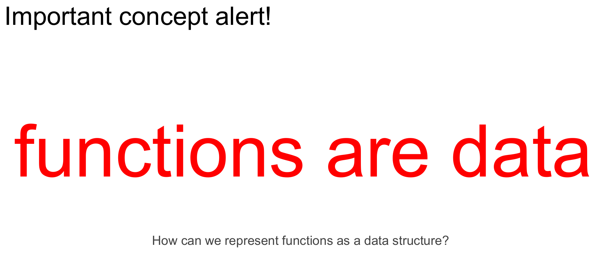
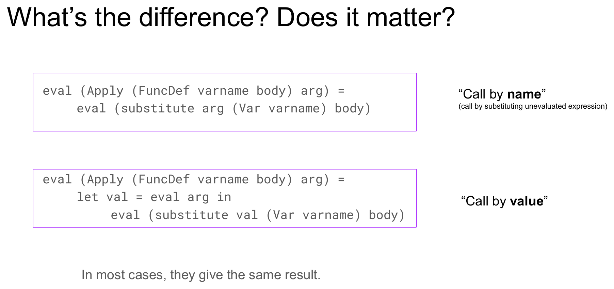

# Module 04.2: Representing Functions

Module 04.1 introduced one of the central ideas of this course:

> **Code is data.**

We represented arithmetic expressions as recursive Haskell data, then wrote an `eval` function that recursively traversed those expressions and gave them meaning.

Now we take the next step.

Functions have been central to everything we have done so far. We have passed functions as arguments, returned them as results, partially applied them, composed them, and treated them as ordinary values.

So if **code is data**, and **functions are code**, then we should be able to represent functions as data too.

> **Functions are data.**

This module extends our little expression language so that it can represent **function definitions** and **function applications**. To give those new expressions semantics, we will introduce **substitution**, use it to explain function application, compare **call-by-name** and **call-by-value** evaluation, and then reconnect all of this to **currying** and multi-argument functions.

By the end of this module, you should be able to:

- represent function definitions and applications in an abstract syntax tree,
- explain why a function definition is itself a value,
- describe function application as substitution followed by evaluation,
- read and perform expression substitution using notation such as `e[x → e']`,
- implement a recursive substitution function over our expression datatype,
- explain why `eval` now needs to return an `Exp` rather than only a `Double`,
- distinguish call-by-name from call-by-value,
- explain some tradeoffs between those evaluation strategies,
- represent multi-argument functions using nested one-argument functions,
- explain why nested application requires evaluating the function position first, and
- identify some important problems that our substitution-based evaluator still does **not** solve.

!!! note "How to use this module"
    When you see a box labeled **Gradescope question**, answer that question in the **Module 4.2 Completion** assignment on Gradescope.

    Other boxes labeled **Pause and think**, **Try it**, or **Practice** are there to help you understand the material. There is nothing to submit for those unless the box explicitly says **Gradescope question**.

---

## Recap: Syntax, Abstract Syntax, and Semantics

Before adding functions, let's reconnect to the picture from Module 04.1.

A programmer begins with **concrete syntax**:

```text
1 + 2 * 3
```

A parser turns that concrete syntax into **abstract syntax**, represented as a tree.

An evaluator then assigns meaning to that tree:

```text
concrete syntax        abstract syntax        semantics

   1 + 2 * 3    --->         +          --->      7
                             / \
                            1   *
                               / \
                              2   3
```

In CS 131, our current focus is mostly on the right-hand side of this pipeline:

```text
abstract syntax  --->  semantics
```

We use:

- **Haskell data types** to represent abstract syntax, and
- a Haskell **`eval` function** to define the semantics.

Parsing, the concrete-syntax-to-abstract-syntax step, comes later.

{ width="720" }

### Our arithmetic language so far

We represented arithmetic expressions with:

```haskell
data Op
  = PlusOp
  | MinusOp
  | TimesOp
  | DivOp
  deriving (Show, Eq)

data Exp
  = Num Double
  | BinOp Exp Op Exp
  deriving (Show, Eq)
```

For example:

```haskell
BinOp (Num 1) PlusOp
      (BinOp (Num 2) TimesOp (Num 3))
```

is the abstract syntax for:

```text
1 + 2 * 3
```

We can think of this as a tiny programming language. The slides give it a name:

> **Arith**, short for Arithmetic Expressions.

And:

```haskell
eval :: Exp -> Double
```

defined the semantics of Arith.

{ width="640" }

{ width="640" }

We then added variables and a lookup mechanism.

At that point, we could represent and evaluate:

- numeric expressions,
- arithmetic operations,
- variables.

What is still missing?

Two large pieces:

1. turning source strings into ASTs, which is **parsing**, and
2. **functions**.

Parsing comes later.

Functions are today's problem.

{ width="640" }

{ width="480" }

---

## What Can We Do With a Function?

Before designing a datatype, ask a simpler question:

> What are the fundamental things we do with functions?

For our purposes, there are two.

### 1. Define a function

When we define a function, we specify:

- a **parameter**, and
- a **body** describing the computation.

For example:

```haskell
addFive x = x + 5
```

Here:

```text
x       parameter
x + 5   body
```

For now, we will assume every function has exactly **one parameter**.

That might sound restrictive, but recall currying from Module 02.2. We already know that a function that appears to take several arguments can be understood as a sequence of one-argument functions.

### 2. Apply a function

Once we have a function, we can apply it to an **argument**:

```haskell
addFive 22
```

The argument does not have to be a literal value:

```haskell
addFive (22 - 4)
```

It can be an arbitrary expression.

So the two structures our language needs to represent are:

```text
function definition:
    parameter + body

function application:
    function + argument
```

{ width="640" }

---

## Representing Functions as Data

Let's extend `Exp`.

```haskell
type VarName = String

data Exp
  = Var    VarName
  | Num    Double
  | BinOp  Exp Op Exp
  | FunDef VarName Exp
  | Apply  Exp Exp
  deriving (Show, Eq)
```

We have added three important constructors.

### `Var`

```haskell
Var "x"
```

represents a reference to a variable named `x`.

### `FunDef`

```haskell
FunDef "x" body
```

represents a function whose:

- parameter is named `"x"`, and
- body is `body`.

For example:

```haskell
FunDef "x"
  (BinOp (Var "x") PlusOp (Num 1))
```

represents the function:

```text
x ↦ x + 1
```

or, in informal Haskell-like notation:

```haskell
\x -> x + 1
```

### `Apply`

```haskell
Apply functionExpression argumentExpression
```

represents applying one expression as a function to another expression as its argument.

For example:

```haskell
Apply
  (FunDef "x"
    (BinOp (Var "x") PlusOp (Num 1)))
  (Num 5)
```

represents applying our "plus one" function to `5`.

![A slide titled "Two main things we can do with functions" showing the extended `Exp` datatype with `FunDef VarName Exp` and `Apply Exp Exp` added (labeled parameter/body and function/argument respectively), followed by a concrete example: defining `FunDef "x" (BinOp (Var "x") PlusOp (Num 1))` with semantics "a function that takes a parameter x and adds 1 to it," then applying it via `Apply (FunDef "x" (BinOp (Var "x") PlusOp (Num 1))) (Num 5)` with semantics "apply the 'plus one' function to the argument 5."](img/04.2/funcdef-apply-datatype.png){ width="720" }

*(The lecture slides spell this constructor `FuncDef`; this page consistently uses `FunDef` — same structure, just the shorter spelling.)*

### One subtle point: these functions are anonymous

Notice that:

```haskell
FunDef "x" body
```

stores the **parameter name**, but not a name for the function itself.

There is no equivalent of:

```haskell
addOne x = x + 1
```

where `addOne` is available inside or outside the body.

Instead, a `FunDef` is simply a value representing a function.

For now, that works well. Later, it will become important when we ask how a function could refer to **itself** recursively.

---

## What Does It Mean to Apply a Function?

We have represented function application syntactically:

```haskell
Apply
  (FunDef "x"
    (BinOp (Var "x") PlusOp (Num 1)))
  (Num 5)
```

But syntax is only half the story.

We need semantics:

> What should this expression *mean*?

!!! question "Gradescope question: What should function application do?"
    **Submit this response on Gradescope.**

    Describe in words what you think should happen if we evaluate this expression:

    ```haskell
    Apply
      (FunDef "x"
        (BinOp (Var "x") PlusOp (Num 1)))
      (Num 5)
    ```

    We know the result should eventually be:

    ```haskell
    Num 6
    ```

    But **how do we get there?**

The basic idea is familiar from ordinary algebra.

We have:

```text
function:
    x ↦ x + 1

argument:
    5
```

To apply the function:

1. find occurrences of the parameter `x` in the body,
2. replace them with the argument `5`,
3. evaluate the resulting expression.

So:

```text
x + 1
```

becomes:

```text
5 + 1
```

which evaluates to:

```text
6
```

In our abstract syntax:

```haskell
BinOp (Var "x") PlusOp (Num 1)
```

becomes:

```haskell
BinOp (Num 5) PlusOp (Num 1)
```

and then:

```haskell
Num 6
```

{ width="640" }

This replacement operation is called **substitution**.

---

## Expression Substitution

We need a precise way to say:

> Replace every appropriate occurrence of variable `x` in expression `e` with expression `e'`.

The standard notation is:

```text
e[x → e']
```

Read this as:

> "In expression `e`, substitute expression `e'` for variable `x`."

Some examples:

```text
(x + 1)[x → 5]
    = 5 + 1
```

```text
(z * z + 7)[z → 2]
    = 2 * 2 + 7
```

```text
(x + y + z)[y → (x / 3)]
    = x + (x / 3) + z
```

An extremely important point:

> **Substitution itself does not evaluate the expression.**

For example:

```text
(x + 1)[x → 5]
```

becomes:

```text
5 + 1
```

during substitution.

It does **not** become `6` until evaluation happens afterward.

![A slide titled "Notation" defining expression substitution as `e[x → e']` ("substitute the expression e' for variable x in the expression e"), with three worked examples — `(x + 1)[x → 5] = 5 + 1`, `(z * z + 7)[z → 2] = 2 * 2 + 7`, `(x + y + z)[y → (x / 3)] = x + (x / 3) + z` — and the note "No evaluation happens, just substitution."](img/04.2/substitution-notation.png){ width="640" }

---

## Practice Substitution Before Implementing It

Before writing a recursive function, work through the structural cases by hand.

!!! question "Gradescope question: Perform these substitutions"
    **Submit this response on Gradescope.**

    What do these four expressions become after performing the substitution?

    **A.**

    ```text
    10[x → 5]
    ```

    **B.**

    ```text
    x[x → 5]
    ```

    **C.**

    ```text
    x[y → (1 + 2)]
    ```

    **D.**

    ```text
    (x + (3 / x))[x → 12]
    ```

Think about why each behaves differently.

### A number

```text
10[x → 5] = 10
```

There are no variables inside the number `10`, so there is nothing to replace.

### The matching variable

```text
x[x → 5] = 5
```

We found exactly the variable being replaced.

### A different variable

```text
x[y → (1 + 2)] = x
```

We are replacing `y`, not `x`, so this occurrence stays unchanged.

### A compound expression

For:

```text
(x + (3 / x))[x → 12]
```

we recurse into the expression's pieces:

```text
(x[x → 12]) + ((3 / x)[x → 12])
```

and eventually obtain:

```text
12 + (3 / 12)
```

Again, substitution stops there. Computing the numeric result is a separate evaluation step.

![A slide titled "Next: let's implement! Wait. Let's think first..." showing the four substitution exercises with their answers and case labels: `10[x → 5] = 10` (base case: nothing to substitute), `x[x → 5] = 5` (base case: just the replacement expression), `x[y → (1 + 2)] = x` (base case: nothing to substitute), and `(x + (3/x))[x → 12] = (x[x → 12]) + ((3/x)[x → 12]) = 12 + (3/12)` (recurse: substitute on left and right).](img/04.2/substitution-exercises-answers.png){ width="640" }

---

## Implementing Substitution

Now the implementation follows the recursive structure of `Exp`.

We will write:

```haskell
substitute replacement variable expression
```

so that:

```text
e[v → e']
```

corresponds to:

```haskell
substitute e' v e
```

Before looking at the complete function, try to fill in its pieces.

!!! question "Gradescope question: Implement `substitute`"
    **Submit this response on Gradescope.**

    How can you implement the `substitute` function?

    Expression substitution:

    ```text
    e[v → e'] == substitute e' v e
    ```

    Fill in the blanks:

    ```haskell
    substitute :: _____ -> _____ -> _____ -> _____

    substitute e' (Var v) (Num n) =
      _________

    substitute e' (Var v) (Var w) =
      ________________________

    substitute e' (Var v) (BinOp left op right) =
      _____________________________________

    substitute _ _ _ =
      error "bad substitution"
    ```

The core implementation is:

```haskell
substitute :: Exp -> Exp -> Exp -> Exp

substitute _ (Var v) (Num n) =
  Num n

substitute replacement (Var v) (Var w) =
  if v == w
    then replacement
    else Var w

substitute replacement var (BinOp left op right) =
  BinOp
    (substitute replacement var left)
    op
    (substitute replacement var right)

substitute _ _ _ =
  error "bad substitution"
```

The first three cases correspond almost directly to our hand-worked examples:

```text
number          -> unchanged

matching Var    -> replacement

different Var   -> unchanged

BinOp           -> recurse into both children
```

{ width="640" }

### But our language contains more than numbers, variables, and binary operations

We have also added:

```haskell
FunDef
Apply
```

The slides deliberately postpone these cases at first.

For nested function definitions, we will eventually need to recurse into the function body:

```haskell
substitute replacement var (FunDef varname body) =
  FunDef varname (substitute replacement var body)
```

This simple rule will let us make progress today.

However, it is **not the final word on substitution**.

Near the end of the module, we will see an example where blindly substituting inside every `FunDef` can do the wrong thing because function parameters introduce their own bindings.

That problem is intentional. It points directly toward the next major topic of the course.

---

## Why Does Evaluation Now Return an `Exp`?

Back in Module 04.1, our evaluator had type:

```haskell
eval :: Exp -> Double
```

That made sense when every fully evaluated expression was a number.

But now consider:

```haskell
FunDef "x"
  (BinOp (Var "x") PlusOp (Num 1))
```

What should evaluating a function definition produce?

It should produce... the function.

A function is already a value.

So `Double` can no longer describe every possible result of evaluation.

Instead:

```haskell
eval :: Exp -> Exp
```

We stay inside the world of expressions.

Numbers evaluate to numeric values represented as `Exp`:

```haskell
eval (Num x) = Num x
```

Function definitions evaluate to themselves:

```haskell
eval (FunDef varname body) =
  FunDef varname body
```

And binary operations evaluate their children and then combine the resulting numeric expressions:

```haskell
eval (BinOp left op right) =
  evalOp (eval left) op (eval right)
```

with:

```haskell
evalOp :: Exp -> Op -> Exp -> Exp

evalOp (Num x) PlusOp  (Num y) = Num (x + y)
evalOp (Num x) MinusOp (Num y) = Num (x - y)
evalOp (Num x) TimesOp (Num y) = Num (x * y)
evalOp (Num x) DivOp   (Num y) = Num (x / y)
```

This explains why the result of our earlier example is:

```haskell
Num 6
```

rather than merely:

```haskell
6
```

We want evaluation to have one result type capable of representing **all of our language's values**, including functions.

{ width="640" }

{ width="640" }

---

## Evaluating Function Application

Now we can finally add semantics for:

```haskell
Apply f arg
```

The simplest version directly mirrors our informal description.

If the function position already contains a function definition:

```haskell
eval (Apply (FunDef varname body) arg) =
  eval (substitute arg (Var varname) body)
```

Read it in three stages:

```text
1. take the function body
2. substitute the argument for the parameter
3. evaluate the resulting expression
```

For example:

```haskell
Apply
  (FunDef "x"
    (BinOp (Var "x") PlusOp (Num 1)))
  (Num 5)
```

becomes:

```haskell
BinOp (Num 5) PlusOp (Num 1)
```

and then:

```haskell
Num 6
```

{ width="640" }

But there is another perfectly reasonable choice.

---

## When Should the Argument Be Evaluated?

Compare these two definitions.

### Strategy 1

```haskell
eval (Apply (FunDef varname body) arg) =
  eval (substitute arg (Var varname) body)
```

The argument is substituted **without being evaluated first**.

### Strategy 2

```haskell
eval (Apply (FunDef varname body) arg) =
  let val = eval arg
  in eval (substitute val (Var varname) body)
```

The argument is evaluated first, and then the resulting value is substituted.

These are different **evaluation strategies**.

The first is **call-by-name**.

The second is **call-by-value**.

{ width="720" }

!!! question "Gradescope question: Compare the two evaluation strategies"
    **Submit this response on Gradescope.**

    We gave two possibilities for evaluating a function application:

    ```haskell
    eval (Apply (FunDef varname body) arg) =
      eval (substitute arg (Var varname) body)
    ```

    and:

    ```haskell
    eval (Apply (FunDef varname body) arg) =
      let val = eval arg
      in eval (substitute val (Var varname) body)
    ```

    **What is the difference between these two evaluation strategies? Will they always produce the same result? Are there cases where one is worse or better than the other?**

---

## Call-by-Name

Under **call-by-name**, the argument expression is substituted directly into the function body without first being evaluated.

Suppose the argument is:

```text
someExpensiveComputation
```

and the parameter appears three times:

```text
x + x + x
```

Substitution may produce:

```text
someExpensiveComputation
+ someExpensiveComputation
+ someExpensiveComputation
```

If evaluation then computes each copy independently, we may repeat the same expensive work several times.

So call-by-name has an important potential cost:

> It can duplicate unevaluated computation.

{ width="640" }

---

## Call-by-Value

Under **call-by-value**, we first evaluate:

```haskell
arg
```

to a value:

```haskell
val
```

and substitute that value into the body.

This avoids recomputing the argument every time the parameter appears.

But there is another possible waste.

Consider a function whose body never uses its parameter:

```text
x ↦ 10
```

If we apply it to a huge computation, call-by-value computes that argument **before discovering that the result does not depend on it at all**.

Even more dramatically, suppose the argument never terminates.

Call-by-value will get stuck evaluating the argument, even though the function body might not need it.

So call-by-value has a different potential cost:

> It can evaluate an argument that never needed to be evaluated.

{ width="640" }

{ width="720" }

### Connection back to laziness

This should sound familiar from Module 02.2.

Haskell's lazy evaluation shares an important motivation with call-by-name: **do not evaluate an expression until its value is actually needed**.

But ordinary Haskell also avoids naively recomputing the same demanded argument every time it is used. It uses sharing, often described as **call-by-need**.

You do not need to implement call-by-need here. The point is that a feature that earlier looked like a quirky fact about Haskell now appears as a deliberate answer to a programming-language design question:

> When should function arguments be evaluated?

---

## Functions with More Than One Argument

So far, our datatype assumes:

```haskell
FunDef parameter body
```

with exactly one parameter.

What about:

```haskell
add x y = x + y
```

?

We already know the answer from currying.

A two-argument function can be represented as a function that takes one argument and returns another function:

```haskell
FunDef "x"
  (FunDef "y"
    (BinOp (Var "x") PlusOp (Var "y")))
```

Conceptually:

```text
x ↦ (y ↦ x + y)
```

Now applying the function to two arguments means applying it **twice**:

```haskell
Apply
  (Apply
    (FunDef "x"
      (FunDef "y"
        (BinOp (Var "x") PlusOp (Var "y"))))
    (Num 10))
  (Num 100)
```

This expression should eventually produce:

```haskell
Num 110
```

### First application

Substitute `10` for `x`:

```haskell
FunDef "y"
  (BinOp (Num 10) PlusOp (Var "y"))
```

Notice what the first application returns:

> **another function**

That is exactly what currying says should happen.

### Second application

Now apply that resulting function to `100`:

```haskell
BinOp (Num 10) PlusOp (Num 100)
```

and evaluate:

```haskell
Num 110
```

{ width="720" }

This is not merely an analogy to Haskell currying.

We have now implemented the same structural idea **inside our own language**.

---

## A Snag: `Apply` Does Not Always Contain a `FunDef`

Our first application rule was:

```haskell
eval (Apply (FunDef varname body) arg) =
  eval (substitute arg (Var varname) body)
```

Look carefully at the pattern:

```haskell
Apply (FunDef varname body) arg
```

It only matches when the **function position is already literally a `FunDef`**.

But our curried two-argument expression has this outer shape:

```haskell
Apply
  (Apply ...)
  (Num 100)
```

The first expression inside the outer `Apply` is itself another `Apply`.

It is **not yet** syntactically a `FunDef`.

So the old pattern does not match.

This is a great example of why thinking carefully about the structure of the abstract syntax matters. Our semantics should not demand that the function position already *look* like a function definition. It may be an expression that **evaluates to** one.

![A slide titled "Functions with more than one argument?" showing the old rule `eval (Apply (FuncDef varname body) arg) = eval (substitute arg (Var varname) body)` crossed out above the nested-Apply expression `Apply (Apply (FuncDef "x" ...) (Num 10)) (Num 100)`, annotated "We want this to simplify down to FuncDef varname body," followed by the corrected rule `eval (Apply fexp arg) = let (FuncDef varname body) = eval fexp in eval (substitute arg (Var varname) body)` and the required substitution case `substitute exp' var (FuncDef varname body) = FuncDef varname (substitute exp' var body)`.](img/04.2/eval-apply-corrected-rule.png){ width="720" }

### Fix: evaluate the function position first

Instead of pattern matching immediately on a `FunDef`, accept any function expression:

```haskell
eval (Apply fexp arg) =
  let FunDef varname body = eval fexp
  in eval (substitute arg (Var varname) body)
```

The important new step is:

```haskell
eval fexp
```

We first evaluate the function position.

We expect its result to be a function value:

```haskell
FunDef varname body
```

Then we substitute the argument into that body.

This makes nested applications work.

### Call-by-value version

If we choose call-by-value for the argument, the corresponding version is:

```haskell
eval (Apply fexp arg) =
  let FunDef varname body = eval fexp
      val = eval arg
  in eval (substitute val (Var varname) body)
```

Two separate decisions are happening:

1. **Function position:** evaluate it until we obtain a function value.
2. **Argument position:** choose when the argument should be evaluated according to our evaluation strategy.

That distinction will continue to matter as languages become more complicated.

---

## The Interpreter So Far

Putting the pieces together, one version of our language now looks like this:

```haskell
data Op
  = PlusOp
  | MinusOp
  | TimesOp
  | DivOp
  deriving (Show, Eq)

type VarName = String

data Exp
  = Var    VarName
  | BinOp  Exp Op Exp
  | Num    Double
  | FunDef VarName Exp
  | Apply  Exp Exp
  deriving (Show, Eq)
```

Arithmetic operations:

```haskell
evalOp :: Exp -> Op -> Exp -> Exp

evalOp (Num x) PlusOp  (Num y) = Num (x + y)
evalOp (Num x) MinusOp (Num y) = Num (x - y)
evalOp (Num x) TimesOp (Num y) = Num (x * y)
evalOp (Num x) DivOp   (Num y) = Num (x / y)
```

Evaluation:

```haskell
eval :: Exp -> Exp

eval (Num x) =
  Num x

eval (BinOp left op right) =
  evalOp (eval left) op (eval right)

eval (FunDef varname body) =
  FunDef varname body

eval (Apply fexp arg) =
  let FunDef varname body = eval fexp
  in eval (substitute arg (Var varname) body)
```

And substitution:

```haskell
substitute :: Exp -> Exp -> Exp -> Exp

substitute _ (Var v) (Num x) =
  Num x

substitute replacement (Var v) (Var w) =
  if v == w
    then replacement
    else Var w

substitute replacement var (BinOp left op right) =
  BinOp
    (substitute replacement var left)
    op
    (substitute replacement var right)

substitute replacement var (FunDef varname body) =
  FunDef varname
    (substitute replacement var body)

substitute _ _ _ =
  error "bad substitution"
```

{ width="720" }

This is already remarkable.

We have described:

- numeric values,
- arithmetic expressions,
- variable references,
- function values,
- function application,
- and an evaluation strategy,

using a small recursive datatype and a handful of recursive functions.

---

## But We Are Only Halfway There

The slide deck ends with an important warning:

> **We're actually only halfway there...**

Our evaluator works for the examples we have chosen, but some deeper questions are now visible.

Consider:

```haskell
FunDef "x"
  (FunDef "x"
    (BinOp (Var "x") PlusOp (Var "x")))
```

There are **two different parameters named `x`**.

What should happen if we substitute for the outer `x`?

Should substitution continue into the inner function body?

The simple substitution rule we wrote does:

```haskell
substitute replacement var (FunDef varname body) =
  FunDef varname (substitute replacement var body)
```

But that can ignore the fact that the inner `FunDef "x"` introduces a **new binding** for the name `x`.

Now consider:

```haskell
FunDef "x"
  (BinOp (Var "x") PlusOp (Var "y"))
```

Where does `y` come from?

It is not the function's parameter.

And finally:

> How would we represent a recursive function?

Our `FunDef` stores a parameter and a body, but the function itself has no name. How could its body refer back to the function?

{ width="640" }

These are not small implementation annoyances.

They are clues that we need better concepts for understanding **which variable occurrence refers to which binding**.

That leads directly to:

- **scope**,
- **free and bound variables**,
- **environments**, and
- **closures**.

Those ideas let us handle names and functions much more systematically than naive textual substitution.

---

## Pulling the Main Ideas Together

This module extends the "code is data" story from arithmetic to functions.

### Function definitions are syntax

```haskell
FunDef "x" body
```

is an ordinary `Exp` value representing a function.

### Functions are values

Evaluating a function definition gives us the function itself:

```haskell
eval (FunDef x body) = FunDef x body
```

This is the interpreter-level version of the principle from Module 02.2:

> **Functions are values.**

### Function application needs semantics

```haskell
Apply f arg
```

does not explain itself.

We define its meaning through an evaluation rule.

### Substitution gives us a first model of application

Applying:

```text
x ↦ body
```

to:

```text
arg
```

can be modeled as:

```text
body[x → arg]
```

followed by evaluation.

### Evaluation strategy is a language-design decision

Call-by-name and call-by-value differ only by a small change in our evaluator, but that small change affects:

- whether work is duplicated,
- whether unused arguments are evaluated,
- and even whether some programs terminate.

### Currying falls naturally out of the representation

A multi-argument function becomes nested one-argument functions:

```haskell
FunDef "x" (FunDef "y" body)
```

and multiple arguments become nested applications:

```haskell
Apply (Apply f a) b
```

### Our first substitution model is deliberately incomplete

Variable shadowing, free variables, and recursion expose weaknesses in naive substitution.

That is not a failure of the exercise. It tells us exactly what conceptual machinery we need next.

---

## Where This Leaves Us

You should now be able to read expressions such as:

```haskell
FunDef "x"
  (BinOp (Var "x") PlusOp (Num 1))
```

and:

```haskell
Apply
  (FunDef "x"
    (BinOp (Var "x") PlusOp (Num 1)))
  (Num 5)
```

and explain both their **syntax** and their intended **semantics**.

You should also be able to explain:

```text
e[x → e']
```

and trace how substitution recursively traverses an expression.

Most importantly, the ideas from the first several modules are now converging:

```text
functions are values
        +
recursive data structures
        +
pattern matching
        +
recursion
        +
code is data
        =
a small interpreter that represents and applies functions
```

The next step is to confront the problems we deliberately left unresolved: **which binding does a variable refer to, what happens when names are shadowed, and what information must a function carry with it in order to behave correctly?**

That takes us to scope, environments, and closures.

---

## Finish the Module 04.2 Completion

The existing Module 4.2 materials identify four substantive completion questions, all of which appeared at the relevant points above:

1. Describe what should happen when evaluating the provided application of the "plus one" function to `5`.
2. Perform the four given substitutions.
3. Complete the implementation of `substitute`.
4. Compare the two proposed function-application evaluation strategies and discuss whether one can be better or worse.

Make sure you have submitted your responses to the **Module 4.2 Completion** assignment on Gradescope.
